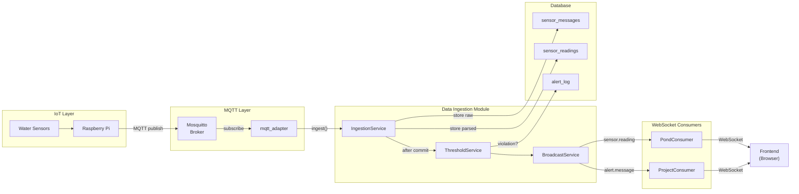
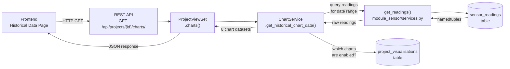
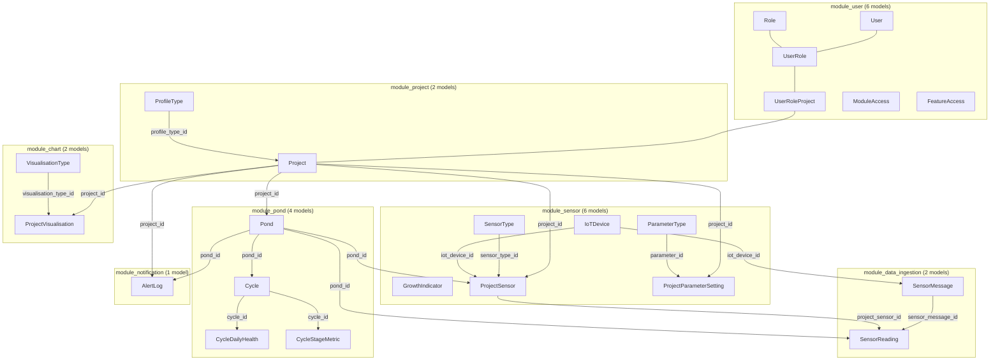
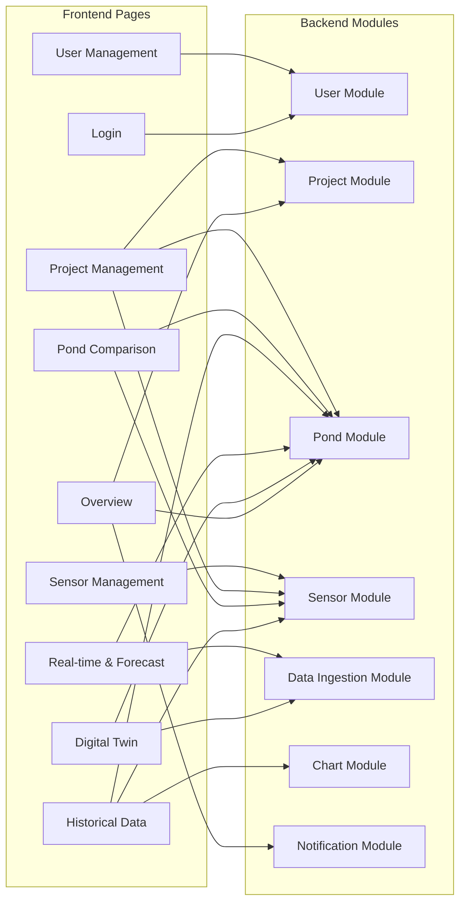

# Architecture Diagram — Refined (Phase 1)

> Paste the Mermaid blocks into [mermaid.live](https://mermaid.live) to render.
> This diagram reflects the 7-module backend structure from `arch_diagram_refinement.md`.

---

## What Changed From the Previous Diagram

| Area | Before | After |
|---|---|---|
| Project Module | 1 big module (Project, Pond, Cycle, DailyHealth, StageMetric, ProfileType) | Split into **Project Module** (Project, ProfileType) + **Pond Module** (Pond, Cycle, DailyHealth, StageMetric) |
| Sensor Management Module | Mixed config + data (8 models) | **Sensor Module** = config only (ParameterType, SensorType, IoTDevice, ProjectSensor, ProjectParameterSetting, GrowthIndicator) |
| Data Ingestion Module | Legacy partition tables + old WebSocket IngestConsumer | Repurposed: **IngestionService** + **ThresholdService** + **BroadcastService** (SensorMessage, SensorReading) |
| WebSocket Broadcaster | Standalone box in diagram | Now lives inside **Data Ingestion Module** as BroadcastService |
| MQTT Service | Separate box | Now **mqtt_adapter** management command inside Sensor Module, calls IngestionService |
| Chart Module | Services only, no entity ownership | Now owns **VisualisationType** + **ProjectVisualisation** |
| User Module | 2 models (User, old Role) | 6 models (User, Role, UserRole, UserRoleProject, ModuleAccess, FeatureAccess) |
| Frontend pages | 6 pages (Login, Overview, Digital Twin, Real-time, Historical, Pond Comparison) | **9 pages** — added Project Management, Sensor Management, User Management |

---

## Frontend Pages (9 total)

| Page | What it covers | Backend modules used |
|---|---|---|
| Login | Authentication | User Module |
| Overview | Dashboard, pond status, alerts | Project, Pond, Notification |
| Digital Twin | 3D pond view, live parameters | Pond, Data Ingestion (WebSocket) |
| Real-time & Forecast | Live charts, predictions | Pond, Data Ingestion (WebSocket) |
| Historical Data | Charts, cycles, health timeline | Pond, Chart, Sensor |
| Pond Comparison | Compare ponds side by side | Pond, Sensor |
| Project Management | Projects, ponds, threshold configuration | Project, Pond, Sensor (thresholds) |
| Sensor Management | IoT devices, sensors, port mapping, parameter types | Sensor |
| User Management | Users, roles, project access assignment | User |

---

## 1. Full Architecture Diagram

```mermaid
graph TB
    %% =====================================================================
    %% FRONTEND LAYER
    %% =====================================================================
    subgraph Frontend["Frontend (React + TypeScript + Vite)"]
        direction TB
        AppRouting["App Routing"]

        subgraph Pages["Pages"]
            direction LR
            LoginPage["Login"]
            OverviewPage["Overview"]
            DigitalTwinPage["Digital Twin"]
            RealTimePage["Real-time &\nForecast"]
            HistoricalPage["Historical\nData"]
            PondComparisonPage["Pond\nComparison"]
            ProjectMgmtPage["Project\nManagement"]
            SensorMgmtPage["Sensor\nManagement"]
            UserMgmtPage["User\nManagement"]
        end

        AppRouting --> LoginPage
        AppRouting --> OverviewPage
        AppRouting --> DigitalTwinPage
        AppRouting --> RealTimePage
        AppRouting --> HistoricalPage
        AppRouting --> PondComparisonPage
        AppRouting --> ProjectMgmtPage
        AppRouting --> SensorMgmtPage
        AppRouting --> UserMgmtPage
    end

    %% User
    User(("Users"))
    User -->|"user navigation"| AppRouting

    %% =====================================================================
    %% FRONTEND TO BACKEND CONNECTIONS
    %% =====================================================================

    LoginPage -->|"send login credentials\n& authenticate users"| RESTAPI
    OverviewPage -->|"request & receive\nproject, pond, alert data"| RESTAPI
    DigitalTwinPage -->|"request & receive\npond, sensor readings"| RESTAPI
    RealTimePage -->|"request & receive\nproject, pond, alert data"| RESTAPI
    HistoricalPage -->|"request & receive\nproject, pond, visualization,\ncycle data"| RESTAPI
    PondComparisonPage -->|"request & receive\npond, treatment &\ncomparison data"| RESTAPI
    ProjectMgmtPage -->|"CRUD projects, ponds,\nthreshold configuration"| RESTAPI
    SensorMgmtPage -->|"CRUD IoT devices, sensors,\nport mapping, parameter types"| RESTAPI
    UserMgmtPage -->|"CRUD users, roles,\nproject access assignment"| RESTAPI

    %% WebSocket connections
    OverviewPage <-->|"receives real-time\nalert updates"| BroadcastSvc
    DigitalTwinPage <-->|"receives real-time\nsensor updates"| BroadcastSvc
    RealTimePage <-->|"receives real-time\nsensor updates"| BroadcastSvc

    %% =====================================================================
    %% BACKEND LAYER
    %% =====================================================================
    subgraph Backend["Backend (Django + Django Channels + Daphne)"]
        direction TB

        RESTAPI["REST API\n(HTTPS Endpoints)"]

        subgraph BackendModules["Backend Modules"]
            direction TB

            subgraph Row1[" "]
                direction LR
                UserModule["User Module\n───────────\nUser, Role\nUserRole\nUserRoleProject\nModuleAccess\nFeatureAccess"]
                ProjectModule["Project Module\n───────────\nProfileType\nProject"]
                PondModule["Pond Module\n───────────\nPond\nCycle\nCycleDailyHealth\nCycleStageMetric"]
            end

            subgraph Row2[" "]
                direction LR
                NotificationModule["Notification Module\n───────────\nAlertLog"]
                ChartModule["Chart Module\n───────────\nVisualisationType\nProjectVisualisation\n+ ChartService"]
            end

            subgraph Row3[" "]
                direction LR
                SensorModule["Sensor Module\n───────────\nParameterType\nGrowthIndicator\nSensorType\nIoTDevice\nProjectSensor\nProjectParameterSetting"]
                DataIngestionModule["Data Ingestion Module\n───────────\nSensorMessage\nSensorReading\n+ IngestionService\n+ ThresholdService"]
            end

            BroadcastSvc["WebSocket Broadcaster\n(BroadcastService)\n───────────\nPondConsumer\nProjectConsumer"]
        end

        RESTAPI --> UserModule
        RESTAPI --> ProjectModule
        RESTAPI --> PondModule
        RESTAPI --> NotificationModule
        RESTAPI --> ChartModule
        RESTAPI --> SensorModule
    end

    %% =====================================================================
    %% INTER-MODULE CONNECTIONS (Backend)
    %% =====================================================================

    DataIngestionModule -->|"creates alerts on\nthreshold violation"| NotificationModule
    DataIngestionModule -->|"broadcasts readings\n& alerts via WebSocket"| BroadcastSvc
    DataIngestionModule -->|"reads sensor config,\nport mapping, thresholds"| SensorModule

    ChartModule -->|"queries sensor_readings\nvia get_readings()"| SensorModule
    ChartModule -->|"reads project\nvisualisation config"| ProjectModule

    PondModule -->|"pond.project_id"| ProjectModule

    NotificationModule -->|"alert_log references\npond & project"| PondModule

    %% =====================================================================
    %% DATABASE
    %% =====================================================================
    subgraph DatabaseLayer["Database"]
        DB[("Aquaculture\n(PostgreSQL)")]
    end

    UserModule -->|"fetch user data"| DB
    ProjectModule -->|"fetch project &\nprofile type data"| DB
    PondModule -->|"fetch pond &\ncycle data"| DB
    NotificationModule -->|"fetch & store\nalert data"| DB
    ChartModule -->|"fetch visualization\nconfig"| DB
    SensorModule -->|"fetch sensor &\nIoT device config"| DB
    DataIngestionModule -->|"store sensor_messages\n& sensor_readings"| DB

    %% =====================================================================
    %% MQTT LAYER
    %% =====================================================================
    subgraph MQTTLayer["MQTT"]
        MQTTBroker["MQTT Broker\n(Mosquitto)"]
    end

    MQTTAdapter["MQTT Adapter\n(mqtt_adapter command)\n───────────\nSubscribes to broker\nValidates HMAC\nCalls IngestionService"]

    MQTTBroker -->|"publish subscribed\nmessage"| MQTTAdapter
    MQTTAdapter -->|"validated payload\nIngestionService.ingest()"| DataIngestionModule

    %% =====================================================================
    %% IoT LAYER
    %% =====================================================================
    subgraph IoTLayer["IoT Agent"]
        RaspberryPi["Raspberry Pi\nPython Service Agent"]
    end

    WaterSensors(("Water\nSensors"))
    WaterSensors -->|"raw sensor data"| RaspberryPi
    RaspberryPi -->|"publish sensor data\nas MQTT message"| MQTTBroker
```

---

## 2. Data Flow Diagram (Write Path)

Shows the MQTT ingestion pipeline — from sensor to dashboard.

---

## 3. Data Flow Diagram (Read Path)

Shows how the frontend gets historical chart data.

---

## 4. Module Boundary Diagram

Shows all 23 models across 7 modules with FK relationships.

---

## 5. Page-to-Module Mapping

Shows which backend modules each frontend page depends on.

---

*Last updated: April 27, 2026*