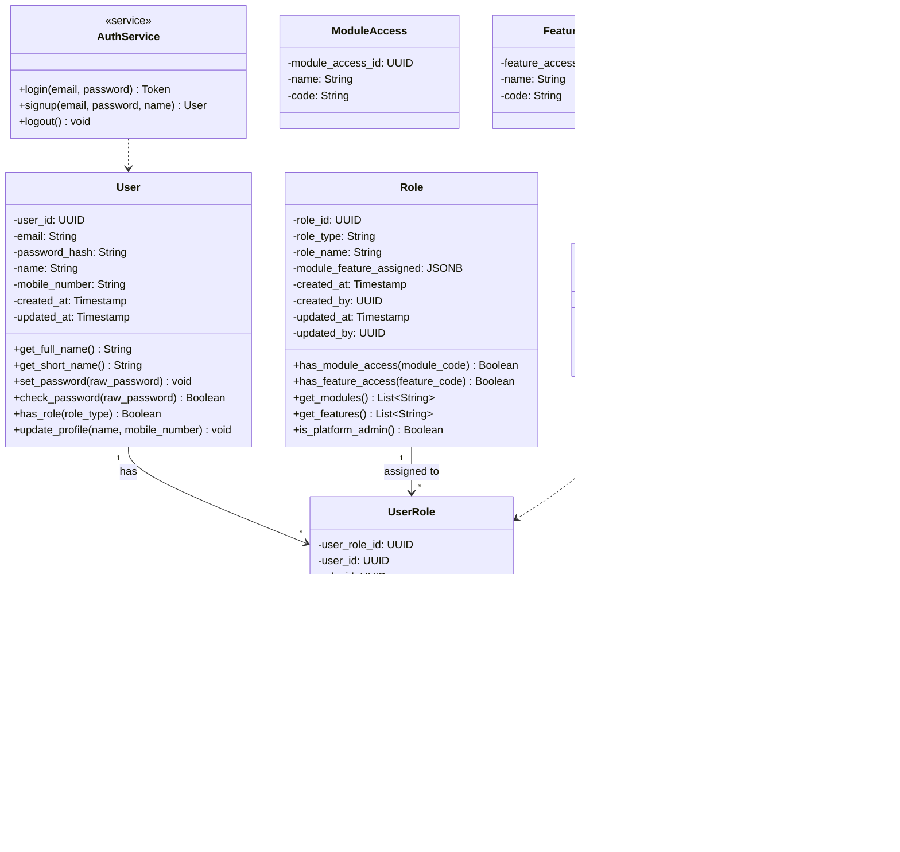

# Class Diagram — module_user

```mermaid
classDiagram
    User "1" --> "*" UserRole : has
    Role "1" --> "*" UserRole : assigned to
    UserRole "1" *-- "*" UserRoleProject : has

    AuthService ..> User
    RBACService ..> UserRole
    RBACService ..> UserRoleProject

    class User {
        -user_id: UUID
        -email: String
        -password_hash: String
        -name: String
        -mobile_number: String
        -created_at: Timestamp
        -updated_at: Timestamp
        +get_full_name() String
        +get_short_name() String
        +set_password(raw_password) void
        +check_password(raw_password) Boolean
        +has_role(role_type) Boolean
        +update_profile(name, mobile_number) void
    }

    class Role {
        -role_id: UUID
        -role_type: String
        -role_name: String
        -module_feature_assigned: JSONB
        -created_at: Timestamp
        -created_by: UUID
        -updated_at: Timestamp
        -updated_by: UUID
        +has_module_access(module_code) Boolean
        +has_feature_access(feature_code) Boolean
        +get_modules() List~String~
        +get_features() List~String~
        +is_platform_admin() Boolean
    }

    class UserRole {
        -user_role_id: UUID
        -user_id: UUID
        -role_id: UUID
        -assigned_at: Timestamp
        -assigned_by: UUID
        +assign_project(project_id) void
        +remove_project(project_id) void
    }

    class UserRoleProject {
        -user_role_project_id: UUID
        -user_role_id: UUID
        -project_id: UUID
    }

    class ModuleAccess {
        -module_access_id: UUID
        -name: String
        -code: String
    }

    class FeatureAccess {
        -feature_access_id: UUID
        -name: String
        -code: String
    }

    class AuthService {
        <<service>>
        +login(email, password) Token
        +signup(email, password, name) User
        +logout() void
    }

    class RBACService {
        <<service>>
        +get_user_projects(user_id) List~Project~
        +has_project_access(user_id, project_id) Boolean
        +has_feature_access(user_id, feature_code) Boolean
    }
```
