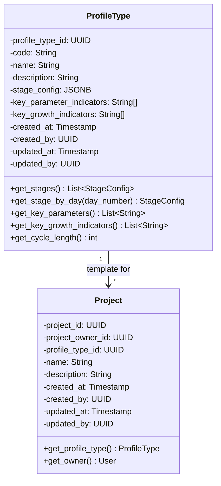

# Class Diagram — module_project

```mermaid
classDiagram
    ProfileType "1" --> "*" Project : template for

    class ProfileType {
        -profile_type_id: UUID
        -code: String
        -name: String
        -description: String
        -stage_config: JSONB
        -key_parameter_indicators: String[]
        -key_growth_indicators: String[]
        -created_at: Timestamp
        -created_by: UUID
        -updated_at: Timestamp
        -updated_by: UUID
        +get_stages() List~StageConfig~
        +get_stage_by_day(day_number) StageConfig
        +get_key_parameters() List~String~
        +get_key_growth_indicators() List~String~
        +get_cycle_length() int
    }

    class Project {
        -project_id: UUID
        -project_owner_id: UUID
        -profile_type_id: UUID
        -name: String
        -description: String
        -created_at: Timestamp
        -created_by: UUID
        -updated_at: Timestamp
        -updated_by: UUID
        +get_profile_type() ProfileType
        +get_owner() User
    }
```
