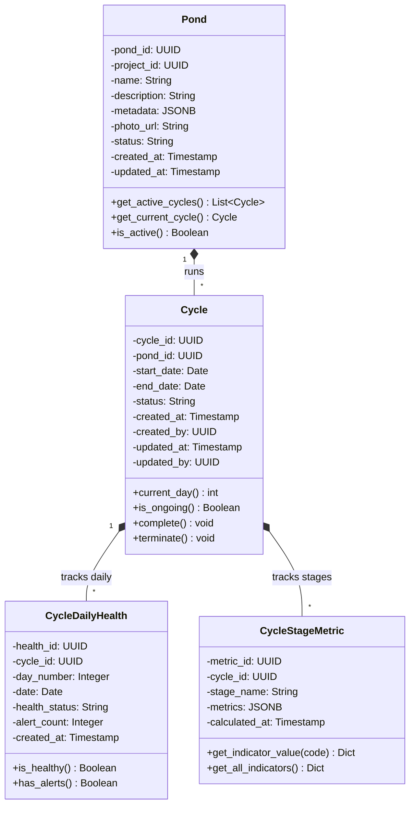

# Class Diagram — module_pond

```mermaid
classDiagram
    Pond "1" *-- "*" Cycle : runs
    Cycle "1" *-- "*" CycleDailyHealth : tracks daily
    Cycle "1" *-- "*" CycleStageMetric : tracks stages

    class Pond {
        -pond_id: UUID
        -project_id: UUID
        -name: String
        -description: String
        -metadata: JSONB
        -photo_url: String
        -status: String
        -created_at: Timestamp
        -updated_at: Timestamp
        +get_active_cycles() List~Cycle~
        +get_current_cycle() Cycle
        +is_active() Boolean
    }

    class Cycle {
        -cycle_id: UUID
        -pond_id: UUID
        -start_date: Date
        -end_date: Date
        -status: String
        -created_at: Timestamp
        -created_by: UUID
        -updated_at: Timestamp
        -updated_by: UUID
        +current_day() int
        +is_ongoing() Boolean
        +complete() void
        +terminate() void
    }

    class CycleDailyHealth {
        -health_id: UUID
        -cycle_id: UUID
        -day_number: Integer
        -date: Date
        -health_status: String
        -alert_count: Integer
        -created_at: Timestamp
        +is_healthy() Boolean
        +has_alerts() Boolean
    }

    class CycleStageMetric {
        -metric_id: UUID
        -cycle_id: UUID
        -stage_name: String
        -metrics: JSONB
        -calculated_at: Timestamp
        +get_indicator_value(code) Dict
        +get_all_indicators() Dict
    }
```
