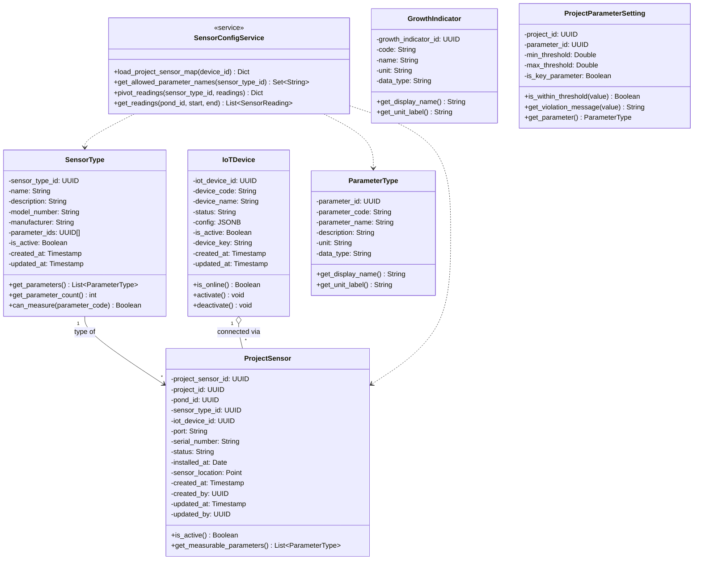

# Class Diagram — module_sensor

```mermaid
classDiagram
    SensorType "1" --> "*" ProjectSensor : type of
    IoTDevice "1" o-- "*" ProjectSensor : connected via

    SensorConfigService ..> ProjectSensor
    SensorConfigService ..> SensorType
    SensorConfigService ..> ParameterType

    class ParameterType {
        -parameter_id: UUID
        -parameter_code: String
        -parameter_name: String
        -description: String
        -unit: String
        -data_type: String
        +get_display_name() String
        +get_unit_label() String
    }

    class GrowthIndicator {
        -growth_indicator_id: UUID
        -code: String
        -name: String
        -unit: String
        -data_type: String
        +get_display_name() String
        +get_unit_label() String
    }

    class SensorType {
        -sensor_type_id: UUID
        -name: String
        -description: String
        -model_number: String
        -manufacturer: String
        -parameter_ids: UUID[]
        -is_active: Boolean
        -created_at: Timestamp
        -updated_at: Timestamp
        +get_parameters() List~ParameterType~
        +get_parameter_count() int
        +can_measure(parameter_code) Boolean
    }

    class IoTDevice {
        -iot_device_id: UUID
        -device_code: String
        -device_name: String
        -status: String
        -config: JSONB
        -is_active: Boolean
        -device_key: String
        -created_at: Timestamp
        -updated_at: Timestamp
        +is_online() Boolean
        +activate() void
        +deactivate() void
    }

    class ProjectSensor {
        -project_sensor_id: UUID
        -project_id: UUID
        -pond_id: UUID
        -sensor_type_id: UUID
        -iot_device_id: UUID
        -port: String
        -serial_number: String
        -status: String
        -installed_at: Date
        -sensor_location: Point
        -created_at: Timestamp
        -created_by: UUID
        -updated_at: Timestamp
        -updated_by: UUID
        +is_active() Boolean
        +get_measurable_parameters() List~ParameterType~
    }

    class ProjectParameterSetting {
        -project_id: UUID
        -parameter_id: UUID
        -min_threshold: Double
        -max_threshold: Double
        -is_key_parameter: Boolean
        +is_within_threshold(value) Boolean
        +get_violation_message(value) String
        +get_parameter() ParameterType
    }

    class SensorConfigService {
        <<service>>
        +load_project_sensor_map(device_id) Dict
        +get_allowed_parameter_names(sensor_type_id) Set~String~
        +pivot_readings(sensor_type_id, readings) Dict
        +get_readings(pond_id, start, end) List~SensorReading~
    }
```
