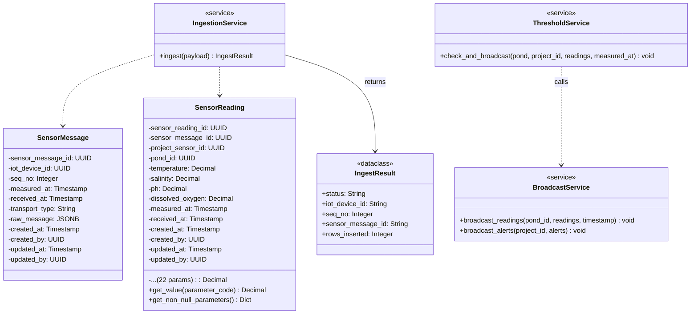

# Class Diagram — module_data_ingestion

```mermaid
classDiagram
    IngestionService ..> SensorMessage
    IngestionService ..> SensorReading
    IngestionService --> IngestResult : returns
    ThresholdService ..> BroadcastService : calls

    class SensorMessage {
        -sensor_message_id: UUID
        -iot_device_id: UUID
        -seq_no: Integer
        -measured_at: Timestamp
        -received_at: Timestamp
        -transport_type: String
        -raw_message: JSONB
        -created_at: Timestamp
        -created_by: UUID
        -updated_at: Timestamp
        -updated_by: UUID
    }

    class SensorReading {
        -sensor_reading_id: UUID
        -sensor_message_id: UUID
        -project_sensor_id: UUID
        -pond_id: UUID
        -temperature: Decimal
        -salinity: Decimal
        -ph: Decimal
        -dissolved_oxygen: Decimal
        -...(22 params): Decimal
        -measured_at: Timestamp
        -received_at: Timestamp
        -created_at: Timestamp
        -created_by: UUID
        -updated_at: Timestamp
        -updated_by: UUID
        +get_value(parameter_code) Decimal
        +get_non_null_parameters() Dict
    }

    class IngestionService {
        <<service>>
        +ingest(payload) IngestResult
    }

    class ThresholdService {
        <<service>>
        +check_and_broadcast(pond, project_id, readings, measured_at) void
    }

    class BroadcastService {
        <<service>>
        +broadcast_readings(pond_id, readings, timestamp) void
        +broadcast_alerts(project_id, alerts) void
    }

    class IngestResult {
        <<dataclass>>
        +status: String
        +iot_device_id: String
        +seq_no: Integer
        +sensor_message_id: String
        +rows_inserted: Integer
    }
```
