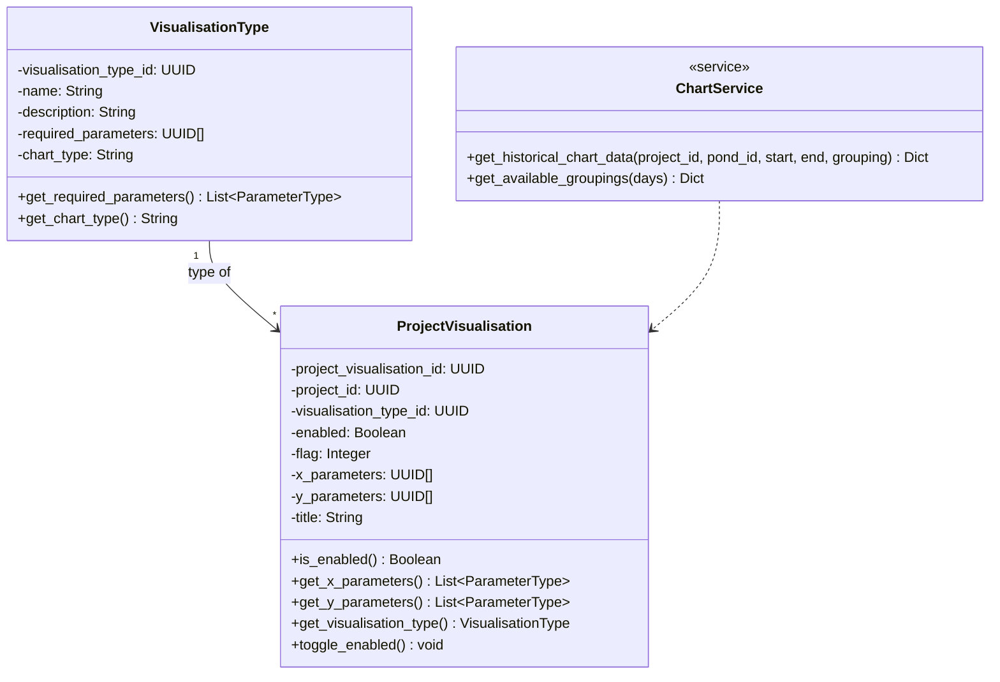

# Class Diagram — module_chart

```mermaid
classDiagram
    VisualisationType "1" --> "*" ProjectVisualisation : type of
    ChartService ..> ProjectVisualisation

    class VisualisationType {
        -visualisation_type_id: UUID
        -name: String
        -description: String
        -required_parameters: UUID[]
        -chart_type: String
        +get_required_parameters() List~ParameterType~
        +get_chart_type() String
    }

    class ProjectVisualisation {
        -project_visualisation_id: UUID
        -project_id: UUID
        -visualisation_type_id: UUID
        -enabled: Boolean
        -flag: Integer
        -x_parameters: UUID[]
        -y_parameters: UUID[]
        -title: String
        +is_enabled() Boolean
        +get_x_parameters() List~ParameterType~
        +get_y_parameters() List~ParameterType~
        +get_visualisation_type() VisualisationType
        +toggle_enabled() void
    }

    class ChartService {
        <<service>>
        +get_historical_chart_data(project_id, pond_id, start, end, grouping) Dict
        +get_available_groupings(days) Dict
    }
```
