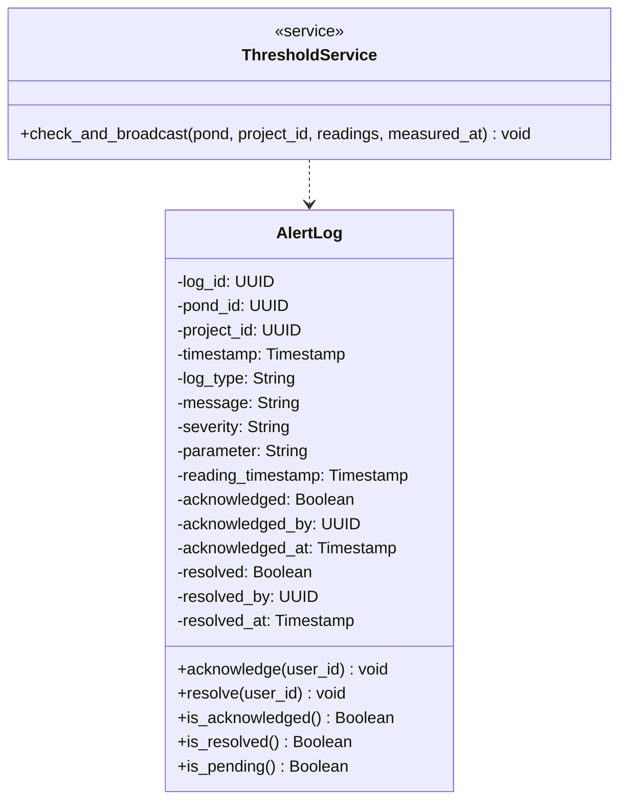

# Class Diagram — module_notification

```mermaid
classDiagram
    ThresholdService ..> AlertLog

    class AlertLog {
        -log_id: UUID
        -pond_id: UUID
        -project_id: UUID
        -timestamp: Timestamp
        -log_type: String
        -message: String
        -severity: String
        -parameter: String
        -reading_timestamp: Timestamp
        -acknowledged: Boolean
        -acknowledged_by: UUID
        -acknowledged_at: Timestamp
        -resolved: Boolean
        -resolved_by: UUID
        -resolved_at: Timestamp
        +acknowledge(user_id) void
        +resolve(user_id) void
        +is_acknowledged() Boolean
        +is_resolved() Boolean
        +is_pending() Boolean
    }

    class ThresholdService {
        <<service>>
        +check_and_broadcast(pond, project_id, readings, measured_at) void
    }
```
