# Class Diagram — Refined (Mermaid)

> Paste into [mermaid.live](https://mermaid.live) to render.
> Based on `class_diagram_refinement.md` — cross-module methods removed, service classes added, primary paths only.

---

## Changes From Previous Class Diagram

| What | Before | After |
|---|---|---|
| Project methods | 8 methods (reached into Pond, Sensor, Chart, Alert) | 2 methods (get_profile_type, get_owner) |
| Pond methods | 6 methods (reached into Sensor, Reading, Alert) | 3 methods (get_active_cycles, get_current_cycle, is_active) |
| Cycle methods | 9 methods (had reverse lookups to DailyHealth, StageMetric, Pond) | 4 methods (current_day, is_ongoing, complete, terminate) |
| SensorReading methods | 6 methods (had check_thresholds, get_readings_for_pond, get_pond, get_sensor) | 2 methods (get_value, get_non_null_parameters) |
| SensorMessage methods | 4 methods (had get_readings, get_latency, parse_raw_message, get_device) | 0 methods (data-only class) |
| IoTDevice methods | 4 methods (had get_assigned_sensors) | 3 methods (is_online, activate, deactivate) |
| ProjectSensor methods | 4 methods (had get_sensor_type, get_device) | 2 methods (is_active, get_measurable_parameters) |
| AlertLog methods | 7 methods (had get_pond, get_project) | 5 methods (acknowledge, resolve, is_acknowledged, is_resolved, is_pending) |
| ProjectVisualisation methods | 6 methods (had get_project) | 5 methods |
| CycleDailyHealth methods | 3 methods (had get_cycle) | 2 methods (is_healthy, has_alerts) |
| CycleStageMetric methods | 3 methods (had get_cycle) | 2 methods (get_indicator_value, get_all_indicators) |
| UserRole methods | 3 methods (had get_projects) | 2 methods (assign_project, remove_project) |
| Service classes | None | 7 added + 1 dataclass |
| Entity relationship arrows | 27 lines (every FK shown) | 9 lines (structural only) |
| Dependency arrows | Mixed with entities | Separated — only on service classes |
| Removed entity arrows | — | 18 arrows moved to service dependencies or removed entirely |

**Rule applied:** Entity arrows show only structural ownership (who contains/owns what). All cross-cutting connections (data flow, lookups, threshold checks) are handled by service classes and shown as service dependencies instead.

---

## Mermaid Class Diagram

```mermaid
classDiagram
    %% ===================================================================
    %% ENTITY RELATIONSHIPS (Structural Only — 9 arrows)
    %% ===================================================================

    %% User & Access
    User "1" --> "*" UserRole : has
    Role "1" --> "*" UserRole : assigned to
    UserRole "1" *-- "*" UserRoleProject : has

    %% Project & Pond
    ProfileType "1" --> "*" Project : template for
    Project "1" *-- "*" Pond : contains

    %% Pond — the operational hub
    Pond "1" *-- "*" Cycle : runs
    Cycle "1" *-- "*" CycleDailyHealth : tracks daily
    Cycle "1" *-- "*" CycleStageMetric : tracks stages
    Pond "1" o-- "*" ProjectSensor : has installed
    SensorType "1" --> "*" ProjectSensor : type of
    IoTDevice "1" o-- "*" ProjectSensor : connected via

    %% ===================================================================
    %% SERVICE DEPENDENCIES (dashed — how services connect the pieces)
    %% ===================================================================

    AuthService ..> User
    RBACService ..> UserRole
    RBACService ..> UserRoleProject
    SensorConfigService ..> ProjectSensor
    SensorConfigService ..> SensorType
    SensorConfigService ..> ParameterType
    IngestionService ..> SensorMessage
    IngestionService ..> SensorReading
    IngestionService ..> SensorConfigService : uses
    IngestionService --> IngestResult : returns
    ThresholdService ..> ProjectParameterSetting
    ThresholdService ..> AlertLog
    ThresholdService ..> BroadcastService : calls
    ChartService ..> ProjectVisualisation
    ChartService ..> SensorConfigService : uses

    %% ===================================================================
    %% USER & ACCESS CLASSES
    %% ===================================================================

    class User {
        -user_id: UUID
        -email: String
        -password_hash: String
        -name: String
        -mobile_number: String
        -created_at: Timestamp
        -updated_at: Timestamp
        +get_full_name() String
        +get_short_name() String
        +set_password(raw_password) void
        +check_password(raw_password) Boolean
        +has_role(role_type) Boolean
        +update_profile(name, mobile_number) void
    }

    class Role {
        -role_id: UUID
        -role_type: String
        -role_name: String
        -module_feature_assigned: JSONB
        -created_at: Timestamp
        -created_by: UUID
        -updated_at: Timestamp
        -updated_by: UUID
        +has_module_access(module_code) Boolean
        +has_feature_access(feature_code) Boolean
        +get_modules() List~String~
        +get_features() List~String~
        +is_platform_admin() Boolean
    }

    class UserRole {
        -user_role_id: UUID
        -user_id: UUID
        -role_id: UUID
        -assigned_at: Timestamp
        -assigned_by: UUID
        +assign_project(project_id) void
        +remove_project(project_id) void
    }

    class UserRoleProject {
        -user_role_project_id: UUID
        -user_role_id: UUID
        -project_id: UUID
    }

    class ModuleAccess {
        -module_access_id: UUID
        -name: String
        -code: String
    }

    class FeatureAccess {
        -feature_access_id: UUID
        -name: String
        -code: String
    }

    %% ===================================================================
    %% PROJECT & POND CLASSES
    %% ===================================================================

    class ProfileType {
        -profile_type_id: UUID
        -code: String
        -name: String
        -description: String
        -stage_config: JSONB
        -key_parameter_indicators: String[]
        -key_growth_indicators: String[]
        -created_at: Timestamp
        -created_by: UUID
        -updated_at: Timestamp
        -updated_by: UUID
        +get_stages() List~StageConfig~
        +get_stage_by_day(day_number) StageConfig
        +get_key_parameters() List~String~
        +get_key_growth_indicators() List~String~
        +get_cycle_length() int
    }

    class Project {
        -project_id: UUID
        -project_owner_id: UUID
        -profile_type_id: UUID
        -name: String
        -description: String
        -created_at: Timestamp
        -created_by: UUID
        -updated_at: Timestamp
        -updated_by: UUID
        +get_profile_type() ProfileType
        +get_owner() User
    }

    class Pond {
        -pond_id: UUID
        -project_id: UUID
        -name: String
        -description: String
        -metadata: JSONB
        -photo_url: String
        -status: String
        -created_at: Timestamp
        -updated_at: Timestamp
        +get_active_cycles() List~Cycle~
        +get_current_cycle() Cycle
        +is_active() Boolean
    }

    class Cycle {
        -cycle_id: UUID
        -pond_id: UUID
        -start_date: Date
        -end_date: Date
        -status: String
        -created_at: Timestamp
        -created_by: UUID
        -updated_at: Timestamp
        -updated_by: UUID
        +current_day() int
        +is_ongoing() Boolean
        +complete() void
        +terminate() void
    }

    class CycleDailyHealth {
        -health_id: UUID
        -cycle_id: UUID
        -day_number: Integer
        -date: Date
        -health_status: String
        -alert_count: Integer
        -created_at: Timestamp
        +is_healthy() Boolean
        +has_alerts() Boolean
    }

    class CycleStageMetric {
        -metric_id: UUID
        -cycle_id: UUID
        -stage_name: String
        -metrics: JSONB
        -calculated_at: Timestamp
        +get_indicator_value(code) Dict
        +get_all_indicators() Dict
    }

    %% ===================================================================
    %% SENSOR & IoT CLASSES
    %% ===================================================================

    class ParameterType {
        -parameter_id: UUID
        -parameter_code: String
        -parameter_name: String
        -description: String
        -unit: String
        -data_type: String
        +get_display_name() String
        +get_unit_label() String
    }

    class GrowthIndicator {
        -growth_indicator_id: UUID
        -code: String
        -name: String
        -unit: String
        -data_type: String
        +get_display_name() String
        +get_unit_label() String
    }

    class SensorType {
        -sensor_type_id: UUID
        -name: String
        -description: String
        -model_number: String
        -manufacturer: String
        -parameter_ids: UUID[]
        -is_active: Boolean
        -created_at: Timestamp
        -updated_at: Timestamp
        +get_parameters() List~ParameterType~
        +get_parameter_count() int
        +can_measure(parameter_code) Boolean
    }

    class IoTDevice {
        -iot_device_id: UUID
        -device_code: String
        -device_name: String
        -status: String
        -config: JSONB
        -is_active: Boolean
        -device_key: String
        -created_at: Timestamp
        -updated_at: Timestamp
        +is_online() Boolean
        +activate() void
        +deactivate() void
    }

    class ProjectSensor {
        -project_sensor_id: UUID
        -project_id: UUID
        -pond_id: UUID
        -sensor_type_id: UUID
        -iot_device_id: UUID
        -port: String
        -serial_number: String
        -status: String
        -installed_at: Date
        -sensor_location: Point
        -created_at: Timestamp
        -created_by: UUID
        -updated_at: Timestamp
        -updated_by: UUID
        +is_active() Boolean
        +get_measurable_parameters() List~ParameterType~
    }

    class ProjectParameterSetting {
        -project_id: UUID
        -parameter_id: UUID
        -min_threshold: Double
        -max_threshold: Double
        -is_key_parameter: Boolean
        +is_within_threshold(value) Boolean
        +get_violation_message(value) String
        +get_parameter() ParameterType
    }

    %% ===================================================================
    %% DATA PIPELINE CLASSES
    %% ===================================================================

    class SensorMessage {
        -sensor_message_id: UUID
        -iot_device_id: UUID
        -seq_no: Integer
        -measured_at: Timestamp
        -received_at: Timestamp
        -transport_type: String
        -raw_message: JSONB
        -created_at: Timestamp
        -created_by: UUID
        -updated_at: Timestamp
        -updated_by: UUID
    }

    class SensorReading {
        -sensor_reading_id: UUID
        -sensor_message_id: UUID
        -project_sensor_id: UUID
        -pond_id: UUID
        -temperature: Decimal
        -salinity: Decimal
        -ph: Decimal
        -dissolved_oxygen: Decimal
        -...(22 params): Decimal
        -measured_at: Timestamp
        -received_at: Timestamp
        -created_at: Timestamp
        -created_by: UUID
        -updated_at: Timestamp
        -updated_by: UUID
        +get_value(parameter_code) Decimal
        +get_non_null_parameters() Dict
    }

    %% ===================================================================
    %% CHART CLASSES
    %% ===================================================================

    class VisualisationType {
        -visualisation_type_id: UUID
        -name: String
        -description: String
        -required_parameters: UUID[]
        -chart_type: String
        +get_required_parameters() List~ParameterType~
        +get_chart_type() String
    }

    class ProjectVisualisation {
        -project_visualisation_id: UUID
        -project_id: UUID
        -visualisation_type_id: UUID
        -enabled: Boolean
        -flag: Integer
        -x_parameters: UUID[]
        -y_parameters: UUID[]
        -title: String
        +is_enabled() Boolean
        +get_x_parameters() List~ParameterType~
        +get_y_parameters() List~ParameterType~
        +get_visualisation_type() VisualisationType
        +toggle_enabled() void
    }

    %% ===================================================================
    %% ALERT CLASS
    %% ===================================================================

    class AlertLog {
        -log_id: UUID
        -pond_id: UUID
        -project_id: UUID
        -timestamp: Timestamp
        -log_type: String
        -message: String
        -severity: String
        -parameter: String
        -reading_timestamp: Timestamp
        -acknowledged: Boolean
        -acknowledged_by: UUID
        -acknowledged_at: Timestamp
        -resolved: Boolean
        -resolved_by: UUID
        -resolved_at: Timestamp
        +acknowledge(user_id) void
        +resolve(user_id) void
        +is_acknowledged() Boolean
        +is_resolved() Boolean
        +is_pending() Boolean
    }

    %% ===================================================================
    %% SERVICE CLASSES
    %% ===================================================================

    class AuthService {
        <<service>>
        +login(email, password) Token
        +signup(email, password, name) User
        +logout() void
    }

    class RBACService {
        <<service>>
        +get_user_projects(user_id) List~Project~
        +has_project_access(user_id, project_id) Boolean
        +has_feature_access(user_id, feature_code) Boolean
    }

    class SensorConfigService {
        <<service>>
        +load_project_sensor_map(device_id) Dict
        +get_allowed_parameter_names(sensor_type_id) Set~String~
        +pivot_readings(sensor_type_id, readings) Dict
        +get_readings(pond_id, start, end) List~SensorReading~
    }

    class IngestionService {
        <<service>>
        +ingest(payload) IngestResult
    }

    class ThresholdService {
        <<service>>
        +check_and_broadcast(pond, project_id, readings, measured_at) void
    }

    class BroadcastService {
        <<service>>
        +broadcast_readings(pond_id, readings, timestamp) void
        +broadcast_alerts(project_id, alerts) void
    }

    class ChartService {
        <<service>>
        +get_historical_chart_data(project_id, pond_id, start, end, grouping) Dict
        +get_available_groupings(days) Dict
    }

    class IngestResult {
        <<dataclass>>
        +status: String
        +iot_device_id: String
        +seq_no: Integer
        +sensor_message_id: String
        +rows_inserted: Integer
    }
```

---

*Last updated: April 27, 2026*
