# AquaShield Monitoring v2 — Overall Class Diagram

---

## All Classes (17 classes)

### 1. User & Access Control (6 classes)

```
┌──────────────────────────────────────────────┐
│                   User                       │
├──────────────────────────────────────────────┤
│ - user_id: UUID                              │
│ - email: String                              │
│ - password_hash: String                      │
│ - name: String                               │
│ - mobile_number: String                      │
│ - created_at: Timestamp                      │
│ - updated_at: Timestamp                      │
├──────────────────────────────────────────────┤
│ + get_full_name(): String                    │
│ + get_short_name(): String                   │
│ + set_password(raw_password: String): void   │
│ + check_password(raw_password: String): Boolean│
│ + get_available_roles(): List<UserRole>      │
│ + get_projects_for_role(role_id: UUID): List<Project>│
│ + has_role(role_type: String): Boolean       │
│ + update_profile(name: String, mobile_number: String): void│
└──────────────────────────────────────────────┘

┌──────────────────────────────────────────────┐
│                   Role                       │
├──────────────────────────────────────────────┤
│ - role_id: UUID                              │
│ - role_type: String                          │
│ - role_name: String                          │
│ - module_feature_assigned: JSONB             │
│ - created_at: Timestamp                      │
│ - created_by: UUID                           │
│ - updated_at: Timestamp                      │
│ - updated_by: UUID                           │
├──────────────────────────────────────────────┤
│ + has_module_access(module_code: String): Boolean│
│ + has_feature_access(feature_code: String): Boolean│
│ + get_modules(): List<String>                │
│ + get_features(): List<String>               │
│ + is_platform_admin(): Boolean               │
└──────────────────────────────────────────────┘

┌──────────────────────────────────────────────┐
│                 UserRole                     │
├──────────────────────────────────────────────┤
│ - user_role_id: UUID                         │
│ - user_id: UUID                              │
│ - role_id: UUID                              │
│ - assigned_at: Timestamp                     │
│ - assigned_by: UUID                          │
├──────────────────────────────────────────────┤
│ + get_projects(): List<Project>              │
│ + assign_project(project_id: UUID): void     │
│ + remove_project(project_id: UUID): void     │
└──────────────────────────────────────────────┘

┌──────────────────────────────────────────────┐
│            UserRoleProject                   │
├──────────────────────────────────────────────┤
│ - user_role_project_id: UUID                 │
│ - user_role_id: UUID                         │
│ - project_id: UUID                           │
├──────────────────────────────────────────────┤
│                                              │
└──────────────────────────────────────────────┘

┌──────────────────────────────────────────────┐
│              ModuleAccess                    │
├──────────────────────────────────────────────┤
│ - module_access_id: UUID                     │
│ - name: String                               │
│ - code: String                               │
├──────────────────────────────────────────────┤
│                                              │
└──────────────────────────────────────────────┘

┌──────────────────────────────────────────────┐
│             FeatureAccess                    │
├──────────────────────────────────────────────┤
│ - feature_access_id: UUID                    │
│ - name: String                               │
│ - code: String                               │
├──────────────────────────────────────────────┤
│                                              │
└──────────────────────────────────────────────┘
```

---

### 2. Profile & Project (3 classes)

```
┌──────────────────────────────────────────────┐
│               ProfileType                    │
├──────────────────────────────────────────────┤
│ - profile_type_id: UUID                      │
│ - code: String                               │
│ - name: String                               │
│ - description: String                        │
│ - stage_config: JSONB                        │
│ - key_parameter_indicators: String[]         │
│ - key_growth_indicators: String[]            │
│ - created_at: Timestamp                      │
│ - created_by: UUID                           │
│ - updated_at: Timestamp                      │
│ - updated_by: UUID                           │
├──────────────────────────────────────────────┤
│ + get_stages(): List<StageConfig>            │
│ + get_stage_by_day(day_number: int): StageConfig│
│ + get_key_parameters(): List<String>         │
│ + get_key_growth_indicators(): List<String>  │
│ + get_cycle_length(): int                    │
└──────────────────────────────────────────────┘

┌──────────────────────────────────────────────┐
│                 Project                      │
├──────────────────────────────────────────────┤
│ - project_id: UUID                           │
│ - project_owner_id: UUID                     │
│ - profile_type_id: UUID                      │
│ - name: String                               │
│ - description: String                        │
│ - created_at: Timestamp                      │
│ - created_by: UUID                           │
│ - updated_at: Timestamp                      │
│ - updated_by: UUID                           │
├──────────────────────────────────────────────┤
│ + get_ponds(): List<Pond>                    │
│ + get_active_ponds(): List<Pond>             │
│ + get_parameter_settings(): List<ProjectParameterSetting>│
│ + get_key_parameters(): List<ProjectParameterSetting>│
│ + get_profile_type(): ProfileType            │
│ + get_owner(): User                          │
│ + get_visualisations(): List<ProjectVisualisation>│
└──────────────────────────────────────────────┘

┌──────────────────────────────────────────────┐
│                   Pond                       │
├──────────────────────────────────────────────┤
│ - pond_id: UUID                              │
│ - project_id: UUID                           │
│ - name: String                               │
│ - description: String                        │
│ - metadata: JSONB                            │
│ - photo_url: String                          │
│ - status: String                             │
│ - created_at: Timestamp                      │
│ - updated_at: Timestamp                      │
├──────────────────────────────────────────────┤
│ + get_active_cycles(): List<Cycle>           │
│ + get_current_cycle(): Cycle                 │
│ + get_latest_reading(): SensorReading        │
│ + get_sensors(): List<ProjectSensor>         │
│ + get_alerts(resolved: Boolean): List<AlertLog>│
│ + is_active(): Boolean                       │
└──────────────────────────────────────────────┘
```

---

### 3. Parameter Types & Growth Indicators (2 classes)

```
┌──────────────────────────────────────────────┐
│              ParameterType                   │
├──────────────────────────────────────────────┤
│ - parameter_id: UUID                         │
│ - parameter_code: String                     │
│ - parameter_name: String                     │
│ - description: String                        │
│ - unit: String                               │
│ - data_type: String                          │
├──────────────────────────────────────────────┤
│ + get_display_name(): String                 │
│ + get_unit_label(): String                   │
└──────────────────────────────────────────────┘

┌──────────────────────────────────────────────┐
│            GrowthIndicator                   │
├──────────────────────────────────────────────┤
│ - growth_indicator_id: UUID                  │
│ - code: String                               │
│ - name: String                               │
│ - unit: String                               │
│ - data_type: String                          │
├──────────────────────────────────────────────┤
│ + get_display_name(): String                 │
│ + get_unit_label(): String                   │
└──────────────────────────────────────────────┘
```

---

### 4. Project Configuration (2 classes)

```
┌──────────────────────────────────────────────┐
│        ProjectParameterSetting               │
├──────────────────────────────────────────────┤
│ - project_id: UUID                           │
│ - parameter_id: UUID                         │
│ - min_threshold: Double                      │
│ - max_threshold: Double                      │
│ - is_key_parameter: Boolean                  │
├──────────────────────────────────────────────┤
│ + is_within_threshold(value: Double): Boolean│
│ + get_parameter(): ParameterType             │
└──────────────────────────────────────────────┘

┌──────────────────────────────────────────────┐
│          ProjectVisualisation                │
├──────────────────────────────────────────────┤
│ - project_visualisation_id: UUID             │
│ - project_id: UUID                           │
│ - visualisation_type_id: UUID                │
│ - enabled: Boolean                           │
│ - flag: Integer                              │
│ - x_parameters: UUID[]                       │
│ - y_parameters: UUID[]                       │
│ - title: String                              │
├──────────────────────────────────────────────┤
│ + is_enabled(): Boolean                      │
│ + get_x_parameters(): List<ParameterType>    │
│ + get_y_parameters(): List<ParameterType>    │
│ + get_visualisation_type(): VisualisationType│
│ + get_project(): Project                     │
│ + toggle_enabled(): void                     │
└──────────────────────────────────────────────┘
```

---

### 5. Sensors & IoT (3 classes)

```
┌──────────────────────────────────────────────┐
│              SensorType                      │
├──────────────────────────────────────────────┤
│ - sensor_type_id: UUID                       │
│ - name: String                               │
│ - description: String                        │
│ - model_number: String                       │
│ - manufacturer: String                       │
│ - parameter_ids: UUID[]                      │
│ - is_active: Boolean                         │
│ - created_at: Timestamp                      │
│ - updated_at: Timestamp                      │
├──────────────────────────────────────────────┤
│ + get_parameters(): List<ParameterType>      │
│ + get_parameter_count(): int                 │
│ + can_measure(parameter_code: String): Boolean│
└──────────────────────────────────────────────┘

┌──────────────────────────────────────────────┐
│               IotDevice                      │
├──────────────────────────────────────────────┤
│ - iot_device_id: UUID                        │
│ - device_code: String                        │
│ - device_name: String                        │
│ - status: String                             │
│ - config: JSONB                              │
│ - is_active: Boolean                         │
│ - device_key: String                         │
│ - created_at: Timestamp                      │
│ - updated_at: Timestamp                      │
├──────────────────────────────────────────────┤
│ + is_online(): Boolean                       │
│ + get_assigned_sensors(): List<ProjectSensor>│
│ + get_messages(limit: int): List<SensorMessage>│
│ + activate(): void                           │
│ + deactivate(): void                         │
└──────────────────────────────────────────────┘

┌──────────────────────────────────────────────┐
│             ProjectSensor                    │
├──────────────────────────────────────────────┤
│ - project_sensor_id: UUID                    │
│ - project_id: UUID                           │
│ - pond_id: UUID                              │
│ - sensor_type_id: UUID                       │
│ - iot_device_id: UUID                        │
│ - port: String                               │
│ - serial_number: String                      │
│ - status: String                             │
│ - installed_at: Date                         │
│ - sensor_location: Point                     │
│ - created_at: Timestamp                      │
│ - created_by: UUID                           │
│ - updated_at: Timestamp                      │
│ - updated_by: UUID                           │
├──────────────────────────────────────────────┤
│ + is_active(): Boolean                       │
│ + get_readings(limit: int): List<SensorReading>│
│ + get_sensor_type(): SensorType              │
│ + get_device(): IotDevice                    │
│ + get_measurable_parameters(): List<ParameterType>│
└──────────────────────────────────────────────┘
```

---

### 6. Sensor Data (2 classes)

```
┌──────────────────────────────────────────────┐
│             SensorMessage                    │
├──────────────────────────────────────────────┤
│ - sensor_message_id: UUID                    │
│ - iot_device_id: UUID                        │
│ - seq_no: Integer                            │
│ - measured_at: Timestamp                     │
│ - received_at: Timestamp                     │
│ - transport_type: String                     │
│ - raw_message: JSONB                         │
│ - created_at: Timestamp                      │
│ - created_by: UUID                           │
│ - updated_at: Timestamp                      │
│ - updated_by: UUID                           │
├──────────────────────────────────────────────┤
│ + get_device(): IotDevice                    │
│ + get_readings(): List<SensorReading>        │
│ + get_latency(): Duration                    │
│ + parse_raw_message(): Dict                  │
└──────────────────────────────────────────────┘

┌──────────────────────────────────────────────┐
│             SensorReading                    │
├──────────────────────────────────────────────┤
│ - sensor_reading_id: UUID                    │
│ - sensor_message_id: UUID                    │
│ - project_sensor_id: UUID                    │
│ - pond_id: UUID                              │
│ - temperature: Decimal                       │
│ - salinity: Decimal                          │
│ - ... (22 parameter columns): Decimal        │
│ - measured_at: Timestamp                     │
│ - received_at: Timestamp                     │
│ - created_at: Timestamp                      │
│ - created_by: UUID                           │
│ - updated_at: Timestamp                      │
│ - updated_by: UUID                           │
├──────────────────────────────────────────────┤
│ + get_value(parameter_code: String): Decimal │
│ + get_non_null_parameters(): Dict            │
│ + check_thresholds(settings: List<ProjectParameterSetting>): List<Alert>│
│ + get_pond(): Pond                           │
│ + get_sensor(): ProjectSensor                │
│ + get_readings_for_pond(pond_id: UUID, start: Date, end: Date): List<SensorReading>  «static»│
└──────────────────────────────────────────────┘
```

---

### 7. Growth Cycles (3 classes)

```
┌──────────────────────────────────────────────┐
│                  Cycle                       │
├──────────────────────────────────────────────┤
│ - cycle_id: UUID                             │
│ - pond_id: UUID                              │
│ - start_date: Date                           │
│ - end_date: Date                             │
│ - status: String                             │
│ - created_at: Timestamp                      │
│ - created_by: UUID                           │
│ - updated_at: Timestamp                      │
│ - updated_by: UUID                           │
├──────────────────────────────────────────────┤
│ + current_day(): int                         │
│ + is_ongoing(): Boolean                      │
│ + get_daily_health(): List<CycleDailyHealth> │
│ + get_health_for_day(day: int): CycleDailyHealth│
│ + get_stage_metrics(): List<CycleStageMetric>│
│ + get_metrics_for_stage(stage_name: String): CycleStageMetric│
│ + get_pond(): Pond                           │
│ + complete(): void                           │
│ + terminate(): void                          │
└──────────────────────────────────────────────┘

┌──────────────────────────────────────────────┐
│           CycleDailyHealth                   │
├──────────────────────────────────────────────┤
│ - health_id: UUID                            │
│ - cycle_id: UUID                             │
│ - day_number: Integer                        │
│ - date: Date                                 │
│ - health_status: String                      │
│ - alert_count: Integer                       │
│ - created_at: Timestamp                      │
├──────────────────────────────────────────────┤
│ + is_healthy(): Boolean                      │
│ + has_alerts(): Boolean                      │
│ + get_cycle(): Cycle                         │
└──────────────────────────────────────────────┘

┌──────────────────────────────────────────────┐
│          CycleStageMetric                    │
├──────────────────────────────────────────────┤
│ - metric_id: UUID                            │
│ - cycle_id: UUID                             │
│ - stage_name: String                         │
│ - metrics: JSONB                             │
│ - calculated_at: Timestamp                   │
├──────────────────────────────────────────────┤
│ + get_indicator_value(code: String): Dict    │
│ + get_all_indicators(): Dict                 │
│ + get_cycle(): Cycle                         │
└──────────────────────────────────────────────┘
```

---

### 8. Visualisations (1 class — VisualisationType)

```
┌──────────────────────────────────────────────┐
│           VisualisationType                  │
├──────────────────────────────────────────────┤
│ - visualisation_type_id: UUID                │
│ - name: String                               │
│ - description: String                        │
│ - required_parameters: UUID[]                │
│ - chart_type: String                         │
├──────────────────────────────────────────────┤
│ + get_required_parameters(): List<ParameterType>│
│ + get_chart_type(): String                   │
└──────────────────────────────────────────────┘
```

---

### 9. Alerts (1 class — AlertLog)

```
┌──────────────────────────────────────────────┐
│                AlertLog                      │
├──────────────────────────────────────────────┤
│ - log_id: UUID                               │
│ - pond_id: UUID                              │
│ - project_id: UUID                           │
│ - timestamp: Timestamp                       │
│ - log_type: String                           │
│ - message: String                            │
│ - severity: String                           │
│ - parameter: String                          │
│ - reading_timestamp: Timestamp               │
│ - acknowledged: Boolean                      │
│ - acknowledged_by: UUID                      │
│ - acknowledged_at: Timestamp                 │
│ - resolved: Boolean                          │
│ - resolved_by: UUID                          │
│ - resolved_at: Timestamp                     │
├──────────────────────────────────────────────┤
│ + acknowledge(user_id: UUID): void           │
│ + resolve(user_id: UUID): void               │
│ + is_acknowledged(): Boolean                 │
│ + is_resolved(): Boolean                     │
│ + is_pending(): Boolean                      │
│ + get_pond(): Pond                           │
│ + get_project(): Project                     │
└──────────────────────────────────────────────┘
```

---

## Class Diagram (Mermaid)

> Paste into [mermaid.live](https://mermaid.live) to visualize. Then reference while drawing in draw.io.

```mermaid
classDiagram
    %% ===== Composition (filled diamond) =====
    Project *-- Pond : contains
    Project *-- ProjectParameterSetting : configures
    Project *-- ProjectSensor : has
    Project *-- ProjectVisualisation : has
    UserRole *-- UserRoleProject : has
    Pond *-- Cycle : runs
    Cycle *-- CycleDailyHealth : has
    Cycle *-- CycleStageMetric : has
    IotDevice *-- SensorMessage : sends

    %% ===== Aggregation (hollow diamond) =====
    IotDevice o-- ProjectSensor : assigned to

    %% ===== Association =====
    User "1" --> "*" UserRole : has
    Role "1" --> "*" UserRole : assigned to
    Project "1" --> "*" UserRoleProject : accessed via
    ProfileType "1" --> "*" Project : template for
    User "1" --> "*" Project : owns
    SensorType "1" --> "*" ProjectSensor : type of
    Pond "1" --> "*" ProjectSensor : located in
    SensorMessage "1" --> "*" SensorReading : parsed into
    ProjectSensor "1" --> "*" SensorReading : produced by
    Pond "1" --> "*" SensorReading : belongs to
    VisualisationType "1" --> "*" ProjectVisualisation : type of
    ParameterType "1" --> "*" ProjectParameterSetting : referenced by
    Pond "1" --> "*" AlertLog : generates
    Project "1" --> "*" AlertLog : belongs to
    User "1" --> "*" AlertLog : acknowledges

    %% ===== Dependency (dashed) =====
    ParameterType ..> SensorReading : column names
    ParameterType ..> ProfileType : key_parameter_indicators
    GrowthIndicator ..> CycleStageMetric : metrics JSONB keys
    GrowthIndicator ..> ProfileType : key_growth_indicators
    ModuleAccess ..> Role : JSONB reference
    FeatureAccess ..> Role : JSONB reference

    %% ===== Class Definitions =====
    class User {
        -user_id: UUID
        -email: String
        -password_hash: String
        -name: String
        -mobile_number: String
        -created_at: Timestamp
        -updated_at: Timestamp
        +get_full_name() String
        +get_short_name() String
        +set_password(raw_password: String) void
        +check_password(raw_password: String) Boolean
        +get_available_roles() List~UserRole~
        +get_projects_for_role(role_id: UUID) List~Project~
        +has_role(role_type: String) Boolean
        +update_profile(name: String, mobile_number: String) void
    }

    class Role {
        -role_id: UUID
        -role_type: String
        -role_name: String
        -module_feature_assigned: JSONB
        -created_at: Timestamp
        -created_by: UUID
        -updated_at: Timestamp
        -updated_by: UUID
        +has_module_access(module_code: String) Boolean
        +has_feature_access(feature_code: String) Boolean
        +get_modules() List~String~
        +get_features() List~String~
        +is_platform_admin() Boolean
    }

    class UserRole {
        -user_role_id: UUID
        -user_id: UUID
        -role_id: UUID
        -assigned_at: Timestamp
        -assigned_by: UUID
        +get_projects() List~Project~
        +assign_project(project_id: UUID) void
        +remove_project(project_id: UUID) void
    }

    class UserRoleProject {
        -user_role_project_id: UUID
        -user_role_id: UUID
        -project_id: UUID
    }

    class ModuleAccess {
        -module_access_id: UUID
        -name: String
        -code: String
    }

    class FeatureAccess {
        -feature_access_id: UUID
        -name: String
        -code: String
    }

    class ProfileType {
        -profile_type_id: UUID
        -code: String
        -name: String
        -description: String
        -stage_config: JSONB
        -key_parameter_indicators: String[]
        -key_growth_indicators: String[]
        -created_at: Timestamp
        -created_by: UUID
        -updated_at: Timestamp
        -updated_by: UUID
        +get_stages() List~StageConfig~
        +get_stage_by_day(day_number: int) StageConfig
        +get_key_parameters() List~String~
        +get_key_growth_indicators() List~String~
        +get_cycle_length() int
    }

    class Project {
        -project_id: UUID
        -project_owner_id: UUID
        -profile_type_id: UUID
        -name: String
        -description: String
        -created_at: Timestamp
        -created_by: UUID
        -updated_at: Timestamp
        -updated_by: UUID
        +get_ponds() List~Pond~
        +get_active_ponds() List~Pond~
        +get_parameter_settings() List~ProjectParameterSetting~
        +get_key_parameters() List~ProjectParameterSetting~
        +get_profile_type() ProfileType
        +get_owner() User
        +get_visualisations() List~ProjectVisualisation~
    }

    class Pond {
        -pond_id: UUID
        -project_id: UUID
        -name: String
        -description: String
        -metadata: JSONB
        -photo_url: String
        -status: String
        -created_at: Timestamp
        -updated_at: Timestamp
        +get_active_cycles() List~Cycle~
        +get_current_cycle() Cycle
        +get_latest_reading() SensorReading
        +get_sensors() List~ProjectSensor~
        +get_alerts(resolved: Boolean) List~AlertLog~
        +is_active() Boolean
    }

    class ParameterType {
        -parameter_id: UUID
        -parameter_code: String
        -parameter_name: String
        -description: String
        -unit: String
        -data_type: String
        +get_display_name() String
        +get_unit_label() String
    }

    class GrowthIndicator {
        -growth_indicator_id: UUID
        -code: String
        -name: String
        -unit: String
        -data_type: String
        +get_display_name() String
        +get_unit_label() String
    }

    class ProjectParameterSetting {
        -project_id: UUID
        -parameter_id: UUID
        -min_threshold: Double
        -max_threshold: Double
        -is_key_parameter: Boolean
        +is_within_threshold(value: Double) Boolean
        +get_parameter() ParameterType
    }

    class ProjectVisualisation {
        -project_visualisation_id: UUID
        -project_id: UUID
        -visualisation_type_id: UUID
        -enabled: Boolean
        -flag: Integer
        -x_parameters: UUID[]
        -y_parameters: UUID[]
        -title: String
        +is_enabled() Boolean
        +get_x_parameters() List~ParameterType~
        +get_y_parameters() List~ParameterType~
        +get_visualisation_type() VisualisationType
        +get_project() Project
        +toggle_enabled() void
    }

    class SensorType {
        -sensor_type_id: UUID
        -name: String
        -description: String
        -model_number: String
        -manufacturer: String
        -parameter_ids: UUID[]
        -is_active: Boolean
        -created_at: Timestamp
        -updated_at: Timestamp
        +get_parameters() List~ParameterType~
        +get_parameter_count() int
        +can_measure(parameter_code: String) Boolean
    }

    class IotDevice {
        -iot_device_id: UUID
        -device_code: String
        -device_name: String
        -status: String
        -config: JSONB
        -is_active: Boolean
        -device_key: String
        -created_at: Timestamp
        -updated_at: Timestamp
        +is_online() Boolean
        +get_assigned_sensors() List~ProjectSensor~
        +get_messages(limit: int) List~SensorMessage~
        +activate() void
        +deactivate() void
    }

    class ProjectSensor {
        -project_sensor_id: UUID
        -project_id: UUID
        -pond_id: UUID
        -sensor_type_id: UUID
        -iot_device_id: UUID
        -port: String
        -serial_number: String
        -status: String
        -installed_at: Date
        -sensor_location: Point
        -created_at: Timestamp
        -created_by: UUID
        -updated_at: Timestamp
        -updated_by: UUID
        +is_active() Boolean
        +get_readings(limit: int) List~SensorReading~
        +get_sensor_type() SensorType
        +get_device() IotDevice
        +get_measurable_parameters() List~ParameterType~
    }

    class SensorMessage {
        -sensor_message_id: UUID
        -iot_device_id: UUID
        -seq_no: Integer
        -measured_at: Timestamp
        -received_at: Timestamp
        -transport_type: String
        -raw_message: JSONB
        -created_at: Timestamp
        -created_by: UUID
        -updated_at: Timestamp
        -updated_by: UUID
        +get_device() IotDevice
        +get_readings() List~SensorReading~
        +get_latency() Duration
        +parse_raw_message() Dict
    }

    class SensorReading {
        -sensor_reading_id: UUID
        -sensor_message_id: UUID
        -project_sensor_id: UUID
        -pond_id: UUID
        -temperature: Decimal
        -salinity: Decimal
        -measured_at: Timestamp
        -received_at: Timestamp
        -created_at: Timestamp
        -created_by: UUID
        -updated_at: Timestamp
        -updated_by: UUID
        +get_value(parameter_code: String) Decimal
        +get_non_null_parameters() Dict
        +check_thresholds(settings) List~Alert~
        +get_pond() Pond
        +get_sensor() ProjectSensor
        +get_readings_for_pond(pond_id, start, end)$ List~SensorReading~
    }

    class Cycle {
        -cycle_id: UUID
        -pond_id: UUID
        -start_date: Date
        -end_date: Date
        -status: String
        -created_at: Timestamp
        -created_by: UUID
        -updated_at: Timestamp
        -updated_by: UUID
        +current_day() int
        +is_ongoing() Boolean
        +get_daily_health() List~CycleDailyHealth~
        +get_health_for_day(day: int) CycleDailyHealth
        +get_stage_metrics() List~CycleStageMetric~
        +get_metrics_for_stage(stage_name: String) CycleStageMetric
        +get_pond() Pond
        +complete() void
        +terminate() void
    }

    class CycleDailyHealth {
        -health_id: UUID
        -cycle_id: UUID
        -day_number: Integer
        -date: Date
        -health_status: String
        -alert_count: Integer
        -created_at: Timestamp
        +is_healthy() Boolean
        +has_alerts() Boolean
        +get_cycle() Cycle
    }

    class CycleStageMetric {
        -metric_id: UUID
        -cycle_id: UUID
        -stage_name: String
        -metrics: JSONB
        -calculated_at: Timestamp
        +get_indicator_value(code: String) Dict
        +get_all_indicators() Dict
        +get_cycle() Cycle
    }

    class VisualisationType {
        -visualisation_type_id: UUID
        -name: String
        -description: String
        -required_parameters: UUID[]
        -chart_type: String
        +get_required_parameters() List~ParameterType~
        +get_chart_type() String
    }

    class AlertLog {
        -log_id: UUID
        -pond_id: UUID
        -project_id: UUID
        -timestamp: Timestamp
        -log_type: String
        -message: String
        -severity: String
        -parameter: String
        -reading_timestamp: Timestamp
        -acknowledged: Boolean
        -acknowledged_by: UUID
        -acknowledged_at: Timestamp
        -resolved: Boolean
        -resolved_by: UUID
        -resolved_at: Timestamp
        +acknowledge(user_id: UUID) void
        +resolve(user_id: UUID) void
        +is_acknowledged() Boolean
        +is_resolved() Boolean
        +is_pending() Boolean
        +get_pond() Pond
        +get_project() Project
    }
```



---

## All Relationships

### Composition (◆ — child cannot exist without parent)

```
Project "1" ◆──── "*" Pond                        : contains
Project "1" ◆──── "*" ProjectParameterSetting      : configures
Project "1" ◆──── "*" ProjectSensor                : has
Project "1" ◆──── "*" ProjectVisualisation         : has
UserRole "1" ◆──── "*" UserRoleProject             : has
Pond "1" ◆──── "*" Cycle                           : runs
Cycle "1" ◆──── "*" CycleDailyHealth               : has
Cycle "1" ◆──── "*" CycleStageMetric               : has
IotDevice "1" ◆── "*" SensorMessage                : sends
```

### Aggregation (◇ — child can exist independently)

```
IotDevice "1" ◇──── "*" ProjectSensor              : assigned to
```

### Association (── plain relationship)

```
User "1" ──── "*" UserRole                         : has
Role "1" ──── "*" UserRole                         : assigned to
Project "1" ──── "*" UserRoleProject               : accessed via
ProfileType "1" ──── "*" Project                   : template for
User "1" ──── "*" Project                          : owns
SensorType "1" ──── "*" ProjectSensor              : type of
Pond "1" ──── "*" ProjectSensor                    : located in
SensorMessage "1" ──── "*" SensorReading           : parsed into
ProjectSensor "1" ──── "*" SensorReading           : produced by
Pond "1" ──── "*" SensorReading                    : belongs to
VisualisationType "1" ──── "*" ProjectVisualisation : type of
ParameterType "1" ──── "*" ProjectParameterSetting : referenced by
Pond "1" ──── "*" AlertLog                         : generates
Project "1" ──── "*" AlertLog                      : belongs to
User "1" ──── "*" AlertLog                         : acknowledges/resolves
```

### Dependency (··· dashed — loose code-based reference)

```
ParameterType "1" ···· "*" SensorReading           : column names
ParameterType "1" ···· "*" ProfileType             : key_parameter_indicators
GrowthIndicator "1" ·· "*" CycleStageMetric        : metrics JSONB keys
GrowthIndicator "1" ·· "*" ProfileType             : key_growth_indicators
ModuleAccess ·········· Role                        : module_feature_assigned JSONB
FeatureAccess ········· Role                        : module_feature_assigned JSONB
```

---

## Class Summary

| # | Class | Category | Django Model Status |
|---|-------|----------|---------------------|
| 1 | User | User & Access | Exists — needs update |
| 2 | Role | User & Access | Exists — needs restructure |
| 3 | UserRole | User & Access | **NEW** |
| 4 | UserRoleProject | User & Access | **NEW** |
| 5 | ModuleAccess | User & Access | **NEW** |
| 6 | FeatureAccess | User & Access | **NEW** |
| 7 | ProfileType | Profile & Project | Exists — needs update |
| 8 | Project | Profile & Project | Exists — needs update |
| 9 | Pond | Profile & Project | Exists — needs update |
| 10 | ParameterType | Parameters | Exists — needs update |
| 11 | GrowthIndicator | Parameters | **NEW** |
| 12 | ProjectParameterSetting | Project Config | Exists (raw SQL) — needs Django model |
| 13 | ProjectVisualisation | Project Config | **NEW** Django model |
| 14 | SensorType | Sensors & IoT | Exists — needs update |
| 15 | IotDevice | Sensors & IoT | **NEW** Django model |
| 16 | ProjectSensor | Sensors & IoT | **NEW** Django model |
| 17 | SensorMessage | Sensor Data | **NEW** Django model |
| 18 | SensorReading | Sensor Data | **NEW** Django model |
| 19 | Cycle | Growth Cycles | Exists — needs update |
| 20 | CycleDailyHealth | Growth Cycles | Exists — no change |
| 21 | CycleStageMetric | Growth Cycles | Exists — needs restructure |
| 22 | VisualisationType | Visualisations | **NEW** Django model |
| 23 | AlertLog | Alerts | Exists — needs update |

---

## Dropped Classes

| Class | Reason |
|-------|--------|
| Role (old) | Restructured — composite PK replaced by proper `roles` table |
| Sensor (legacy) | Replaced by ProjectSensor |
| Alert (legacy) | Replaced by AlertLog |

---

*Last updated: April 20, 2026*