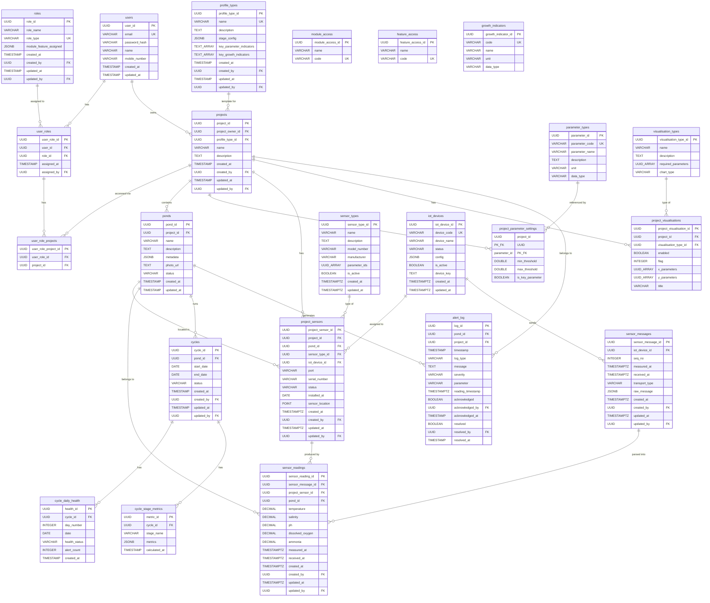

# AquaShield Monitoring v2 — Overall ERD Diagram

---

## All Tables (23 tables)

### 1. User & Access Control (6 tables)

```
┌─────────────────────────────┐
│           users             │
├─────────────────────────────┤
│ PK  user_id          UUID   │
│     email          VARCHAR  │ UNIQUE
│     password_hash  VARCHAR  │
│     name           VARCHAR  │
│     mobile_number  VARCHAR  │
│     created_at   TIMESTAMP  │
│     updated_at   TIMESTAMP  │
└─────────────────────────────┘

┌─────────────────────────────┐
│           roles             │
├─────────────────────────────┤
│ PK  role_id          UUID   │
│     role_name      VARCHAR  │
│     role_type      VARCHAR  │ UNIQUE
│     module_feature_assigned JSONB│
│     created_at   TIMESTAMP  │
│ FK  created_by       UUID   │ → users
│     updated_at   TIMESTAMP  │
│ FK  updated_by       UUID   │ → users
└─────────────────────────────┘

┌─────────────────────────────┐
│         user_roles          │
├─────────────────────────────┤
│ PK  user_role_id     UUID   │
│ FK  user_id          UUID   │ → users
│ FK  role_id          UUID   │ → roles
│     assigned_at  TIMESTAMP  │
│ FK  assigned_by      UUID   │ → users
└─────────────────────────────┘

┌──────────────────────────────┐
│     user_role_projects       │
├──────────────────────────────┤
│ PK  user_role_project_id UUID│
│ FK  user_role_id      UUID   │ → user_roles
│ FK  project_id        UUID   │ → projects
└──────────────────────────────┘

┌─────────────────────────────┐
│       module_access         │
├─────────────────────────────┤
│ PK  module_access_id UUID   │
│     name           VARCHAR  │
│     code           VARCHAR  │ UNIQUE
└─────────────────────────────┘

┌─────────────────────────────┐
│      feature_access         │
├─────────────────────────────┤
│ PK  feature_access_id UUID  │
│     name           VARCHAR  │
│     code           VARCHAR  │ UNIQUE
└─────────────────────────────┘
```

> `module_access` and `feature_access` are independent reference tables. No FK between them. `roles.module_feature_assigned` JSONB references codes from both.

---

### 2. Profile & Project (4 tables)

```
┌──────────────────────────────────┐
│          profile_types           │
├──────────────────────────────────┤
│ PK  profile_type_id       UUID   │
│     code                VARCHAR  │ UNIQUE
│     name                VARCHAR  │
│     description            TEXT  │
│     stage_config           JSONB │
│     key_parameter_indicators TEXT[]│
│     key_growth_indicators  TEXT[] │
│     created_at         TIMESTAMP │
│ FK  created_by             UUID  │ → users
│     updated_at         TIMESTAMP │
│ FK  updated_by             UUID  │ → users
└──────────────────────────────────┘

┌──────────────────────────────────┐
│           projects               │
├──────────────────────────────────┤
│ PK  project_id             UUID  │
│ FK  project_owner_id          UUID  │ → users
│ FK  profile_type_id        UUID  │ → profile_types
│     name                VARCHAR  │
│     description            TEXT  │
│     created_at         TIMESTAMP │
│ FK  created_by             UUID  │ → users
│     updated_at         TIMESTAMP │
│ FK  updated_by             UUID  │ → users
└──────────────────────────────────┘

┌──────────────────────────────────┐
│             ponds                │
├──────────────────────────────────┤
│ PK  pond_id                UUID  │
│ FK  project_id             UUID  │ → projects
│     name                VARCHAR  │
│     description            TEXT  │
│     metadata               JSONB │
│     photo_url               TEXT │
│     status              VARCHAR  │
│     created_at         TIMESTAMP │
│     updated_at         TIMESTAMP │
└──────────────────────────────────┘

┌──────────────────────────────────┐
│   project_parameter_settings     │
├──────────────────────────────────┤
│ PK,FK  project_id          UUID  │ → projects
│ PK,FK  parameter_id        UUID  │ → parameter_types
│     min_threshold   DOUBLE PREC  │
│     max_threshold   DOUBLE PREC  │
│     is_key_parameter    BOOLEAN  │
└──────────────────────────────────┘
```

---

### 3. Parameter Types & Growth Indicators (2 reference tables)

```
┌──────────────────────────────────┐
│        parameter_types           │
├──────────────────────────────────┤
│ PK  parameter_id           UUID  │
│     parameter_code       VARCHAR │ UNIQUE
│     parameter_name       VARCHAR │
│     description            TEXT  │
│     unit                VARCHAR  │
│     data_type           VARCHAR  │
└──────────────────────────────────┘

┌──────────────────────────────────┐
│       growth_indicators          │
├──────────────────────────────────┤
│ PK  growth_indicator_id    UUID  │
│     code                VARCHAR  │ UNIQUE
│     name                VARCHAR  │
│     unit                VARCHAR  │
│     data_type           VARCHAR  │
└──────────────────────────────────┘
```

---

### 4. Sensors & IoT (3 tables)

```
┌──────────────────────────────────┐
│          iot_devices             │
├──────────────────────────────────┤
│ PK  iot_device_id          UUID  │
│     device_code          VARCHAR │ UNIQUE
│     device_name          VARCHAR │
│     status               VARCHAR │
│     config                 JSONB │
│     is_active            BOOLEAN │
│     device_key              TEXT │
│     created_at       TIMESTAMPTZ │
│     updated_at       TIMESTAMPTZ │
└──────────────────────────────────┘

┌──────────────────────────────────┐
│         sensor_types             │
├──────────────────────────────────┤
│ PK  sensor_type_id         UUID  │
│     name                VARCHAR  │
│     description            TEXT  │
│     model_number        VARCHAR  │
│     manufacturer        VARCHAR  │
│     parameter_ids        UUID[]  │
│     is_active            BOOLEAN │
│     created_at       TIMESTAMPTZ │
│     updated_at       TIMESTAMPTZ │
└──────────────────────────────────┘

┌──────────────────────────────────┐
│        project_sensors           │
├──────────────────────────────────┤
│ PK  project_sensor_id     UUID   │
│ FK  project_id             UUID  │ → projects
│ FK  pond_id                UUID  │ → ponds
│ FK  sensor_type_id         UUID  │ → sensor_types
│ FK  iot_device_id          UUID  │ → iot_devices
│     port                VARCHAR  │
│     serial_number       VARCHAR  │
│     status              VARCHAR  │
│     installed_at           DATE  │
│     sensor_location       POINT  │
│     created_at       TIMESTAMPTZ │
│ FK  created_by             UUID  │ → users
│     updated_at       TIMESTAMPTZ │
│ FK  updated_by             UUID  │ → users
└──────────────────────────────────┘
```

---

### 5. Sensor Data (2 tables)

```
┌──────────────────────────────────┐
│        sensor_messages           │
├──────────────────────────────────┤
│ PK  sensor_message_id      UUID  │
│ FK  iot_device_id          UUID  │ → iot_devices
│     seq_no              INTEGER  │
│     measured_at      TIMESTAMPTZ │
│     received_at      TIMESTAMPTZ │
│     transport_type      VARCHAR  │
│     raw_message            JSONB │
│     created_at       TIMESTAMPTZ │
│ FK  created_by             UUID  │ → users
│     updated_at       TIMESTAMPTZ │
│ FK  updated_by             UUID  │ → users
└──────────────────────────────────┘

┌──────────────────────────────────┐
│        sensor_readings           │
├──────────────────────────────────┤
│ PK  sensor_reading_id      UUID  │
│ FK  sensor_message_id      UUID  │ → sensor_messages
│ FK  project_sensor_id      UUID  │ → project_sensors
│ FK  pond_id                UUID  │ → ponds
│     temperature          DECIMAL │
│     salinity             DECIMAL │
│     ph                   DECIMAL │
│     water_level          DECIMAL │
│     dissolved_oxygen     DECIMAL │
│     turbidity            DECIMAL │
│     nitrate              DECIMAL │
│     nitrite              DECIMAL │
│     ammonia              DECIMAL │
│     ammonium             DECIMAL │
│     ph_lab               DECIMAL │
│     carbonate            DECIMAL │
│     bicarbonate          DECIMAL │
│     tan                  DECIMAL │
│     alkalinity           DECIMAL │
│     calcium              DECIMAL │
│     magnesium            DECIMAL │
│     phosphate            DECIMAL │
│     total_hardness       DECIMAL │
│     hydrogen_sulfide     DECIMAL │
│     total_vibrio_count   DECIMAL │
│     total_bacteria_count DECIMAL │
│     measured_at      TIMESTAMPTZ │
│     received_at      TIMESTAMPTZ │
│     created_at       TIMESTAMPTZ │
│ FK  created_by             UUID  │ → users
│     updated_at       TIMESTAMPTZ │
│ FK  updated_by             UUID  │ → users
└──────────────────────────────────┘
```

---

### 6. Growth Cycles (3 tables)

```
┌──────────────────────────────────┐
│            cycles                │
├──────────────────────────────────┤
│ PK  cycle_id               UUID  │
│ FK  pond_id                UUID  │ → ponds
│     start_date             DATE  │
│     end_date               DATE  │ NULL = ongoing
│     status              VARCHAR  │
│     created_at         TIMESTAMP │
│ FK  created_by             UUID  │ → users
│     updated_at         TIMESTAMP │
│ FK  updated_by             UUID  │ → users
└──────────────────────────────────┘

┌──────────────────────────────────┐
│       cycle_daily_health         │
├──────────────────────────────────┤
│ PK  health_id              UUID  │
│ FK  cycle_id               UUID  │ → cycles
│     day_number          INTEGER  │
│     date                   DATE  │
│     health_status       VARCHAR  │
│     alert_count         INTEGER  │
│     created_at         TIMESTAMP │
└──────────────────────────────────┘

┌──────────────────────────────────┐
│      cycle_stage_metrics         │
├──────────────────────────────────┤
│ PK  metric_id              UUID  │
│ FK  cycle_id               UUID  │ → cycles
│     stage_name          VARCHAR  │
│     metrics                JSONB │
│     calculated_at      TIMESTAMP │
└──────────────────────────────────┘
```

---

### 7. Visualisations (2 tables)

```
┌──────────────────────────────────┐
│      visualisation_types         │
├──────────────────────────────────┤
│ PK  visualisation_type_id  UUID  │
│     name                VARCHAR  │
│     description            TEXT  │
│     required_parameters  UUID[]  │
│     chart_type          VARCHAR  │
└──────────────────────────────────┘

┌──────────────────────────────────┐
│     project_visualisations       │
├──────────────────────────────────┤
│ PK  project_visualisation_id UUID│
│ FK  project_id             UUID  │ → projects
│ FK  visualisation_type_id  UUID  │ → visualisation_types
│     enabled              BOOLEAN │
│     flag                INTEGER  │
│     x_parameters          UUID[] │
│     y_parameters          UUID[] │
│     title               VARCHAR  │
└──────────────────────────────────┘
```

---

### 8. Alerts (1 table)

```
┌──────────────────────────────────┐
│           alert_log              │
├──────────────────────────────────┤
│ PK  log_id                 UUID  │
│ FK  pond_id                UUID  │ → ponds
│ FK  project_id             UUID  │ → projects
│     timestamp          TIMESTAMP │
│     log_type            VARCHAR  │
│     message                TEXT  │
│     severity            VARCHAR  │
│     parameter           VARCHAR  │
│     reading_timestamp TIMESTAMPTZ│
│     acknowledged        BOOLEAN  │
│ FK  acknowledged_by        UUID  │ → users
│     acknowledged_at    TIMESTAMP │
│     resolved            BOOLEAN  │
│ FK  resolved_by            UUID  │ → users
│     resolved_at        TIMESTAMP │
└──────────────────────────────────┘

```

---

## ERD Relationship Diagram (Mermaid)

> Paste this into [mermaid.live](https://mermaid.live) or draw.io (Extras → Edit Diagram → Mermaid) to render a proper visual ERD.



> **Note on `sensor_readings`:** Only key columns shown in Mermaid diagram. Full table has 22 parameter columns (temperature, salinity, ph, water_level, dissolved_oxygen, turbidity, nitrate, nitrite, ammonia, ammonium, ph_lab, carbonate, bicarbonate, tan, alkalinity, calcium, magnesium, phosphate, total_hardness, hydrogen_sulfide, total_vibrio_count, total_bacteria_count).

---

## Table Summary

| # | Table | Type | Category | Status |
|---|-------|------|----------|--------|
| 1 | `users` | Entity | User & Access | Refined |
| 2 | `roles` | Entity | User & Access | Refined (was `role_types`) |
| 3 | `user_roles` | Junction | User & Access | NEW |
| 4 | `user_role_projects` | Junction | User & Access | NEW |
| 5 | `module_access` | Reference | User & Access | NEW |
| 6 | `feature_access` | Reference | User & Access | NEW |
| 7 | `profile_types` | Entity | Profile & Project | Refined |
| 8 | `projects` | Entity | Profile & Project | Refined |
| 9 | `ponds` | Entity | Profile & Project | Refined |
| 10 | `project_parameter_settings` | Junction | Profile & Project | Refined (was `project_parameter_thresholds`) |
| 11 | `parameter_types` | Reference | Parameters | Refined |
| 12 | `growth_indicators` | Reference | Parameters | NEW |
| 13 | `sensor_types` | Entity | Sensors & IoT | Unchanged |
| 14 | `iot_devices` | Entity | Sensors & IoT | Unchanged |
| 15 | `project_sensors` | Entity | Sensors & IoT | Refined |
| 16 | `sensor_messages` | Entity | Sensor Data | Unchanged |
| 17 | `sensor_readings` | Entity | Sensor Data | Unchanged |
| 18 | `cycles` | Entity | Growth Cycles | Refined |
| 19 | `cycle_daily_health` | Entity | Growth Cycles | Unchanged |
| 20 | `cycle_stage_metrics` | Entity | Growth Cycles | Refined |
| 21 | `visualisation_types` | Entity | Visualisations | Unchanged |
| 22 | `project_visualisations` | Entity | Visualisations | Unchanged |
| 23 | `alert_log` | Entity | Alerts | Unchanged |

---

## Dropped Tables

| Table | Reason |
|-------|--------|
| `roles` (old) | Replaced by `roles` (new) + `user_roles` + `user_role_projects` |
| `sensors` (legacy) | Replaced by `project_sensors` |
| `alerts` (legacy) | Replaced by `alert_log` |

---

## All Relationships (FK Summary)

| From | Column | To | On Delete |
|------|--------|----|-----------|
| `roles` | `created_by` | `users` | |
| `roles` | `updated_by` | `users` | |
| `user_roles` | `user_id` | `users` | CASCADE |
| `user_roles` | `role_id` | `roles` | RESTRICT |
| `user_roles` | `assigned_by` | `users` | |
| `user_role_projects` | `user_role_id` | `user_roles` | CASCADE |
| `user_role_projects` | `project_id` | `projects` | CASCADE |
| `profile_types` | `created_by` | `users` | |
| `profile_types` | `updated_by` | `users` | |
| `projects` | `project_owner_id` | `users` | |
| `projects` | `profile_type_id` | `profile_types` | |
| `projects` | `created_by` | `users` | |
| `projects` | `updated_by` | `users` | |
| `ponds` | `project_id` | `projects` | CASCADE |
| `project_parameter_settings` | `project_id` | `projects` | CASCADE |
| `project_parameter_settings` | `parameter_id` | `parameter_types` | RESTRICT |
| `project_sensors` | `project_id` | `projects` | CASCADE |
| `project_sensors` | `pond_id` | `ponds` | RESTRICT |
| `project_sensors` | `sensor_type_id` | `sensor_types` | RESTRICT |
| `project_sensors` | `iot_device_id` | `iot_devices` | SET NULL |
| `project_sensors` | `created_by` | `users` | |
| `project_sensors` | `updated_by` | `users` | |
| `sensor_messages` | `iot_device_id` | `iot_devices` | CASCADE |
| `sensor_messages` | `created_by` | `users` | |
| `sensor_messages` | `updated_by` | `users` | |
| `sensor_readings` | `sensor_message_id` | `sensor_messages` | CASCADE |
| `sensor_readings` | `project_sensor_id` | `project_sensors` | RESTRICT |
| `sensor_readings` | `pond_id` | `ponds` | RESTRICT |
| `sensor_readings` | `created_by` | `users` | |
| `sensor_readings` | `updated_by` | `users` | |
| `cycles` | `pond_id` | `ponds` | CASCADE |
| `cycles` | `created_by` | `users` | |
| `cycles` | `updated_by` | `users` | |
| `cycle_daily_health` | `cycle_id` | `cycles` | CASCADE |
| `cycle_stage_metrics` | `cycle_id` | `cycles` | CASCADE |
| `project_visualisations` | `project_id` | `projects` | CASCADE |
| `project_visualisations` | `visualisation_type_id` | `visualisation_types` | |
| `alert_log` | `pond_id` | `ponds` | CASCADE |
| `alert_log` | `project_id` | `projects` | CASCADE |
| `alert_log` | `acknowledged_by` | `users` | |
| `alert_log` | `resolved_by` | `users` | |

---

## JSONB / Array References (non-FK, code-based)

| Table.Column | References codes from |
|---|---|
| `roles.module_feature_assigned.modules_access` | `module_access.code` |
| `roles.module_feature_assigned.features_access` | `feature_access.code` |
| `profile_types.key_parameter_indicators` (TEXT[]) | `parameter_types.parameter_code` |
| `profile_types.key_growth_indicators` (TEXT[]) | `growth_indicators.code` |
| `cycle_stage_metrics.metrics` (JSONB keys) | `growth_indicators.code` |
| `sensor_types.parameter_ids` (UUID[]) | `parameter_types.parameter_id` |
| `visualisation_types.required_parameters` (UUID[]) | `parameter_types.parameter_id` |
| `project_visualisations.x_parameters` (UUID[]) | `parameter_types.parameter_id` |
| `project_visualisations.y_parameters` (UUID[]) | `parameter_types.parameter_id` |

---

## Open Discussion Points for Satish

1. **`project_parameter_settings.is_key_parameter` vs `profile_types.key_parameter_indicators`** — overlap between project-level and profile-level key parameter definitions.
2. **`iot_devices.device_key`** — where does this key come from? Auto-generated, manufacturer-provided, or manually entered?
3. **Electricity consumption** — sensor_messages receives data continuously. Need to assess compute/cost implications.
4. **Use case diagram mismatch** — "View Sensor Types" and "View Project Sensors" labels are swapped in the diagram. To be refined.
5. **Email blur security** — login flow exposes user roles before password entry. Show role selection after password validation instead?

---

*Last updated: April 17, 2026*