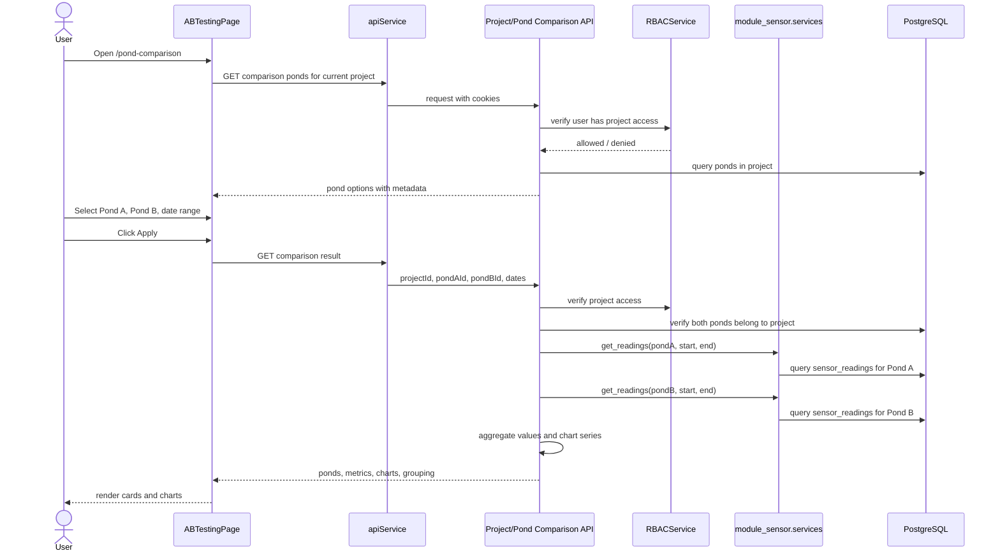

# Pond Comparison / A-B Testing - Overall Plan

## Purpose

Turn the current frontend-only Pond Comparison page into a backend-driven feature.

The frontend is already mostly shaped: users choose Pond A, Pond B, a date range, click Apply, then see metric cards and charts in either stacked or side-by-side mode. The missing part is the backend comparison API and the frontend integration that replaces the current hardcoded data.

This plan intentionally focuses on pond comparison only. It does not try to complete `module_pond`, `module_sensor`, or `module_project` redesign in the same pass.

## Current Reality

### Frontend

Relevant files:

- `frontend/src/pages/ABTestingPage.tsx`
- `frontend/src/components/ab-testing/ComparisonConfig.tsx`
- `frontend/src/components/ab-testing/PondSelector.tsx`
- `frontend/src/components/ab-testing/MetricCard.tsx`
- `frontend/src/components/ab-testing/MetricPair.tsx`
- `frontend/src/components/ab-testing/MetricGrid.tsx`
- `frontend/src/components/charts/ComparisonChart.tsx`
- `frontend/src/utils/abTesting.ts`
- `frontend/src/types/index.ts`

The page currently uses:

- Mock pond options.
- Mock chart series.
- Mock metric pairs.
- Local "draft" state for what the user is editing.
- Local "applied" state for what charts/cards display after Apply.
- `ComparisonChart` data points shaped as `{ label, seriesA, seriesB }`.
- `MetricPairResponse` shaped as `{ label, unit, treatmentValue, baselineValue }`.

This is a good UI shape. The backend should return data close to that shape so the frontend stays simple.

### Backend

Relevant current files:

- `backend/module_project/models.py`
- `backend/module_project/views.py`
- `backend/module_project/serializers.py`
- `backend/module_project/urls.py`
- `backend/module_sensor/models.py`
- `backend/module_sensor/services.py`
- `backend/module_chart/services/chart_service.py`
- `backend/module_user/services.py`

Current backend facts:

- `Pond` currently lives in `module_project`, not a separate `module_pond`.
- `ProjectViewSet` and `PondViewSet` already enforce project access through `RBACService.get_user_project_ids()`.
- `module_sensor.services.get_readings()` already reads normalized rows from `sensor_readings` by `pond_id` and date range.
- `ChartService` already contains useful grouping helpers for hourly/daily/weekly/monthly aggregation.
- Feature access already has `view_pond_comparison`.
- User access is now direct via `user_projects`; old references to `user_roles` and `user_role_projects` in archive docs are stale.

### Local Data Snapshot

Read-only local database check on 2026-05-18:

| Table | Count |
|---|---:|
| `projects` | 3 |
| `ponds` | 16 |
| `project_sensors` | 2 |
| `sensor_types` | 1 |
| `sensor_messages` | 126 |
| `sensor_readings` | 185 |

Project distribution:

| Project | Profile | Ponds |
|---|---|---:|
| Demo Shrimp Farm | shrimp | 5 |
| Demo Fish Farm | fish | 6 |
| Demo Crab Hatchery | crab_hatchery | 5 |

Only two ponds currently have `project_sensors` and `sensor_readings`:

- Demo Shrimp Farm / Pond A
- Demo Shrimp Farm / Pond B

Currently populated reading columns are mostly:

- `temperature`
- `ph`
- `salinity`
- `dissolved_oxygen`

Current UI metrics that are not meaningfully populated yet:

- `ammonium`
- `turbidity`
- `electricity`

So phase 1 should support the real populated parameters first, while designing the contract so ammonium/turbidity/electricity can be enabled once data exists.

## Updated Flow

The old archive sequence assumed role tables and a future `module_pond`. The current flow should be:



## Proposed API Shape

Keep API under the project boundary for now because project access is already centralized there.

### 1. Pond Options

`GET /api/projects/{projectId}/pond-comparison/ponds`

Purpose:

- Populate Pond A and Pond B dropdowns.
- Return enough metadata to render the details cards without extra pond-detail calls.

Response:

```json
{
  "projectId": "uuid",
  "ponds": [
    {
      "pondId": "uuid",
      "name": "Pond A",
      "companyName": "AquaTech Farms",
      "gpsLocation": "1.40194 N, 103.95197 E",
      "treatmentStartDate": null,
      "hasSensorData": true,
      "firstReadingAt": "2026-01-01T08:00:00+08:00",
      "lastReadingAt": "2026-03-18T15:56:00+08:00"
    }
  ]
}
```

### 2. Comparison Result

`GET /api/projects/{projectId}/pond-comparison`

Query params:

- `pondAId`
- `pondBId`
- `startDate`
- `endDate`
- `grouping=auto|hourly|daily|weekly|monthly`
- optional later: `parameters=temperature,ph,dissolved_oxygen`

Response:

```json
{
  "projectId": "uuid",
  "pondA": { "pondId": "uuid", "name": "Pond A" },
  "pondB": { "pondId": "uuid", "name": "Pond B" },
  "dateRange": {
    "startDate": "2026-01-01",
    "endDate": "2026-03-18",
    "grouping": "daily"
  },
  "metrics": [
    {
      "parameter": "dissolved_oxygen",
      "label": "Dissolved O2",
      "unit": "mg/L",
      "treatmentValue": 16.58,
      "baselineValue": 42.61,
      "difference": -26.03,
      "percentDifference": -61,
      "lowerIsBetter": false
    }
  ],
  "charts": [
    {
      "parameter": "dissolved_oxygen",
      "title": "Dissolved Oxygen (DO)",
      "unit": "mg/L",
      "variant": "line",
      "data": [
        { "label": "Jan 01", "seriesA": 5.12, "seriesB": 6.01 }
      ]
    }
  ]
}
```

Naming note:

- The UI currently calls Pond A "treatment" and Pond B "baseline".
- The backend should not assume Pond A is always chemically treated unless we later add treatment configuration.
- For phase 1, treat them as two selected ponds. Keep response fields as `treatmentValue` and `baselineValue` only because the current frontend type uses those names.

## Feature Boundary

Phase 1 should not create a full A/B experiment management system.

Do now:

- Compare any two accessible ponds inside the same accessible project.
- Read existing `sensor_readings`.
- Aggregate values per parameter and time bucket.
- Return frontend-ready metric and chart data.
- Enforce project access.

Do later:

- Store formal treatment/control pairing.
- Store treatment start date as first-class data.
- Add manual/electricity readings.
- Split `module_pond` from `module_project`.
- Clean up `module_sensor` ownership and model mismatches.

## Engineering Decisions

1. Keep calculation in backend.
   Frontend should not average raw sensor readings or decide grouping rules.

2. Reuse `get_readings()` and `ChartService` grouping logic.
   Avoid writing a second raw SQL path in phase 1 unless performance forces it.

3. Put the endpoint under `ProjectViewSet`.
   It already has `get_object()` project access filtering. That is safer than a global `/ponds/compare` endpoint.

4. Use `view_pond_comparison` feature access in addition to project access.
   Project access answers "which farm data can this user see". Feature access answers "can this user use this page".

5. Keep response stable for frontend.
   The UI should receive `ponds`, `metrics`, and `charts`, not raw readings.

6. Do not block on `module_pond`.
   `module_pond` is architecturally correct, but this feature can ship using current `module_project.Pond`.

## Phase Plan

| Phase | Goal | Output |
|---|---|---|
| Phase 1 | Backend read API | Pond options endpoint + comparison endpoint using current tables |
| Phase 2 | Frontend integration | Replace mock data with API calls and loading/error/empty states |
| Phase 3 | Data quality and parameter refinement | Better parameter config, missing-data handling, optional seeded demo data |
| Phase 4 | Tests and production hardening | Backend tests, frontend smoke/tests, performance checks |
| Phase 5 | Future architecture cleanup | Split `module_pond`, consolidate sensor model, add formal experiment/treatment data |

## Open Questions

1. Is "Pond A" always the treated pond, or just the first selected pond?
2. Where should treatment start date live before `module_pond` exists: `ponds.metadata.treatment_start_date`, a temporary comparison config table, or not shown until formal treatment data exists?
3. Should phase 1 hide parameters with no data, or show them as "No data"?
4. Should comparison allow ponds from different projects? Current recommendation: no, only same project.
5. Should "electricity" be part of phase 1? Current recommendation: no, unless we add a real source table or manual readings.
6. Should `ParameterType` model be corrected now? The database uses `parameter_code` and `parameter_name`; the current Django model expects `name`. This is a risk if comparison logic relies on `ParameterType` ORM.

## Source References Read

- `archive/sequence_diagram/pond_comparison/ab_testing.md`
- `archive/pond_comparison_diagrams/pond_comparison_sequence.md`
- `archive/pond_comparison_diagrams/pond_comparison_activity.md`
- `archive/pond_comparison_api_docs/openapi.yaml`
- `archive/A_B_TESTING.md`
- `archive/a_b_testing_configuration.md`
- `archive/resuable_chart_a_b_testing.md`
- `archive/class_and_arch_diagram_refinement/class_2_module_project.md`
- `archive/class_and_arch_diagram_refinement/class_3_module_pond.md`
- `archive/class_and_arch_diagram_refinement/class_4_module_sensor.md`
- Current frontend and backend files listed above.
