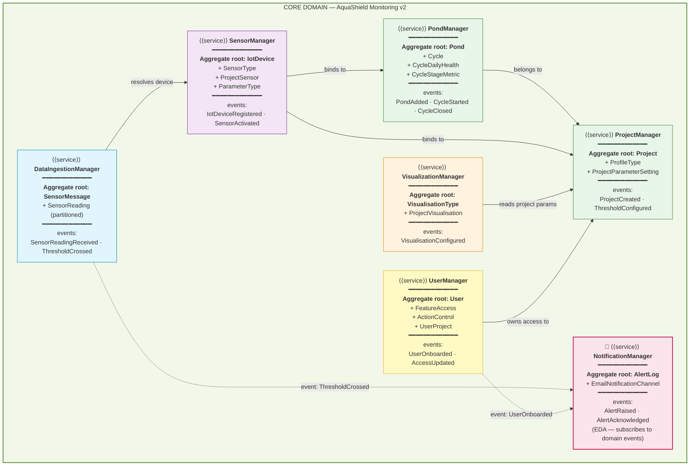

# Slide 10 — Microservices via DDD (Modular Monolith with Bounded Contexts)

> **📌 PPTX generation note:** All Mermaid diagrams in this file should be **left as empty placeholders** in the generated slide. The presenter will screenshot the rendered Mermaid output and insert each image manually.

**Time budget:** 2 minutes.
**Audience:** MTech academic panel.
**Framing:** the teacher pushes for microservices; the team chose a **modular monolith** with strict **Domain-Driven Design** boundaries. Each module is a bounded context with its own aggregate root and domain events. **NotificationManager** uses **Event-Driven Architecture** so it stays decoupled from the producers.

---

## Slide content (what appears on the slide)

### Title
**Bounded Contexts via DDD — Seven Services in One Runtime**

### Sub-title / framing line

*A modular monolith on Django: each module is a bounded context with its own aggregate root, domain events, and clear interface — same separation as microservices, without the operational cost of running seven independent services.*

---

### Body Part 1 · Service catalog *(table)*

| `<<service>>` | Aggregate root | Entities in the aggregate | Domain events emitted |
|---|---|---|---|
| **UserManager** | `User` | `FeatureAccess` · `ActionControl` · `UserProject` | `UserOnboarded` · `UserAccessUpdated` · `UserDeactivated` |
| **ProjectManager** | `Project` | `ProfileType` · `ProjectParameterSetting` | `ProjectCreated` · `ThresholdConfigured` |
| **PondManager** | `Pond` | `Cycle` · `CycleDailyHealth` · `CycleStageMetric` | `PondAdded` · `CycleStarted` · `CycleStageAdvanced` · `CycleClosed` |
| **SensorManager** | `IotDevice` | `SensorType` · `ProjectSensor` · `ParameterType` | `IotDeviceRegistered` · `SensorActivated` · `SensorDeactivated` |
| **DataIngestionManager** | `SensorMessage` | `SensorReading` *(partitioned)* | `SensorReadingReceived` · `ThresholdCrossed` |
| **VisualizationManager** | `VisualisationType` | `ProjectVisualisation` | `VisualisationConfigured` |
| **📢 NotificationManager** *(EDA)* | `AlertLog` | `EmailNotificationChannel` | `AlertRaised` · `AlertAcknowledged` · `NotificationDelivered` |

---

### Body Part 2 · Bounded Context Map *(Mermaid — follows the reference DDD layout)*

### Caption under diagram (one line)

*Solid arrows = synchronous calls (REST or in-process). Dashed arrows = domain events. NotificationManager never knows who produced an event — it just subscribes and sends email.*

---

## Speaker notes (≈ 90–120s — say out loud, don't put on slide)

> "Microservices is a structural question, not just a technology choice. With our team size, running seven independent services in production isn't realistic — but the *separation of concerns* that microservices give you is still valuable.

> So we took the middle road: a **modular monolith**, with **Domain-Driven Design** as the discipline that enforces the boundaries.

> Each box on the diagram is a `<<service>>`. It has an **aggregate root entity** — the only entity that other contexts are allowed to reference. The other entities inside the aggregate are *internal* — they're owned by the root and never reached into from outside.

> Concretely:
> - **UserManager** — aggregate root is `User`. FeatureAccess, ActionControl, and UserProject live inside that aggregate.
> - **ProjectManager** — root is `Project`. ProfileType, ParameterType, and threshold settings are inside.
> - **PondManager** — root is `Pond`. Cycle, daily-health logs, and stage metrics belong to a pond.
> - **SensorManager** — root is `IotDevice`. Sensor types and the project-sensor binding live around it.
> - **DataIngestionManager** — root is `SensorMessage`. SensorReading is the partitioned downstream table that feeds the dashboard. This is where `SensorReadingReceived` and `ThresholdCrossed` are emitted.
> - **VisualizationManager** — root is `VisualisationType`, with per-project configurations.

> The one that follows **Event-Driven Architecture** explicitly is **NotificationManager**. It doesn't *call* anyone. It *subscribes* to domain events — `ThresholdCrossed` from DataIngestionManager, `UserOnboarded` from UserManager — and reacts by raising an alert and sending it via the **email notification channel**.

> The key engineering point: this same architecture **cleanly extracts to microservices later** if scale demands it. Each bounded context already owns its data, speaks events, and has a stable interface. Migrating one module to its own service is a deployment change, not a redesign."

---

## Notes for the panel (if asked)

- *Why not actual microservices?* — Seven services in production means seven runtimes, seven CI pipelines, seven on-call rotations, seven network-failure modes. The cost is in *operations*, not in code structure. Django modules give the code-structure benefit without the operational cost.
- *How are domain events implemented?* — Two transports. **In-process** events use Django's signal system (synchronous, in the same request). **WebSocket fan-out** for live readings uses Channels group pub/sub backed by Redis. Alert emails go through the email notification channel.
- *What stops one bounded context from reaching into another's tables?* — Discipline: code review enforces the module-namespace boundary. Each module exposes only its serializers and service-layer functions; direct ORM access across modules is flagged in review.
- *Why is NotificationManager the only EDA service?* — Notifications are *naturally pub/sub* — many producers, one consumer concern. The other modules use synchronous request/response because the caller needs the result immediately (e.g. `POST /users` needs to return the new user). The architecture supports EDA everywhere; we just don't need it everywhere.

---

*Last updated: 2026-05-20*
