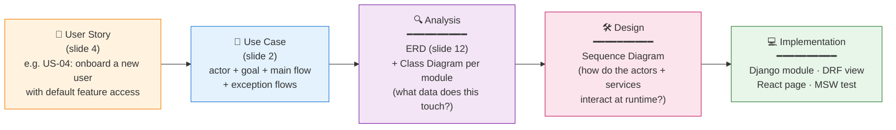

# Slide 11 — Software Design (Use Case → Analysis → Design Transition)

**Time budget:** 1 minute.
**Audience:** MTech academic panel.
**Framing:** show the *methodology* — every user story from slide 4 traces through use-case ⇒ analysis (ERD + class diagram) ⇒ design (sequence diagram). Use one or two of the existing sequence diagrams as the worked example.

> **📌 PPTX generation note:** All Mermaid diagrams in this file should be **left as empty placeholders** in the generated slide. The presenter will screenshot the rendered Mermaid output and insert each image manually.

---

## Slide content (what appears on the slide)

### Title
**From User Story to Sequence — Software Design Methodology**

### Sub-title

*Every user story on slide 4 is traced through three artefacts: the use case (who · what · why), the analysis model (ERD + class diagram → what data), and the design (sequence diagram → how the runtime executes).*

---

### Body Part 1 · The transition pipeline *(Mermaid)*

---

### Body Part 2 · Worked examples (sequence diagram catalog)

| Bounded context | Sequence diagrams *(under `archive/sequence_diagram/`)* | Traces back to |
|---|---|---|
| **UserManager** (`user_module/`) | `1_login.md` · `2_update_profile.md` · `3_onboard_user.md` · `4_manage_user_access.md` · `5_security_controls.md` | US-01 → US-07 |
| **ProfileType** *(template)* (`profile_module/`) | `1_manage_profile_type.md` | US-32 |
| **ProjectManager** *(instance · 1:1 with profile type)* (`project_module/`) | `1_manage_project.md` | US-33 · US-35 · US-36 |
| **SensorManager + Parameter Catalogue** (`sensor_management/`) | `1_manage_sensor_and_parameter_type.md` | US-17 · US-18 · US-35 |
| **PondManager — Pond Comparison** (`pond_comparison/`) | `ab_testing.md` | US-11 · US-12 |

---

### Body Part 3 · Anatomy of a sequence diagram — what's in every file

Each sequence diagram in `archive/sequence_diagram/` follows the **same five-section template** so the panel can read any one of them with no extra context:

1. **Title + one-line summary** — actor + goal in one sentence.
2. **Mermaid sequence block** — `actor` · `participant`s (one per bounded context) · `DB` lifeline · `alt` blocks for validation and error paths.
3. **Tables Involved** — small table mapping each `DB` interaction to the underlying SQL table + operation (`create` / `read` / `update`).
4. **API Endpoints** — small table mapping every arrow that crosses a service boundary to its REST route + HTTP method.
5. **Notes** — captures business rules, constraints, and design decisions that aren't visible in the arrows (e.g. "1:1 relationship", "transactional create", "composite primary key", "deletion intentionally absent").

### Visual suggestion

- A single horizontal arrow from **User Story** through to **Implementation**, with each artefact as a coloured pill.
- Below the arrow, a strip of small icons referencing the 5 sequence-diagram folders (`user_module`, `profile_module`, `project_module`, `sensor_management`, `pond_comparison`).
- If space allows, embed one full sequence diagram on the side as a worked example — `archive/sequence_diagram/user_module/3_onboard_user.md` is the most readable showcase (3 services, parallel reference-catalog fetch, transactional insert, error branch).

---

## Speaker notes (≈ 60s — say out loud, don't put on slide)

> "Every user story on the backlog slide traces through three design artefacts before it becomes code.

> **First — the use case.** Who's the actor, what's the goal, what are the main and exception flows. You saw that on slide 2.

> **Second — analysis.** The ERD tells me which tables the use case touches; the class diagram tells me which bounded context owns those tables. You'll see both on the next slide.

> **Third — design.** The **sequence diagram** is where I tie the use case to the analysis. It shows the actor, the bounded contexts the request flows through, the database hops, and the validation branches.

> Every sequence diagram in the repo follows the **same five-section template** — title, Mermaid block, tables involved, API endpoints, and design notes — so any single diagram is self-contained.

> I'll point at two on screen during the demo: **`3_onboard_user.md`** shows a transactional admin flow with parallel reference-catalog fetches; **`pond_comparison/ab_testing.md`** shows the multi-phase Pond Comparison flow across four bounded contexts. Both are reproducible from the user stories in slide 4."

---

## Notes for the panel (if asked)

- *How do you keep the sequence diagrams in sync with the implementation?* — They live in `archive/sequence_diagram/` next to the ERD and class-diagram artefacts. The `Notes` section at the bottom of each file captures the *invariants* — the business rules that the implementation must preserve. When code changes, the test for "did the design drift?" is whether the Notes section still describes the runtime.
- *Why split profile and project into two diagrams when they're 1:1?* — The profile type is the **template** (the *shape* — stage timeline + key indicators). The project is the **instance** (the *content* — pond list + thresholds + owner). Conflating them in one diagram hides the template/instance distinction that drives BioBloc's multi-profile story.
- *Why one combined diagram for sensor type + parameter type?* — They share a single admin page (two tabs), and one cites the other (`sensor_types.parameter_ids` references `parameter_types`). Splitting them into two diagrams would duplicate the form-open / save flow on both sides.
- *What does the Notes section of each sequence diagram capture?* — Anything that's true at design time but not visible in arrows: 1:1 vs 1:N relationships, composite primary keys, transactional boundaries, why deletion is or isn't exposed, wire-format decisions (camelCase vs snake_case), JSONB shapes.

---

*Last updated: 2026-05-20*
