# Slide 13 — CI/CD Pipeline (SAST · DAST · Unit · E2E · Load · Stress)

> **📌 PPTX generation note:** All Mermaid diagrams in this file should be **left as empty placeholders** in the generated slide. The presenter will screenshot the rendered Mermaid output and insert each image manually.

**Time budget:** 1 minute (flex up to 90s with the diagram).
**Audience:** MTech academic panel.
**Framing:** show the full **CI → CD** lifecycle on one slide, **for both frontend and backend in parallel lanes**. Highlight where each consultant-named stage lives — SAST, DAST, Unit Testing, Load + Stress Testing.

---

## Slide content (what appears on the slide)

### Title
**CI/CD — Two Lanes, Nine + Seven Stages, From `git push` to Live Revision**

### Body Part 1 · Pipeline diagram *(Mermaid)*

```mermaid
flowchart TB
    PUSH["👤 Developer<br/>git push origin dev"]
    FILTER{"path filter<br/>(GitHub Actions trigger)"}

    PUSH --> FILTER

    subgraph FE_CI["🎨 ci-frontend.yml  (9 stages)"]
        direction TB
        FE_TC["1 · Type check<br/>tsc --noEmit"]
        FE_LINT["2 · Lint<br/>eslint"]
        FE_UT["3 · 🟢 Unit Test<br/>vitest + coverage<br/>(103/103)"]
        FE_SAST["4 · 🔒 SAST<br/>Semgrep p/default + OWASP-10 + React<br/>SARIF artifact"]
        FE_SCA["5 · 📦 SCA<br/>npm audit · fail on high+"]
        FE_E2E["6 · 🧪 E2E<br/>Playwright · user-mgmt flows<br/>page.route mocks"]
        FE_DAST["7 · 🛡️ DAST<br/>OWASP ZAP baseline<br/>vs vite preview :5173"]
        FE_LOAD["8 · ⚡ Load<br/>k6 · 5 VUs · 30s<br/>p95<500ms · err<1%"]
        FE_STRESS["9 · 🔥 Stress<br/>k6 · ramp 10→30→60 VUs<br/>p95<4000ms · err<20%"]
        FE_TC --> FE_LINT --> FE_UT --> FE_SAST --> FE_SCA --> FE_E2E --> FE_DAST --> FE_LOAD --> FE_STRESS
    end

    subgraph BE_CI["⚙️ ci-backend.yml  (7 stages)"]
        direction TB
        BE_LINT["1 · Lint<br/>ruff"]
        BE_UT["2 · 🟢 Unit Test<br/>pytest + cov<br/>(Postgres service)"]
        BE_SAST["3 · 🔒 SAST<br/>bandit -lll<br/>(high-only)"]
        BE_SCA["4 · 📦 SCA<br/>pip-audit · fail on CVE"]
        BE_DAST["5 · 🛡️ DAST<br/>OWASP ZAP baseline<br/>vs Django dev server :8000"]
        BE_LOAD["6 · ⚡ Load<br/>k6 · 10 VUs · 30s<br/>p95<800ms · err<2%"]
        BE_STRESS["7 · 🔥 Stress<br/>k6 · ramp 20→50→100 VUs<br/>p95<6000ms · err<30%"]
        BE_LINT --> BE_UT --> BE_SAST --> BE_SCA --> BE_DAST --> BE_LOAD --> BE_STRESS
    end

    FILTER -->|"frontend/** changed"| FE_TC
    FILTER -->|"backend/** changed"| BE_LINT

    subgraph FE_CD["🎨 deploy-gcp-frontend.yml"]
        direction TB
        FE_BUILD["docker build<br/>(node multi-stage → nginx)"]
        FE_PUSHIMG["docker push<br/>asia-southeast1-docker.pkg.dev/.../frontend:sha"]
        FE_RUN["gcloud run deploy frontend-svc<br/>--image=:sha"]
        FE_BUILD --> FE_PUSHIMG --> FE_RUN
    end

    subgraph BE_CD["⚙️ deploy-gcp-backend.yml"]
        direction TB
        BE_BUILD["docker build<br/>(python:3.12-slim + gunicorn)"]
        BE_PUSHIMG["docker push<br/>asia-southeast1-docker.pkg.dev/.../backend:sha"]
        BE_RUN["gcloud run deploy backend-svc<br/>--add-cloudsql-instances<br/>--set-secrets"]
        BE_BUILD --> BE_PUSHIMG --> BE_RUN
    end

    FE_STRESS -->|all 9 green| FE_BUILD
    BE_STRESS -->|all 7 green| BE_BUILD

    FE_SVC["frontend-svc · Cloud Run<br/>revision n"]
    BE_SVC["backend-svc · Cloud Run<br/>revision n"]
    FE_RUN --> FE_SVC
    BE_RUN --> BE_SVC

    style PUSH fill:#fff3e0,stroke:#f57c00,stroke-width:2px
    style FE_CI fill:#e1f5fe,stroke:#0277bd,stroke-width:1px
    style BE_CI fill:#ede7f6,stroke:#5e35b1,stroke-width:1px
    style FE_CD fill:#e8f5e9,stroke:#2e7d32,stroke-width:1px
    style BE_CD fill:#c8e6c9,stroke:#388e3c,stroke-width:1px
    style FE_UT fill:#fff9c4,stroke:#f9a825
    style BE_UT fill:#fff9c4,stroke:#f9a825
    style FE_SAST fill:#ffebee,stroke:#c62828
    style BE_SAST fill:#ffebee,stroke:#c62828
    style FE_DAST fill:#ffe0b2,stroke:#e65100
    style BE_DAST fill:#ffe0b2,stroke:#e65100
    style FE_LOAD fill:#f3e5f5,stroke:#7b1fa2
    style FE_STRESS fill:#f3e5f5,stroke:#7b1fa2
    style BE_LOAD fill:#f3e5f5,stroke:#7b1fa2
    style BE_STRESS fill:#f3e5f5,stroke:#7b1fa2
```

### Body Part 2 · Consultant-named stages — what each one catches

| Stage | Frontend tool | Backend tool | What it proves |
|---|---|---|---|
| 🟢 **Unit Testing** | Vitest (RTL + MSW) | pytest (+ Postgres svc) | Logic + component correctness |
| 🧪 **E2E Testing** | Playwright | *— covered transitively* | Real-browser flow over user-mgmt scenarios |
| 🔒 **SAST** (static) | Semgrep · SARIF | bandit -lll | Source-code-level security findings |
| 📦 **SCA** (dependency) | `npm audit` · fail high+ | `pip-audit` · fail on CVE | Known CVEs in third-party packages |
| 🛡️ **DAST** (dynamic) | OWASP ZAP vs `vite preview` | OWASP ZAP vs Django dev server | Runtime security — missing headers, leaks, cookie attrs |
| ⚡ **Load** | k6 · 5 VUs / 30s | k6 · 10 VUs / 30s | Throughput + p95 under nominal traffic |
| 🔥 **Stress** | k6 · ramp 10→30→60 VUs | k6 · ramp 20→50→100 VUs | Saturation point — where p95 + error rate degrade |

### Caption under diagram (one line)

*Two independent lanes — every commit runs every stage on its side; CD fires only when the CI lane is fully green. The same image SHA flows from build → Artifact Registry → Cloud Run revision.*

---

## Speaker notes (≈ 75–90s — say out loud, don't put on slide)

> "The CI/CD pipeline runs in **two parallel lanes** — one for frontend, one for backend. Each lane has its own stages, its own deploy target, and its own image in Artifact Registry. A typo in a React component never triggers a Django rebuild, and vice versa.

> The frontend lane runs **nine CI stages**: typecheck with tsc, ESLint, Vitest unit tests, Semgrep for SAST with SARIF output, npm audit for SCA, Playwright end-to-end tests, OWASP ZAP baseline for DAST against `vite preview`, then k6 load and k6 stress against the same target.

> The backend lane runs **seven CI stages**: Ruff, pytest with a real Postgres service, bandit for SAST, pip-audit for SCA, ZAP against the Django dev server, and k6 load and stress.

> The four consultant-named stages — SAST, DAST, Unit, Load + Stress — are each represented on both sides. The thresholds differ — Django's dev server isn't built for high concurrency, so the stress thresholds are looser there than for nginx-served static SPA on the frontend side.

> Only when **all stages turn green** does the CD half fire — `docker build`, `docker push` to Artifact Registry, then `gcloud run deploy` rolls out a new Cloud Run revision tagged with the commit SHA. Backend deploy attaches the Cloud SQL connection and mounts the runtime secrets at boot."

---

## Notes for the panel (if asked)

- *Why split into two lanes instead of one combined pipeline?* — Lifecycle isolation. Each Cloud Run service has its own revisions; tying them to a combined CI means slower feedback and unnecessary rebuilds. Path-filtered triggers keep CI fast and blast radius small.
- *Why are DAST + load + stress in CI and not in CD?* — They're disposable-environment checks. ZAP against the live Cloud Run URL would pollute audit logs; k6 stress against the live URL is a self-DoS. The CI-spawned target lives for one job and dies with the runner.
- *Why is SCA red for high+ but SAST only red for HIGH severity (bandit `-lll`)?* — SCA findings are typically actionable (bump dependency). SAST findings on Python and JS are typically advisory or context-sensitive (asserts in tests, weak random in non-crypto contexts). Failing on HIGH-only catches real risks without burning developer time on noise.
- *What about Playwright E2E on the backend?* — Backend's `unit-test` job exercises the API end-to-end at the request/response level via DRF's test client. Browser-level E2E is the frontend lane's responsibility — its Playwright tests cover the full user-mgmt flows over the live frontend.
- *How do the k6 stress thresholds compare against industry?* — Loose. The intent is to **find** the saturation point, not enforce an SLO. A real prod deploy would tighten these once a baseline production load profile is known.

---

*Last updated: 2026-05-20*
