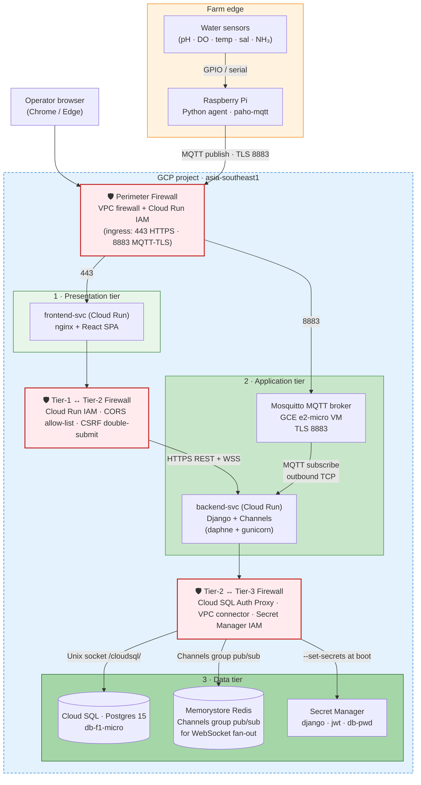

# Slide 8 — Diagrams: Physical & Logical Architecture

> **📌 PPTX generation note:** All Mermaid diagrams in this file should be **left as empty placeholders** in the generated slide. The presenter will screenshot the rendered Mermaid output and insert each image manually.

**Time budget:** 1 minute (flex up to 90s with both diagrams).
**Audience:** MTech academic panel.
**Framing:** two views of the same system — *logical* shows responsibilities and message flow; *physical* shows where each component runs on GCP, organised into a classic **three-tier architecture** with firewalls at every tier boundary. **Deployment / CI-CD lives on the next slide** — this slide is runtime-only.

---

## Slide content (what appears on the slide)

### Title
**Architecture — Logical View · Physical View (Three-Tier on GCP)**

### Layout — split slide

#### Left side · Logical View *(existing diagram)*

> **[INSERT logical architecture image — `presentation/AquaShield UML Diagrams-Architecture Diagram.drawio-2.png`]**
>
> Caption: *Responsibilities and message flow — frontend pages, REST endpoints, backend modules, MQTT pipeline, WebSocket broadcaster, database.*

#### Right side · Physical View — three-tier on GCP *(Mermaid)*

### Caption under physical diagram (one line)

*Three tiers, three firewall boundaries — perimeter at the public edge, tier-1↔tier-2 enforcing IAM + CORS + CSRF, tier-2↔tier-3 gating data access via Cloud SQL Auth Proxy and Secret Manager IAM.*

---

## Speaker notes (≈ 60–90s — say out loud, don't put on slide)

> "Two diagrams of the same system.

> **On the left — the logical view.** Frontend pages talk to the REST API; the API delegates to backend modules — Project, Notification, Chart, Pond, AI; the MQTT pipeline ingests sensor messages; the WebSocket broadcaster pushes live readings out to connected browsers; everything writes through to Postgres.

> **On the right — the physical view, a classic three-tier architecture on GCP with a firewall at every tier boundary.**

> Three firewalls. The **perimeter firewall** at the public edge only opens two ports — 443 for HTTPS and 8883 for MQTT-over-TLS. The **tier-1 to tier-2 firewall** is enforced by Cloud Run IAM, the CORS allow-list, and CSRF double-submit — that's the boundary the browser's API calls cross. The **tier-2 to tier-3 firewall** is enforced by the Cloud SQL Auth Proxy, the VPC connector for Memorystore, and Secret Manager IAM — the backend can read data only through credentials granted at boot.

> **Tier 1 — presentation** — is the `frontend-svc` Cloud Run service, nginx serving the React SPA.

> **Tier 2 — application** — splits between `backend-svc` on Cloud Run, which runs Django plus Channels, and **Mosquitto** on a small GCE e2-micro VM. We deliberately did *not* put the broker on Cloud Run because brokers need persistent TCP listeners.

> **Tier 3 — data** — is Cloud SQL Postgres for transactional data, **Memorystore Redis** for the Channels group pub/sub that fans live sensor readings out to every connected WebSocket client, and Secret Manager for the runtime secrets.

> The Raspberry Pi at the farm edge publishes MQTT-over-TLS to the broker through the perimeter firewall. The Django backend subscribes outbound to that same broker."

---

## Notes for the panel (if asked)

- *Why three firewalls instead of just a perimeter?* — Defence in depth. A perimeter alone fails open if any one Cloud Run service is mis-configured. With tier-boundary controls, even an attacker who gets onto the application tier still needs Cloud SQL Auth Proxy credentials and Secret Manager IAM bindings to reach the data tier.
- *Why is the MQTT broker on a VM and not on Cloud Run?* — Cloud Run is HTTPS-only and request-driven; an MQTT broker needs a persistent TCP listener and long-lived edge connections. Cloud Run can talk *to* a broker (outbound TCP works), but it can't *be* a broker.
- *What does Memorystore Redis actually do here?* — It's the **channel layer** for Django Channels. When a sensor reading lands in the MQTT adapter, it's published to a Redis group; every WebSocket consumer subscribed to that pond's group receives it and forwards it to the browser. Without Redis, multiple Cloud Run instances couldn't coordinate which clients to broadcast to.
- *How is the diagram different from production?* — Production runs on a single Azure VM with everything co-located. The GCP demo deliberately *decomposes* — separate services per concern — to demonstrate a more modern, cloud-native deployment pattern.

---

*Last updated: 2026-05-20*
