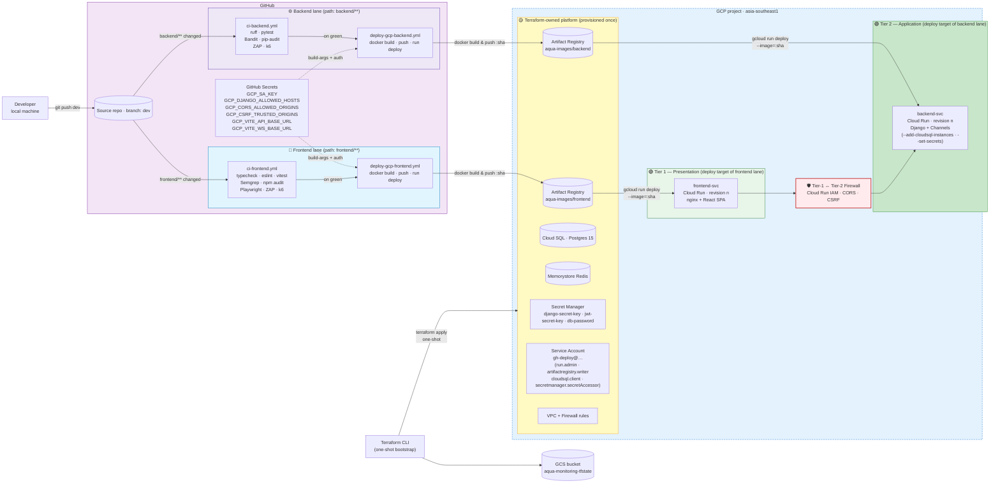

# Slide 9 — Deployment Diagram

> **📌 PPTX generation note:** All Mermaid diagrams in this file should be **left as empty placeholders** in the generated slide. The presenter will screenshot the rendered Mermaid output and insert each image manually.

**Time budget:** 1 minute.
**Audience:** MTech academic panel.
**Framing:** how code becomes a running revision on GCP. Two *parallel* pipeline lanes — one for the frontend, one for the backend — landing on two distinct Cloud Run services in two distinct tiers. The tier separation from the physical diagram (slide 8) is preserved here in the deployment view: each tier has its own image, its own service, and its own deploy workflow.

---

## Slide content (what appears on the slide)

### Title
**Deployment Pipeline — Two Lanes, Two Tiers, One `git push`**

### Body — deployment diagram *(Mermaid)*

### Three flows on one diagram

| Flow | Trigger | Owner | Target | Frequency |
|---|---|---|---|---|
| **Platform bootstrap** | `terraform apply` from developer machine | Terraform | Artifact Registry · Cloud SQL · Redis · Secret Manager · IAM · VPC | Once |
| **🎨 Frontend deploy** | `git push origin dev` touching `frontend/**` | GitHub Actions | `frontend-svc` on Cloud Run (Tier 1) | Every FE-affecting push |
| **⚙️ Backend deploy** | `git push origin dev` touching `backend/**` | GitHub Actions | `backend-svc` on Cloud Run (Tier 2) | Every BE-affecting push |

### Caption under diagram (one line)

*Two independent lanes — frontend changes never trigger a backend deploy, backend changes never trigger a frontend deploy. The tier boundary from the physical diagram is preserved end-to-end: each tier has its own image, its own service, its own pipeline.*

---

## Speaker notes (≈ 75–90s — say out loud, don't put on slide)

> "Here's how a `git push` becomes a live Cloud Run revision. There are **three flows** on this diagram.

> **The first runs once** — Terraform bootstrap from a developer machine. It provisions the entire platform: Artifact Registry, Cloud SQL, Memorystore Redis, Secret Manager, the deploy service account with scoped IAM bindings, and the VPC firewall rules. Terraform's state lives in a GCS bucket so the same apply works from any machine with credentials.

> **The other two flows run on every push to `dev`**, but they're independent of each other.

> The **frontend lane** fires when a commit touches `frontend/**`. The `ci-frontend.yml` workflow runs typecheck, ESLint, Vitest, Semgrep SAST, npm audit SCA, Playwright E2E, ZAP DAST, and k6 load and stress. On green, `deploy-gcp-frontend.yml` builds the frontend Docker image, pushes it to the `aqua-images/frontend` repository in Artifact Registry tagged with the commit SHA, then calls `gcloud run deploy` to roll out a new `frontend-svc` revision in **Tier 1**.

> The **backend lane** fires when a commit touches `backend/**`. `ci-backend.yml` runs Ruff, pytest, Bandit SAST, pip-audit SCA, ZAP DAST, k6 load and stress. On green, `deploy-gcp-backend.yml` builds the backend image, pushes it to `aqua-images/backend`, then deploys to `backend-svc` in **Tier 2**, attaching the Cloud SQL connection and the runtime secrets at deploy time.

> The two lanes never overlap. A frontend-only change never triggers a backend deploy, and vice versa. The tier boundary that appears in the physical diagram — Cloud Run IAM plus CORS plus CSRF — is preserved here: the two services run separately, they get their own image, they're rolled forward and rolled back independently."

---

## Notes for the panel (if asked)

- *Why two lanes instead of one combined deploy?* — Each Cloud Run service has its own lifecycle. A typo fix in a React component shouldn't trigger a Django rebuild that takes three minutes longer. Path-filtered triggers keep CI fast and the blast radius of each deploy small.
- *What happens on a CI failure?* — CD doesn't fire on that lane. The corresponding Cloud Run service keeps serving the previous revision. The other lane is unaffected.
- *Where do secrets enter?* — Two places. **Build-time** secrets (`GCP_VITE_API_BASE_URL`, `GCP_VITE_WS_BASE_URL`) are baked into the frontend bundle by the CD workflow via `--build-arg`. **Runtime** secrets (`DJANGO_SECRET_KEY`, `JWT_SECRET_KEY`, `DB_PASSWORD`) live in Secret Manager and are mounted into `backend-svc` via `--set-secrets` at boot. Neither path ever puts a secret into a container image at rest.
- *Why split Terraform from GitHub Actions?* — Terraform owns *platform* state — things that change rarely (registry, DB, secrets, IAM). GitHub Actions owns *application* state — images and revisions that change on every commit. Letting Terraform try to manage revisions causes constant drift; letting GitHub Actions manage IAM loses the reproducibility win.
- *Are the deploys idempotent?* — Yes. `gcloud run deploy` creates the service on first call and updates it on subsequent calls. Image tags are commit SHAs, so reverting is a re-deploy of an earlier SHA.

---

*Last updated: 2026-05-20*
