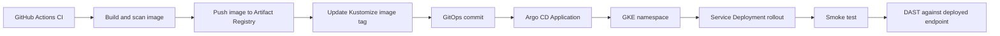

# CD And GitOps Checklist

## Target

| Item | Selection |
|---|---|
| CD tool | Argo CD |
| Deployment source of truth | Git |
| Manifest format | Kustomize |
| Runtime target | GKE |
| Image source | GCP Artifact Registry |
| Sync model | Automatic for dev, manual or approved for staging/prod |

## Argo CD Flow

## Artifact Registry Handoff Checklist

| Status | Task | Output |
|---|---|---|
| [ ] | Push service image from CI to Artifact Registry | Versioned image exists |
| [ ] | Tag image with Git SHA | Traceable image tag |
| [ ] | Scan image before GitOps update | Vulnerability result |
| [ ] | Update Kustomize image reference | Manifest points to new Artifact Registry image |
| [ ] | Commit GitOps manifest update | Argo CD detects desired image change |
| [ ] | Verify GKE can pull image | Deployment rollout succeeds |
| [ ] | Record deployed image tag/digest | Evidence links commit to running pod |

## Argo CD Application Checklist

| Status | Application | Source Path | Target Namespace |
|---|---|---|---|
| [ ] | `identity-access-service-dev` | `k8s/overlays/dev/identity-access-service` | `aquashield-dev` |
| [ ] | `project-service-dev` | `k8s/overlays/dev/project-service` | `aquashield-dev` |
| [ ] | `pond-service-dev` | `k8s/overlays/dev/pond-service` | `aquashield-dev` |
| [ ] | `sensor-service-dev` | `k8s/overlays/dev/sensor-service` | `aquashield-dev` |
| [ ] | `ingestion-service-dev` | `k8s/overlays/dev/ingestion-service` | `aquashield-dev` |
| [ ] | `notification-service-dev` | `k8s/overlays/dev/notification-service` | `aquashield-dev` |
| [ ] | `realtime-gateway-dev` | `k8s/overlays/dev/realtime-gateway` | `aquashield-dev` |
| [ ] | `analytics-service-dev` | `k8s/overlays/dev/analytics-service` | `aquashield-dev` |
| [ ] | `audit-service-dev` | `k8s/overlays/dev/audit-service` | `aquashield-dev` |

## Sync Policy Checklist

| Status | Environment | Policy |
|---|---|---|
| [ ] | Dev | Auto-sync allowed |
| [ ] | Dev | Self-heal enabled if stable |
| [ ] | Staging | Manual sync or GitHub environment approval |
| [ ] | Production | Manual sync and approval only if included |
| [ ] | All | Prune enabled only after review |
| [ ] | All | Drift detection visible |

## Deployment Evidence Checklist

| Status | Evidence | Expected Result |
|---|---|---|
| [ ] | Argo CD app screenshot | Synced and healthy |
| [ ] | Argo CD commit SHA | Matches GitOps commit |
| [ ] | Artifact Registry image | Image tag exists before Argo CD rollout |
| [ ] | Deployed image tag | Matches CI image tag |
| [ ] | Kubernetes rollout | Only changed service pods restarted |
| [ ] | Post-deploy smoke test | New deployment responds correctly |
| [ ] | DAST report | OWASP ZAP or equivalent report captured |
| [ ] | Drift demo if time | Argo CD detects cluster drift |
| [ ] | Rollback demo if time | Previous Git commit/image restored |

## Post-Deployment Security Checklist

| Status | Task | Output |
|---|---|---|
| [ ] | Wait for Argo CD application health | Target service is live |
| [ ] | Run smoke test before DAST | Basic endpoint readiness confirmed |
| [ ] | Run OWASP ZAP baseline scan against dev/staging API | DAST report |
| [ ] | Run authenticated DAST for protected routes if feasible | Authenticated security evidence |
| [ ] | Upload DAST report as CI/CD artifact | Evidence retained |
| [ ] | Fail staging/prod gate on critical findings | Security gate enforced |

## Considerations

| Topic | Guidance |
|---|---|
| Argo CD role | Argo CD does not build container images. It watches GitOps manifests and reconciles GKE to the desired state. |
| Artifact Registry role | Artifact Registry is still required. CI pushes versioned service images there, and GKE pulls those images during Argo CD rollout. |
| CI/CD boundary | CI performs build, unit/integration tests, SAST, SCA, secret scan, SBOM, container scan, image push, and GitOps manifest update. CD performs Argo CD sync, rollout verification, smoke tests, DAST, and rollback evidence. |
| DAST timing | DAST runs after deployment because it needs a live endpoint. Use GitHub Actions after Argo CD health is confirmed, or Argo CD hooks/workflows if time allows. |
| Path-aware deployment | If only Identity changes, only Identity image and Kustomize tag should change, and only Identity pods should roll. |
| Rollback | Rollback should restore a previous GitOps image tag/digest, not rebuild an old image. |
