# CI Implementation Checklist

## Target

| Item | Selection |
|---|---|
| CI platform | GitHub Actions |
| Repository model | Monorepo-aware service pipelines |
| Image registry | GCP Artifact Registry |
| Auth to GCP | GitHub OIDC with Workload Identity Federation |
| Build selection | Path filters and changed-service matrix |
| Deployment handoff | GitOps manifest update for Argo CD |

## Mermaid Diagram

```mermaid
flowchart LR
  Dev[Developer Push] --> Branch{Branch}

  Branch -->|feature or main| Detect[Detect Changed Paths]
  Detect --> Matrix[Changed Service Matrix]
  Matrix --> Lint[Lint and Unit Tests]
  Lint --> Contract[API and gRPC Contract Checks]
  Contract --> Security[SAST SCA Secret Scan SBOM]
  Security --> Build[Build Container Image]
  Build --> Scan[Container Image Scan]
  Scan --> Registry[Push to Artifact Registry]
  Registry --> GitOps[Update GitOps Manifest]
  GitOps --> Summary[CI Evidence Summary]

  Branch -->|performance-test branch or manual dispatch| K6Perf[k6 Performance Evidence]
  K6Perf --> PerfReport[k6 Summary JSON and CI Artifact]
```

## Workflow Checklist

| Status | Job | Output |
|---|---|---|
| [ ] | `detect-changes` | Changed service list |
| [ ] | `contract-check` | Proto/API compatibility result |
| [ ] | `service-lint` | Lint result per changed service |
| [ ] | `service-unit-test` | Unit test result per changed service |
| [ ] | `service-integration-test` | Integration test result per changed service |
| [ ] | `sast` | Static analysis result |
| [ ] | `sca` | Dependency vulnerability result |
| [ ] | `secret-scan` | Secret leak result |
| [ ] | `sbom` | SBOM artifact |
| [ ] | `container-build` | Service image |
| [ ] | `container-scan` | Image vulnerability result |
| [ ] | `push-image` | Image pushed to Artifact Registry |
| [ ] | `update-gitops-manifest` | Kustomize image tag updated |
| [ ] | `k6-performance-test` | k6 summary JSON and report artifact from performance-test branch or manual dispatch |
| [ ] | `pubsub-backlog-drain` | Ingestion backlog drain evidence when the deployed target is ready |
| [ ] | `post-build-summary` | Build evidence summary |

## Path Filter Checklist

| Changed Path | Action |
|---|---|
| `identity-access-service/**` | Build/test/scan Identity only |
| `project-service/**` | Build/test/scan Project only |
| `pond-service/**` | Build/test/scan Pond only |
| `sensor-service/**` | Build/test/scan Sensor only |
| `ingestion-service/**` | Build/test/scan Ingestion only |
| `notification-service/**` | Build/test/scan Notification only |
| `realtime-gateway/**` | Build/test/scan Realtime Gateway only |
| `analytics-service/**` | Build/test/scan Analytics only |
| `audit-service/**` | Build/test/scan Audit only |
| `shared-api/proto/**` | Run gRPC contract generation/tests for affected services |
| `shared-api/events/**` | Run Pub/Sub event schema validation |
| `k8s/**` | Validate manifests |
| `infra/**` | Terraform validate/plan |

## Branch Strategy Checklist

| Status | Branch | Purpose |
|---|---|---|
| [ ] | `main` or protected integration branch | Normal CI, image build, security scan, GitOps handoff |
| [ ] | `feature/*` | Changed-service lint/test/contract/security checks |
| [ ] | `performance-test` | Run k6 performance scenarios only when explicitly pushed or manually dispatched |
| [ ] | Manual workflow dispatch | Allow controlled k6 runs without blocking daily development |

## k6 Load, Stress, And Growth Test Checklist

| Status | Task | Output |
|---|---|---|
| [ ] | Store k6 scripts | `loadtests/k6/*.js` |
| [ ] | Parameterize base URL, users, ramp-up, hold, duration, and scenario | Reusable k6 scripts |
| [ ] | Run busy-day load test from `performance-test` branch or manual dispatch | Normal expected-traffic result |
| [ ] | Run endpoint herd tests from `performance-test` branch or manual dispatch | Focused endpoint saturation result |
| [ ] | Run growth probe against approved data volumes | Query scaling result |
| [ ] | Run WebSocket fanout test | Realtime connection evidence |
| [ ] | Upload k6 summary JSON result | Raw performance evidence |
| [ ] | Generate Markdown summary | Human-readable report artifact |
| [ ] | Record throughput, p95, p99, error rate | Performance summary |
| [ ] | Keep k6 jobs out of normal service CI | Fast daily CI |

## Service Build Matrix

| Status | Service | Runtime | Test Command | Image Name |
|---|---|---|---|---|
| [ ] | Identity and Access | Java | `./gradlew test` or `mvn test` | `identity-access-service` |
| [ ] | Project | Java | `./gradlew test` or `mvn test` | `project-service` |
| [ ] | Pond | Java | `./gradlew test` or `mvn test` | `pond-service` |
| [ ] | Sensor | Java | `./gradlew test` or `mvn test` | `sensor-service` |
| [ ] | Ingestion | Java | `./gradlew test` or `mvn test` | `ingestion-service` |
| [ ] | Notification | Java | `./gradlew test` or `mvn test` | `notification-service` |
| [ ] | Realtime Gateway | Java | `./gradlew test` or `mvn test` | `realtime-gateway` |
| [ ] | Analytics | TypeScript | `npm test` | `analytics-service` |
| [ ] | Audit | Java | `./gradlew test` or `mvn test` | `audit-service` |

## Security Checklist

| Status | Task | Output |
|---|---|---|
| [ ] | Configure branch protection | PR required before protected branches |
| [ ] | Configure GitHub environments | Approval gate for staging/prod |
| [ ] | Configure OIDC to GCP | No long-lived GCP key |
| [ ] | Configure least-privilege CI service account | Artifact push and manifest update only |
| [ ] | Generate SBOM | Artifact stored |
| [ ] | Scan image | Container vulnerability evidence |
| [ ] | Upload scan results | Evidence for report |

## Evidence Checklist

| Status | Evidence | Expected Result |
|---|---|---|
| [ ] | Commit touching only Identity service | Only Identity pipeline runs |
| [ ] | Artifact Registry image | New Identity image tag exists |
| [ ] | Scan output | SAST/SCA/container scan visible |
| [ ] | GitOps manifest commit | Only Identity image tag changed |
| [ ] | CI summary artifact | Pipeline result captured |
| [ ] | k6 local performance report | Captured from Docker Compose rehearsal |
| [ ] | k6 cloud-native performance report | Captured from Kubernetes Job or GitHub Actions runner |

## Considerations

| Topic | Guidance |
|---|---|
| Artifact Registry | CI still owns image build, image scan, and image push to GCP Artifact Registry. Argo CD deploys the image referenced by the GitOps manifest. |
| Load and stress tests | k6 performance scenarios are intentionally separated from normal CI because they are slow and resource-intensive. |
| Branch isolation | Use one `performance-test` branch or manual workflow dispatch so performance jobs do not block normal feature/service pipelines. |
| Evidence | Keep k6 summary JSON, generated Markdown summaries, and key metrics as CI artifacts for the final report and demo evidence. |
| Deployment target | Run k6 against a deployed dev/staging environment, not against unit-test containers inside the CI runner. |
