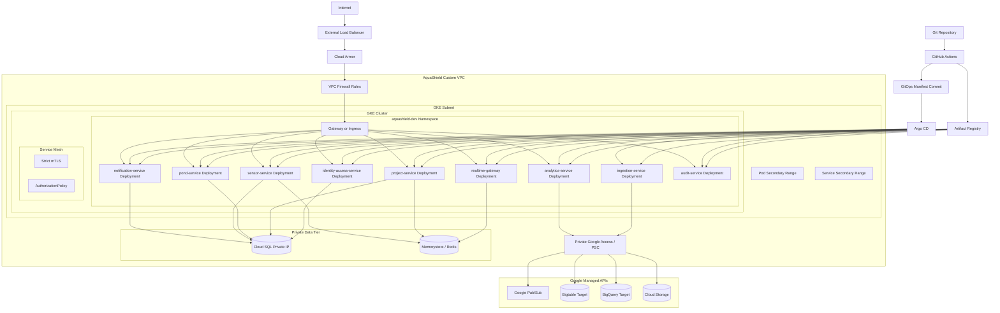
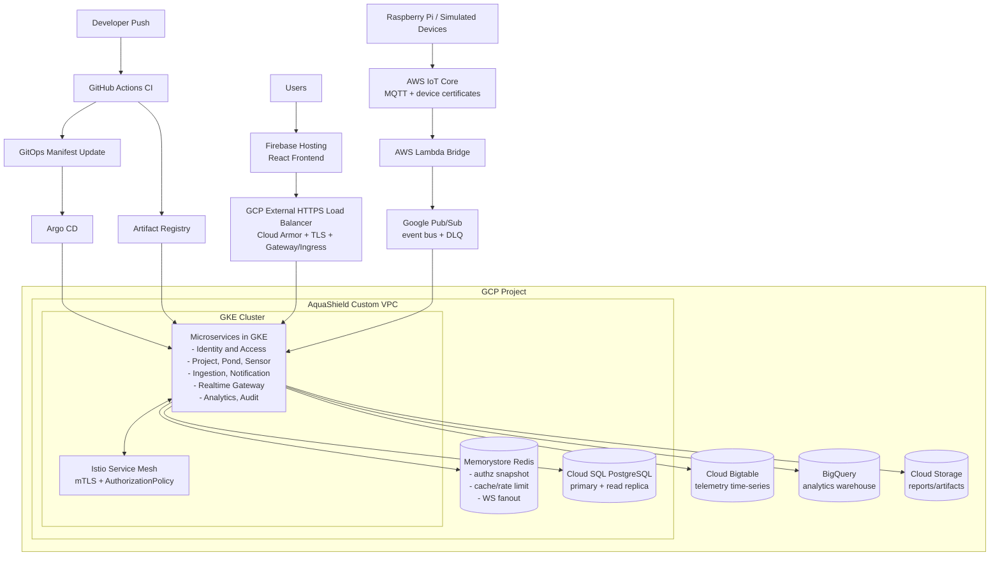

# Deployment Documentation

## Mermaid Diagram

## Presentation Diagram

## Presentation Diagram Notes

| Area | What To Say |
|---|---|
| Frontend | Firebase Hosting serves the React SPA. API and WebSocket traffic goes to the GCP edge endpoint. |
| GCP edge | External HTTPS Load Balancer, Cloud Armor, managed TLS, and GKE Gateway/Ingress protect and route backend traffic. |
| Services | The diagram groups microservices for readability. Detailed service-level deployment remains in the implementation diagram above. |
| Redis | Memorystore supports authorization snapshots, cache/rate limits, and WebSocket cross-pod fanout. |
| Data tier | Cloud SQL stores transactional data; Bigtable stores telemetry time-series; BigQuery supports historical analytics. |
| IoT ingress | Devices publish to AWS IoT Core. Lambda bridges normalized events into Google Pub/Sub. |
| GitOps | CI builds and pushes images to Artifact Registry, updates GitOps manifests, and Argo CD reconciles GKE. |

## Manifest Checklist

| Status | Manifest | Purpose |
|---|---|---|
| [ ] | Namespace | Environment boundary |
| [ ] | VPC/subnet | Network boundary for private workloads |
| [ ] | ServiceAccount per service | Workload identity |
| [ ] | Deployment per service | Workload rollout |
| [ ] | Service per service | Stable DNS |
| [ ] | ConfigMap per service | Runtime config |
| [ ] | Secret/ExternalSecret per service | Sensitive config |
| [ ] | HPA per service | Autoscaling |
| [ ] | PDB per service | Availability during disruption |
| [ ] | Gateway/Ingress | External routing |
| [ ] | NetworkPolicy | Pod traffic control |
| [ ] | AuthorizationPolicy | Mesh access control |
| [ ] | PeerAuthentication | Strict mTLS |
| [ ] | Argo CD Application | GitOps deployment |

## Deployment Checklist

| Status | Task | Output |
|---|---|---|
| [ ] | Build service image | Image in Artifact Registry |
| [ ] | Update Kustomize image tag | GitOps commit |
| [ ] | Argo CD sync | Deployment applied |
| [ ] | Rolling update | Only changed service pods restart |
| [ ] | Verify private data access | Services reach data tier privately |
| [ ] | Verify blocked direct access | Public cannot access pods/databases directly |
| [ ] | Run smoke test | Health/API check passes |
| [ ] | Capture rollout evidence | Screenshot/logs |
