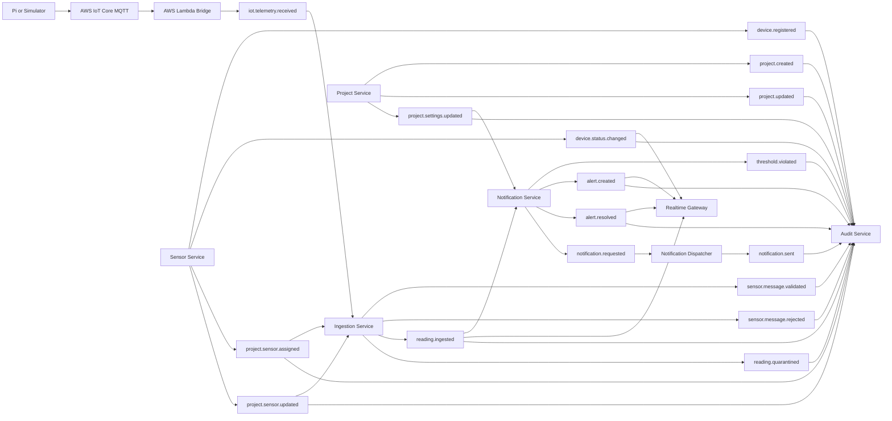

# Event-Driven Architecture Documentation

## Mermaid Diagram

## Contract Checklist

| Status | Item | Output |
|---|---|---|
| [ ] | Topic catalogue | Topic list with owners |
| [ ] | Subscription catalogue | Subscription list with consumers |
| [ ] | Event envelope definition | Required shared fields |
| [ ] | Event payload schemas | Schema per event type |
| [ ] | DLQ mapping | DLQ per important subscription |
| [ ] | Retry policy | Delivery attempts and replay rules |
| [ ] | Idempotency policy | Idempotency keys per event |
| [ ] | Audit correlation | Event IDs, correlation IDs, trace IDs |

## DLQ Checklist

| Status | Subscription | DLQ |
|---|---|---|
| [ ] | Ingestion on `iot.telemetry.received` | `iot.telemetry.received.dlq` |
| [ ] | Notification on `reading.ingested` | `reading.ingested.dlq` |
| [ ] | Realtime on `alert.created` | `alert.created.dlq` |
| [ ] | Audit on audit events | `audit.event.recorded.dlq` |
| [ ] | Notification on `project.settings.updated` | `project.settings.updated.dlq` |
| [ ] | Audit on Project events | `project.created.dlq`, `project.updated.dlq`, `project.settings.updated.dlq` |
| [ ] | Ingestion on Sensor mapping events | `project.sensor.assigned.dlq`, `project.sensor.updated.dlq` |
| [ ] | Audit on Sensor events | `device.registered.dlq`, `device.status.changed.dlq`, `project.sensor.assigned.dlq`, `project.sensor.updated.dlq` |

## Evidence Checklist

| Status | Evidence | Expected Result |
|---|---|---|
| [ ] | Published valid event | Consumer processes event |
| [ ] | Published invalid event | Event rejected or DLQ path triggered |
| [ ] | Duplicate event | Consumer remains idempotent |
| [ ] | DLQ replay | Repaired event reprocessed |
| [ ] | Event diagram rendered | Mermaid diagram included in report |
