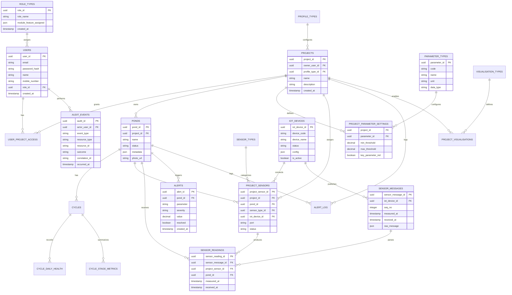

# ERD Documentation

## Mermaid ERD

## Documentation Checklist

| Status | Item | Output |
|---|---|---|
| [ ] | Define service-owned schemas | Ownership map |
| [ ] | Define Identity tables | User/role/access ERD |
| [ ] | Define Project tables | Project/profile/parameter settings ERD |
| [ ] | Define Pond tables | Pond/cycle/health/stage metrics ERD |
| [ ] | Define Sensor tables | Device/sensor/mapping ERD |
| [ ] | Define Ingestion tables | Raw/parsed reading model or external store mapping |
| [ ] | Define Notification tables | Alerts and notification state ERD |
| [ ] | Define Audit tables | Append-only audit ERD |
| [ ] | Mark read-replica use cases | Read/write ownership notes |
| [ ] | Mark Bigtable/BigQuery external models | Non-relational store notes |

## Service Ownership Map

| Service | Owned Relational Data |
|---|---|
| Identity and Access | `users`, `role_types`, `user_project_access`, token state |
| Project | `projects`, `profile_types`, `parameter_types`, `project_parameter_settings`, optional visualisation config |
| Pond | `ponds`, `cycles`, `cycle_daily_health`, `cycle_stage_metrics`, optional treatments |
| Sensor | `sensor_types`, `iot_devices`, `project_sensors`, compatibility `sensors` |
| Ingestion | Parsed reading fallback tables, outbox if used |
| Notification | `alerts`, `alert_log`, notification request/delivery tables |
| Audit | `audit_events` |

