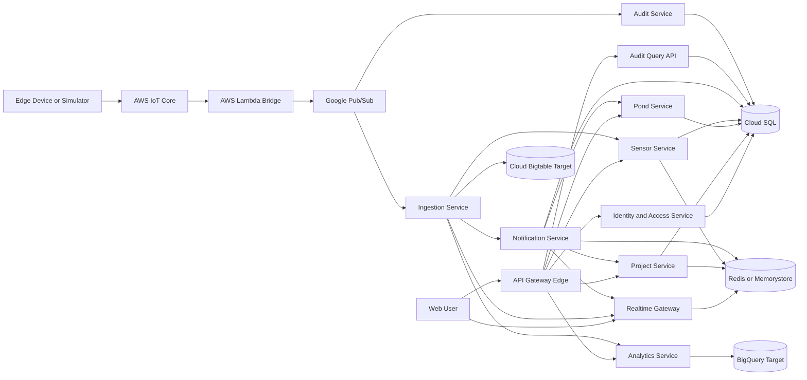

# Logical Architecture Documentation

## Mermaid Diagram

## Documentation Checklist

| Status | Item | Output |
|---|---|---|
| [ ] | List every logical service | Service catalogue |
| [ ] | Define service responsibility | Responsibility matrix |
| [ ] | Define synchronous calls | gRPC communication map |
| [ ] | Define event consumers | Pub/Sub consumer map |
| [ ] | Define owned data stores | Data ownership map |
| [ ] | Define public entry points | REST/WebSocket entry map |
| [ ] | Define future placeholders | ML/LLM add-on boxes |

## Service Catalogue

| Service | Runtime | Main Responsibility |
|---|---|---|
| Identity and Access | Java | Users, roles, tokens, access checks |
| Project | Java | Projects, profiles, parameters, thresholds |
| Pond | Java | Ponds, cycles, health, stage metrics |
| Sensor | Java | Device, sensor, port, pond mappings |
| Ingestion | Java | Telemetry validation, persistence, events |
| Notification | Java | Alert lifecycle and notification events |
| Realtime Gateway | Java WebFlux | WebSocket sessions and fanout |
| Analytics | TypeScript | Charts, comparisons, summaries |
| Audit | Java | Append-only audit records |
| ML | Python future | Future model serving |
| LLM | Python future | Future LLM/RAG add-on |

