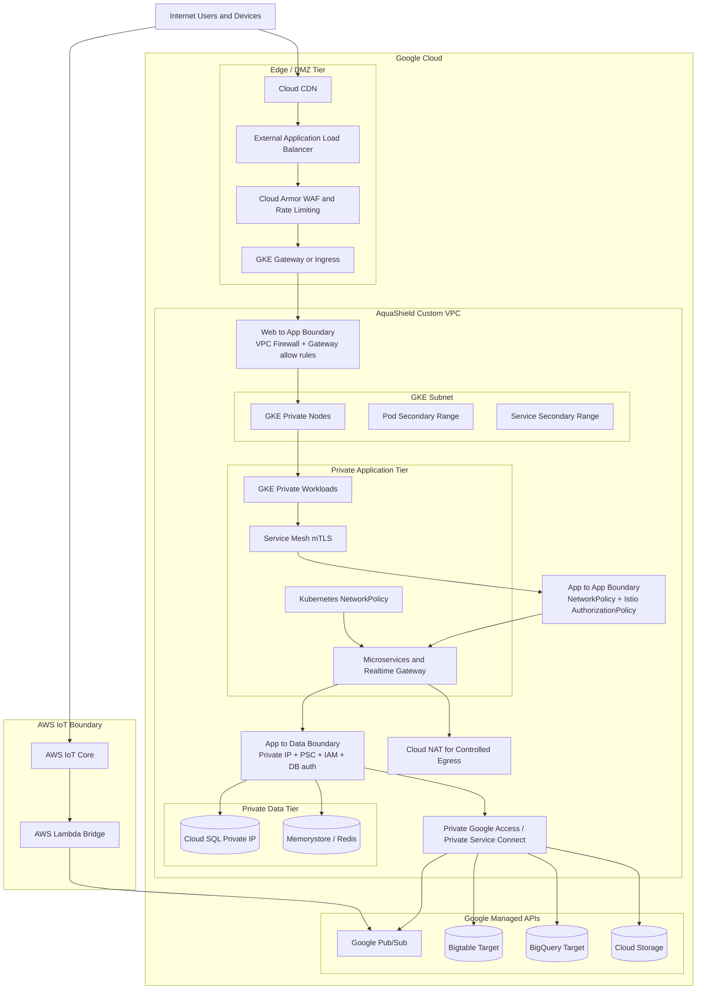
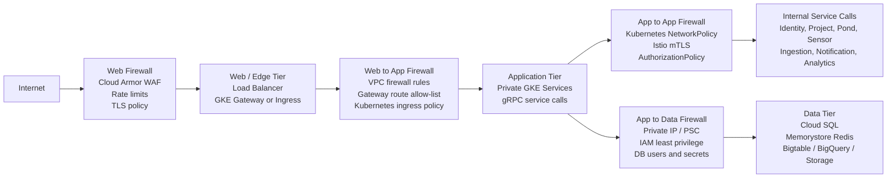

# Network Security Checklist

## Target

| Item | Selection |
|---|---|
| Network model | Cloud-native three-tier security architecture |
| Public tier | Edge/DMZ only |
| Application tier | Private GKE workloads |
| Data tier | Private managed data services |
| Primary GCP network | Custom VPC |
| Inter-tier firewall model | Cloud Armor, VPC firewall, Kubernetes NetworkPolicy, Istio AuthorizationPolicy, IAM/private endpoints |
| Kubernetes network control | NetworkPolicy |
| Service identity control | Istio/Cloud Service Mesh mTLS and AuthorizationPolicy |
| Cloud firewall/WAF | Cloud Armor and VPC firewall rules |
| AWS boundary | AWS IoT Core managed MQTT ingress and Lambda bridge |

## Three-Tier Model

## Three-Layer Firewall Boundaries

## Inter-Tier Firewall Checklist

| Status | Boundary | Controls |
|---|---|---|
| [ ] | Internet to Web/Edge | Cloud Armor WAF, rate limits, managed TLS, HTTPS-only, origin/CORS policy |
| [ ] | Web/Edge to Application | GCP load balancer backend policy, GKE Gateway/Ingress route allow-list, VPC firewall health-check and backend rules |
| [ ] | Application to Application | Kubernetes NetworkPolicy, Istio mTLS, Istio AuthorizationPolicy, service account identity |
| [ ] | Application to Data | Private IP/PSC, VPC firewall/private connectivity, IAM, database users, Kubernetes Secrets/External Secrets |
| [ ] | Application to Google APIs | Private Google Access/PSC, workload identity, least-privilege IAM |
| [ ] | Application to Internet egress | Cloud NAT, egress allow-list where feasible, no public IP on private nodes |
| [ ] | AWS IoT to GCP event bus | AWS IoT policy, Lambda execution role, WIF to GCP, Pub/Sub publisher-only IAM |

## Tier Checklist

| Status | Tier | Rule |
|---|---|---|
| [ ] | Edge/DMZ | Only CDN/load balancer/Gateway are internet-facing |
| [ ] | Edge/DMZ | TLS is enforced at the public edge |
| [ ] | Edge/DMZ | Cloud Armor protects REST and WebSocket paths |
| [ ] | Edge/DMZ to Application | Only load balancer/Gateway traffic can reach GKE backend services |
| [ ] | Application | GKE services are not directly public |
| [ ] | Application | Internal calls use service DNS and gRPC |
| [ ] | Application | Service mesh mTLS is enabled for service-to-service traffic |
| [ ] | Application | NetworkPolicy restricts pod-to-pod paths |
| [ ] | Application to Data | Only authorized workload identities and required network paths can reach managed data services |
| [ ] | Data | Cloud SQL uses private IP |
| [ ] | Data | Redis/Memorystore is private only |
| [ ] | Data | Bigtable/BigQuery access is IAM-controlled |
| [ ] | Data | Cloud Storage access is IAM/signed-URL controlled |

## VPC Checklist

| Status | Task | Output |
|---|---|---|
| [ ] | Create custom VPC | Dedicated AquaShield network |
| [ ] | Create subnet for GKE nodes | Node subnet |
| [ ] | Enable VPC-native GKE | Pod and service secondary ranges |
| [ ] | Create secondary IP range for pods | Pod CIDR |
| [ ] | Create secondary IP range for services | Service CIDR |
| [ ] | Enable private nodes if feasible | Nodes without public IPs |
| [ ] | Configure Cloud NAT if private nodes need outbound internet | Controlled egress |
| [ ] | Enable Private Google Access | Private access to Google APIs |
| [ ] | Configure private service access / Private Service Connect where needed | Managed service private connectivity |
| [ ] | Create Cloud SQL private IP connection | Database not public |

## Firewall And Edge Controls

| Status | Control | Purpose |
|---|---|---|
| [ ] | Cloud Armor WAF | Block common web attacks |
| [ ] | Cloud Armor rate limiting | Protect login/API/WebSocket token endpoints |
| [ ] | Cloud Armor IP allow/deny if needed | Controlled admin/demo access |
| [ ] | Managed TLS certificate | HTTPS edge |
| [ ] | HTTP to HTTPS redirect | Enforce encrypted transport |
| [ ] | VPC firewall for health checks | Allow required Google load balancer health checks |
| [ ] | VPC firewall for load balancer to GKE | Allow only required backend traffic |
| [ ] | VPC firewall for internal traffic | Allow only required internal ranges |
| [ ] | VPC firewall/private connectivity for data tier | Keep Cloud SQL/Redis private and reachable only from approved workloads/subnets |
| [ ] | VPC firewall deny defaults | Avoid broad inbound access |
| [ ] | Egress control | Restrict outbound where practical |

## Kubernetes NetworkPolicy Checklist

| Status | Policy | Rule |
|---|---|---|
| [ ] | Default deny ingress | Pods are not open by default |
| [ ] | Default deny egress if feasible | Explicit outbound paths |
| [ ] | API edge to public API services | Gateway can call exposed backend services |
| [ ] | Ingestion to Sensor Service | Ingestion can resolve device mappings |
| [ ] | Notification to Project/Pond Services | Notification can load thresholds/context |
| [ ] | Realtime Gateway to Redis | Gateway can use subscription/fanout store |
| [ ] | Services to Cloud SQL connector/private IP | Only required services reach SQL |
| [ ] | Services to Pub/Sub/Google APIs | Only event publishers/consumers allowed |
| [ ] | Monitoring namespace to metrics endpoints | Observability allowed |

## Service Mesh Authorization Checklist

| Status | Callee | Allowed Service Accounts |
|---|---|---|
| [ ] | Identity Service | API edge and selected internal services |
| [ ] | Project Service | API edge, Notification, Analytics |
| [ ] | Pond Service | API edge, Notification, Analytics |
| [ ] | Sensor Service | API edge, Ingestion |
| [ ] | Ingestion Service | Pub/Sub consumer workload only |
| [ ] | Notification Service | API edge and event consumer workload |
| [ ] | Realtime Gateway | API edge and selected event/push paths |
| [ ] | Analytics Service | API edge and aggregate jobs |
| [ ] | Audit Service | API edge for query, event consumer for writes |

## IAM Checklist

| Status | Principal | Minimal Permissions |
|---|---|---|
| [ ] | CI service account | Push images, update GitOps if required |
| [ ] | Argo CD service account | Read manifests and sync Kubernetes resources |
| [ ] | GKE workload service accounts | Only service-specific GCP permissions |
| [ ] | Ingestion Service | Pub/Sub subscriber, telemetry store writer |
| [ ] | Notification Service | Pub/Sub subscriber/publisher, Cloud SQL access |
| [ ] | Analytics Service | BigQuery read/query, Redis cache access |
| [ ] | Audit Service | Pub/Sub subscriber, audit DB writer |
| [ ] | Lambda bridge GCP principal | `pubsub.publisher` only on `iot.telemetry.received` |
| [ ] | Human admins | Least-privilege cloud/project access |

## AWS IoT Boundary Checklist

| Status | Task | Output |
|---|---|---|
| [ ] | Use AWS IoT device certificates | Device identity |
| [ ] | Scope IoT policy by topic namespace | Device can publish only allowed topic |
| [ ] | Keep Lambda bridge without public inbound endpoint | No public bridge API |
| [ ] | Publish to GCP Pub/Sub through WIF | No long-lived GCP key |
| [ ] | Log bridge failures in CloudWatch | Failure evidence |
| [ ] | Keep application HMAC/signature validation | Payload integrity beyond device cert |

## Evidence Checklist

| Status | Evidence | Expected Result |
|---|---|---|
| [ ] | VPC/subnet screenshot | Custom network visible |
| [ ] | GKE private/node network screenshot | Cluster network evidence |
| [ ] | Cloud SQL private IP screenshot | DB not publicly exposed |
| [ ] | Cloud Armor policy screenshot | WAF/rate limit configured |
| [ ] | NetworkPolicy manifest | Pod traffic policy documented |
| [ ] | Istio AuthorizationPolicy manifest | Service identity access documented |
| [ ] | Denied direct DB/public access test | Private data tier protected |
| [ ] | Denied unauthorized pod-to-pod call | Network/mesh policy works |
| [ ] | Successful allowed gRPC call | Required service communication works |
