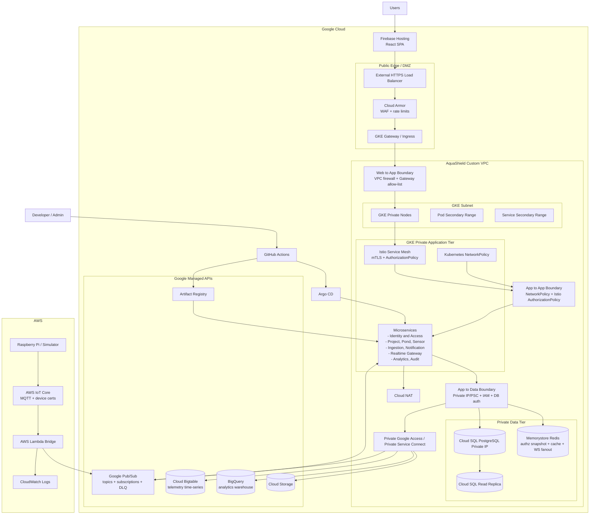

# Physical Cloud Architecture Documentation

## Mermaid Diagram

## Physical Boundary Summary

| Boundary | Physical Control |
|---|---|
| Frontend edge | Firebase Hosting serves the static React SPA. |
| Internet to backend | External HTTPS Load Balancer, Cloud Armor, managed TLS, GKE Gateway/Ingress. |
| Web to app | VPC firewall rules, backend allow-list, GKE Gateway/Ingress routing. |
| App to app | Kubernetes NetworkPolicy, Istio mTLS, Istio AuthorizationPolicy, service accounts. |
| App to data | Private IP/PSC, IAM, DB users, Kubernetes Secrets/External Secrets. |
| Event ingress | AWS IoT Core to Lambda bridge to Google Pub/Sub. |
| Build to deploy | GitHub Actions pushes images to Artifact Registry and updates GitOps manifests; Argo CD deploys to GKE. |
| Performance testing | k6 performance evidence runs from a Kubernetes Job or GitHub Actions manual/performance-test workflow against deployed dev/staging endpoints. |

## Documentation Checklist

| Status | Item | Output |
|---|---|---|
| [ ] | Frontend deployment documented | Firebase Hosting frontend |
| [ ] | GCP edge documented | Backend load balancer, Cloud Armor, Gateway/Ingress |
| [ ] | VPC documented | Custom VPC, GKE subnet, pod/service ranges, private access, Cloud NAT |
| [ ] | GKE platform documented | Private nodes, namespaces, grouped services, mesh |
| [ ] | Network security documented | DMZ, web-to-app, app-to-app, app-to-data firewalls, NetworkPolicy |
| [ ] | AWS IoT path documented | Device, IoT Core, Lambda bridge |
| [ ] | Pub/Sub path documented | Topics, subscriptions, DLQs |
| [ ] | Data stores documented | Cloud SQL primary/read replica, Redis, Bigtable, BigQuery, Storage |
| [ ] | CI/CD platform documented | GitHub Actions, Artifact Registry, Argo CD |
| [ ] | Cost boundaries documented | Bigtable/BigQuery limited demo scope |

## Evidence Checklist

| Status | Evidence | Expected Result |
|---|---|---|
| [ ] | Cloud architecture diagram | Mermaid rendered diagram |
| [ ] | Firebase Hosting screenshot | Frontend deployment visible |
| [ ] | Cloud resource screenshots | GCP/AWS resources visible |
| [ ] | VPC/subnet screenshot | Custom VPC and subnet visible |
| [ ] | Private IP screenshot | Cloud SQL/Memorystore private access visible |
| [ ] | Firewall/security screenshot | Cloud Armor, VPC firewall, NetworkPolicy, or Istio policy visible |
| [ ] | Network entry proof | Public HTTPS endpoint works |
| [ ] | IoT bridge proof | AWS event reaches Pub/Sub |
| [ ] | Data-store proof | Cloud SQL/Redis/BigQuery evidence captured |
| [ ] | GitOps rollout proof | Artifact Registry image deployed by Argo CD |
