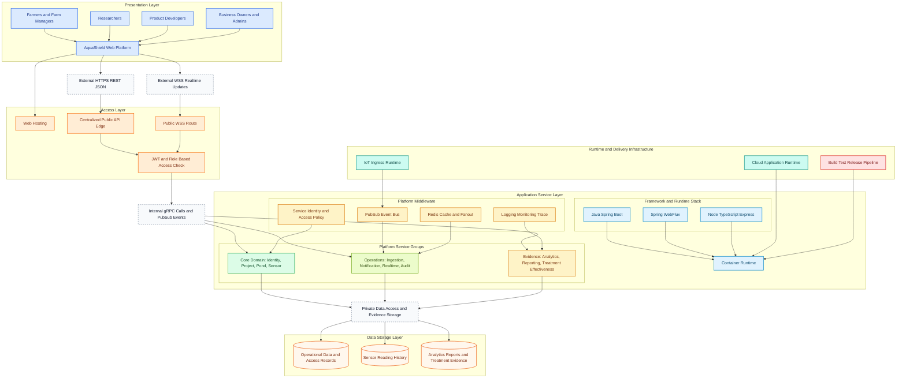
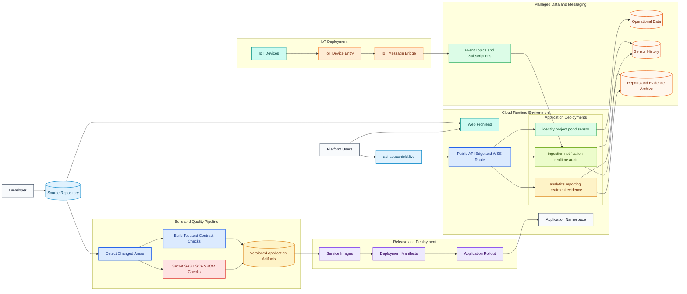

# Initial Solution Architecture

## Initial Logical Architecture

```mermaid
flowchart TB
  subgraph Presentation["Presentation Layer"]
    direction LR
    Farmers["Farmers and Farm Managers"]:::ui
    Researchers["Researchers"]:::ui
    ProductTeam["Product Developers"]:::ui
    Admins["Business Owners and Admins"]:::ui
    WebApp["AquaShield Web Platform"]:::ui
  end

  ExternalRest["External HTTPS REST JSON"]:::bar
  ExternalWSS["External WSS Realtime Updates"]:::bar

  subgraph Access["Access Layer"]
    direction LR
    WebHosting["Web Hosting"]:::gateway
    PublicApi["Centralized Public API Edge"]:::gateway
    WssRoute["Public WSS Route"]:::gateway
    AccessCheck["JWT and Role Based Access Check"]:::gateway
  end

  InternalFlow["Internal gRPC Calls and PubSub Events"]:::bar

  subgraph ServiceLayer["Application Service Layer"]
    direction TB
    subgraph RuntimeStack["Framework and Runtime Stack"]
      direction LR
      Java["Java Spring Boot"]:::framework
      WebFlux["Spring WebFlux"]:::framework
      Node["Node TypeScript Express"]:::framework
    end

    subgraph ServiceGroups["Platform Service Groups"]
      direction TB
      Core["Core Domain: Identity, Project, Pond, Sensor"]:::service
      Operations["Operations: Ingestion, Notification, Realtime, Audit"]:::ops
      Evidence["Evidence: Analytics, Reporting, Treatment Effectiveness"]:::data
    end

    subgraph Middleware["Platform Middleware"]
      direction TB
      PubSub["PubSub Event Bus"]:::middleware
      Redis["Redis Cache and Fanout"]:::middleware
      Policy["Service Identity and Access Policy"]:::middleware
      Observability["Logging Monitoring Trace"]:::middleware
    end

    ContainerRuntime["Container Runtime"]:::framework
  end

  DataAccess["Private Data Access and Evidence Storage"]:::bar

  subgraph DataLayer["Data Storage Layer"]
    direction TB
    OperationalStore[("Operational Data and Access Records")]:::store
    TelemetryStore[("Sensor Reading History")]:::store
    EvidenceStore[("Analytics Reports and Treatment Evidence")]:::store
  end

  subgraph RuntimeDelivery["Runtime and Delivery Infrastructure"]
    direction LR
    CloudRuntime["Cloud Application Runtime"]:::runtime
    IoTIngress["IoT Ingress Runtime"]:::runtime
    Delivery["Build Test Release Pipeline"]:::devops
  end

  Farmers --> WebApp
  Researchers --> WebApp
  ProductTeam --> WebApp
  Admins --> WebApp
  WebApp --> WebHosting
  WebApp --> ExternalRest
  WebApp --> ExternalWSS
  ExternalRest --> PublicApi
  ExternalWSS --> WssRoute
  PublicApi --> AccessCheck
  WssRoute --> AccessCheck
  AccessCheck --> InternalFlow

  InternalFlow --> Core
  InternalFlow --> Operations
  InternalFlow --> Evidence

  Java --> ContainerRuntime
  WebFlux --> ContainerRuntime
  Node --> ContainerRuntime
  PubSub --> Operations
  Redis --> Operations
  Policy --> Core
  Observability --> Evidence

  Core --> DataAccess
  Operations --> DataAccess
  Evidence --> DataAccess
  DataAccess --> OperationalStore
  DataAccess --> TelemetryStore
  DataAccess --> EvidenceStore

  CloudRuntime --> ContainerRuntime
  IoTIngress --> PubSub
  Delivery --> ContainerRuntime

  classDef ui fill:#dbeafe,stroke:#2563eb,stroke-width:1.5px,color:#1e3a8a;
  classDef gateway fill:#ffedd5,stroke:#f97316,stroke-width:1.6px,color:#7c2d12;
  classDef framework fill:#e0f2fe,stroke:#0284c7,stroke-width:1.5px,color:#0c4a6e;
  classDef service fill:#dcfce7,stroke:#16a34a,stroke-width:1.5px,color:#14532d;
  classDef ops fill:#ecfccb,stroke:#65a30d,stroke-width:1.5px,color:#365314;
  classDef data fill:#fef3c7,stroke:#d97706,stroke-width:1.5px,color:#78350f;
  classDef middleware fill:#fef3c7,stroke:#d97706,stroke-width:1.5px,color:#78350f;
  classDef store fill:#fff7ed,stroke:#ea580c,stroke-width:1.5px,color:#7c2d12;
  classDef runtime fill:#ccfbf1,stroke:#0d9488,stroke-width:1.5px,color:#134e4a;
  classDef devops fill:#fee2e2,stroke:#dc2626,stroke-width:1.5px,color:#7f1d1d;
  classDef bar fill:#f8fafc,stroke:#64748b,stroke-dasharray:4 4,stroke-width:1.2px,color:#0f172a;
```

## Initial Physical Architecture

```mermaid
flowchart LR
  subgraph Public["Public Zone"]
    Users["Platform Users"]:::actor
    Devices["IoT Devices"]:::device
  end

  subgraph Edge["DMZ and Internet Edge"]
    WebHosting["Web Application Hosting"]:::edge
    DNS["DNS and Managed TLS"]:::edge
    LoadBalancer["HTTPS Load Balancer"]:::edge
    PublicApi["Centralized Public API Edge"]:::edge
    WssRoute["Public WSS Route"]:::edge
  end

  subgraph IoTZone["IoT Ingress Zone"]
    DeviceTrust["Device Certificates and Trust"]:::iot
    IoTBridge["IoT Message Bridge"]:::iot
    IngressLogs["Ingress Logs"]:::observability
  end

  subgraph App["App Zone Platform Cluster"]
    NetworkBase["Private Application Network"]:::network
    IngressRouting["Kubernetes Ingress Routing"]:::network
    Policy["Service Identity and Authorization Policy"]:::sec
    CoreServices["Core Services: Identity, Project, Pond, Sensor"]:::service
    OperationServices["Operation Services: Ingestion, Notification, Realtime, Audit"]:::ops
    EvidenceServices["Evidence Services: Analytics, Reporting, Treatment Effectiveness"]:::data
    PrivateAccess["Private Data Access"]:::network
  end

  subgraph CloudServices["Cloud Services"]
    Messaging["Managed Event Topics and Subscriptions"]:::eventbus
    OperationalData["Operational Database and Cache"]:::store
    TelemetryData["Sensor History Store"]:::store
    EvidenceData["Analytics Reports and Evidence Archive"]:::store
    Observability["Logging Monitoring Trace"]:::observability
  end

  Users --> WebHosting
  Users --> DNS --> LoadBalancer --> PublicApi --> IngressRouting
  WebHosting --> PublicApi
  PublicApi --> WssRoute --> IngressRouting
  IngressRouting --> Policy

  Devices --> DeviceTrust --> IoTBridge --> Messaging
  IoTBridge --> IngressLogs
  Messaging --> OperationServices

  NetworkBase --> Policy
  Policy --> CoreServices
  Policy --> OperationServices
  Policy --> EvidenceServices

  CoreServices --> PrivateAccess
  OperationServices --> PrivateAccess
  EvidenceServices --> PrivateAccess
  PrivateAccess --> OperationalData
  PrivateAccess --> TelemetryData
  PrivateAccess --> EvidenceData
  CoreServices --> Observability
  OperationServices --> Observability
  EvidenceServices --> Observability

  classDef actor fill:#f8fafc,stroke:#475569,stroke-width:1.4px,color:#0f172a;
  classDef device fill:#ccfbf1,stroke:#0d9488,stroke-width:1.5px,color:#134e4a;
  classDef edge fill:#dbeafe,stroke:#2563eb,stroke-width:2px,color:#1e3a8a;
  classDef iot fill:#ffedd5,stroke:#f97316,stroke-width:1.5px,color:#7c2d12;
  classDef network fill:#e0f2fe,stroke:#0284c7,stroke-width:1.5px,color:#0c4a6e;
  classDef sec fill:#fee2e2,stroke:#dc2626,stroke-width:1.5px,color:#7f1d1d;
  classDef service fill:#dcfce7,stroke:#16a34a,stroke-width:1.5px,color:#14532d;
  classDef ops fill:#ecfccb,stroke:#65a30d,stroke-width:1.5px,color:#365314;
  classDef data fill:#fef3c7,stroke:#d97706,stroke-width:1.5px,color:#78350f;
  classDef eventbus fill:#dcfce7,stroke:#16a34a,stroke-width:2px,color:#14532d;
  classDef store fill:#fff7ed,stroke:#ea580c,stroke-width:1.5px,color:#7c2d12;
  classDef observability fill:#f1f5f9,stroke:#64748b,stroke-width:1.4px,color:#0f172a;
```

## Initial Deployment Architecture

```mermaid
flowchart LR
  Dev["Developer"]:::actor
  Repo[("Source Repository")]:::source

  subgraph CI["Build and Quality Pipeline"]
    Detect["Detect Changed Areas"]:::pipeline
    Tests["Build Test and Contract Checks"]:::pipeline
    Security["Secret SAST SCA SBOM Checks"]:::sec
    Package[("Versioned Application Artifacts")]:::artifact
  end

  subgraph CD["Release and Deployment"]
    Images["Service Images"]:::release
    Manifests["Deployment Manifests"]:::release
    Rollout["Application Rollout"]:::release
  end

  subgraph Runtime["Cloud Runtime Environment"]
    Frontend["Web Frontend"]:::runtime
    Edge["Public API Edge and WSS Route"]:::edge
    AppNS["Application Namespace"]:::namespace

    subgraph Deployments["Application Deployments"]
      Core["identity project pond sensor"]:::service
      Operations["ingestion notification realtime audit"]:::ops
      Analytics["analytics reporting treatment evidence"]:::data
    end
  end

  subgraph DataMessaging["Managed Data and Messaging"]
    Events["Event Topics and Subscriptions"]:::eventbus
    OpsData[("Operational Data")]:::store
    SensorHistory[("Sensor History")]:::store
    Reports[("Reports and Evidence Archive")]:::store
  end

  subgraph IoTDeployment["IoT Deployment"]
    Devices["IoT Devices"]:::device
    IoTEntry["IoT Device Entry"]:::iot
    Bridge["IoT Message Bridge"]:::iot
  end

  Users["Platform Users"]:::actor
  Api["api.aquashield.live"]:::source

  Dev --> Repo
  Repo --> Detect
  Detect --> Tests
  Detect --> Security
  Tests --> Package
  Security --> Package
  Package --> Images
  Images --> Manifests
  Manifests --> Rollout
  Rollout --> AppNS

  Repo --> Frontend
  Users --> Frontend
  Users --> Api --> Edge
  Edge --> Core
  Edge --> Operations
  Edge --> Analytics

  Devices --> IoTEntry --> Bridge --> Events
  Events --> Operations
  Operations --> SensorHistory
  Operations --> Reports
  Core --> OpsData
  Analytics --> SensorHistory
  Analytics --> Reports

  classDef actor fill:#f8fafc,stroke:#475569,stroke-width:1.4px,color:#0f172a;
  classDef source fill:#e0f2fe,stroke:#0284c7,stroke-width:1.5px,color:#0c4a6e;
  classDef pipeline fill:#dbeafe,stroke:#2563eb,stroke-width:2px,color:#1e3a8a;
  classDef sec fill:#fee2e2,stroke:#dc2626,stroke-width:1.5px,color:#7f1d1d;
  classDef artifact fill:#fef3c7,stroke:#d97706,stroke-width:1.5px,color:#78350f;
  classDef release fill:#ede9fe,stroke:#7c3aed,stroke-width:1.5px,color:#3b0764;
  classDef runtime fill:#ccfbf1,stroke:#0d9488,stroke-width:1.5px,color:#134e4a;
  classDef edge fill:#dbeafe,stroke:#2563eb,stroke-width:2px,color:#1e3a8a;
  classDef namespace fill:#f8fafc,stroke:#334155,stroke-width:1.5px,color:#0f172a;
  classDef service fill:#dcfce7,stroke:#16a34a,stroke-width:1.5px,color:#14532d;
  classDef ops fill:#ecfccb,stroke:#65a30d,stroke-width:1.5px,color:#365314;
  classDef data fill:#fef3c7,stroke:#d97706,stroke-width:1.5px,color:#78350f;
  classDef eventbus fill:#dcfce7,stroke:#16a34a,stroke-width:2px,color:#14532d;
  classDef store fill:#fff7ed,stroke:#ea580c,stroke-width:1.5px,color:#7c2d12;
  classDef device fill:#ccfbf1,stroke:#0d9488,stroke-width:1.5px,color:#134e4a;
  classDef iot fill:#ffedd5,stroke:#f97316,stroke-width:1.5px,color:#7c2d12;
```
