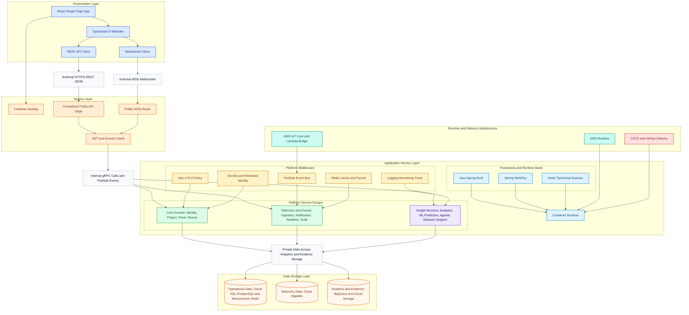
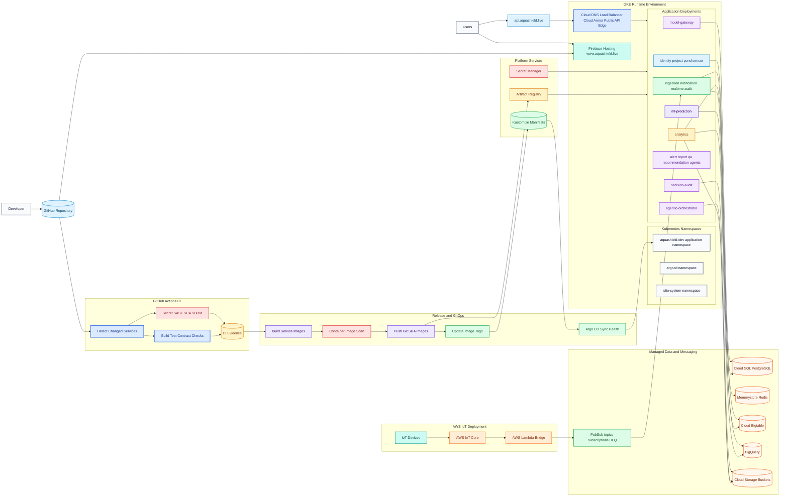

# Updated Solution Architecture

## Updated Logical Architecture

```mermaid
flowchart TB
  subgraph Presentation["Presentation Layer"]
    direction LR
    ReactSPA["React Single Page App"]:::ui
    TypeScript["TypeScript UI Modules"]:::ui
    Axios["REST API Client"]:::ui
    WSClient["WebSocket Client"]:::ui
  end

  RestProtocol["External HTTPS REST JSON"]:::bar
  WsProtocol["External WSS WebSocket"]:::bar

  subgraph Access["Access Layer"]
    direction LR
    Firebase["Firebase Hosting"]:::gateway
    ApiEdge["Centralized Public API Edge"]:::gateway
    WssGateway["Public WSS Route"]:::gateway
    AuthEdge["JWT and Access Check"]:::gateway
  end

  ServiceProtocol["Internal gRPC Calls and PubSub Events"]:::bar

  subgraph ServiceLayer["Application Service Layer"]
    direction TB
    subgraph RuntimeStack["Framework and Runtime Stack"]
      direction LR
      Java["Java Spring Boot"]:::framework
      WebFlux["Spring WebFlux"]:::framework
      Node["Node TypeScript Express"]:::framework
    end

    subgraph DomainServices["Platform Service Groups"]
      direction TB
      CoreServices["Core Domain: Identity, Project, Pond, Sensor"]:::service
      EventServices["Telemetry and Events: Ingestion, Notification, Realtime, Audit"]:::service
      InsightServices["Insight Services: Analytics, ML Prediction, Agentic Decision Support"]:::intel
    end

    subgraph Middleware["Platform Middleware"]
      direction TB
      PubSub["PubSub Event Bus"]:::middleware
      Redis["Redis Cache and Fanout"]:::middleware
      Istio["Istio mTLS Policy"]:::middleware
      Secrets["Secrets and Workload Identity"]:::middleware
      Observability["Logging Monitoring Trace"]:::middleware
    end

    ContainerRuntime["Container Runtime"]:::framework
  end

  DataProtocol["Private Data Access Analytics and Evidence Storage"]:::bar

  subgraph DataLayer["Data Storage Layer"]
    direction TB
    OperationalStore[("Operational Data: Cloud SQL PostgreSQL and Memorystore Redis")]:::store
    TelemetryStore[("Telemetry Data: Cloud Bigtable")]:::store
    AnalyticsStore[("Analytics and Evidence: BigQuery and Cloud Storage")]:::store
  end

  subgraph RuntimeDelivery["Runtime and Delivery Infrastructure"]
    direction LR
    GKE["GKE Runtime"]:::runtime
    IoTBridge["AWS IoT Core and Lambda Bridge"]:::runtime
    Delivery["CI/CD and GitOps Delivery"]:::devops
  end

  ReactSPA --> TypeScript
  TypeScript --> Axios
  TypeScript --> WSClient
  ReactSPA --> Firebase
  Axios --> RestProtocol
  WSClient --> WsProtocol
  RestProtocol --> ApiEdge
  WsProtocol --> WssGateway
  ApiEdge --> AuthEdge
  WssGateway --> AuthEdge
  AuthEdge --> ServiceProtocol

  ServiceProtocol --> CoreServices
  ServiceProtocol --> EventServices
  ServiceProtocol --> InsightServices

  Java --> ContainerRuntime
  WebFlux --> ContainerRuntime
  Node --> ContainerRuntime
  PubSub --> EventServices
  Redis --> EventServices
  Istio --> CoreServices
  Secrets --> CoreServices
  Observability --> InsightServices

  CoreServices --> DataProtocol
  EventServices --> DataProtocol
  InsightServices --> DataProtocol
  DataProtocol --> OperationalStore
  DataProtocol --> TelemetryStore
  DataProtocol --> AnalyticsStore

  GKE --> ContainerRuntime
  IoTBridge --> PubSub
  Delivery --> ContainerRuntime

  classDef ui fill:#dbeafe,stroke:#2563eb,stroke-width:1.5px,color:#1e3a8a;
  classDef gateway fill:#ffedd5,stroke:#f97316,stroke-width:1.6px,color:#7c2d12;
  classDef framework fill:#e0f2fe,stroke:#0284c7,stroke-width:1.5px,color:#0c4a6e;
  classDef service fill:#dcfce7,stroke:#16a34a,stroke-width:1.5px,color:#14532d;
  classDef intel fill:#ede9fe,stroke:#7c3aed,stroke-width:1.5px,color:#3b0764;
  classDef agent fill:#f3e8ff,stroke:#9333ea,stroke-width:1.5px,color:#581c87;
  classDef middleware fill:#fef3c7,stroke:#d97706,stroke-width:1.5px,color:#78350f;
  classDef devops fill:#fee2e2,stroke:#dc2626,stroke-width:1.5px,color:#7f1d1d;
  classDef store fill:#fff7ed,stroke:#ea580c,stroke-width:1.5px,color:#7c2d12;
  classDef runtime fill:#ccfbf1,stroke:#0d9488,stroke-width:1.5px,color:#134e4a;
  classDef bar fill:#f8fafc,stroke:#64748b,stroke-dasharray:4 4,stroke-width:1.2px,color:#0f172a;
```

## Updated Physical Architecture

```mermaid
flowchart LR
  subgraph Public["Public Zone"]
    WebUsers["Web Users"]:::actor
    FarmDevices["IoT Devices"]:::device
  end

  subgraph DMZ["DMZ and Internet Edge"]
    Firebase["Firebase Hosting React SPA"]:::edge
    DNS["Cloud DNS and Managed TLS"]:::edge
    LB["HTTPS Load Balancer"]:::edge
    Armor["Cloud Armor WAF and Rate Limits"]:::security
    PublicApiEdge["Public API Edge"]:::edge
    WssRoute["Public WSS Route"]:::edge
  end

  subgraph IoTZone["IoT Ingress Zone"]
    AwsIoT["AWS IoT Core MQTT and Device Certificates"]:::iot
    Lambda["AWS Lambda Bridge"]:::iot
    CloudWatch["CloudWatch Logs"]:::observability
  end

  subgraph App["App Zone Private GKE Cluster"]
    NetworkBase["AquaShield VPC, GKE Subnet, Pod and Service Ranges"]:::network
    ClusterIngress["Kubernetes Ingress Routing"]:::network
    Mesh["Istio mTLS and Authorization Policy"]:::security
    WorkloadIdentity["Workload Identity Service Accounts"]:::security
    ApiServices["API Services: Identity, Project, Pond, Sensor, Ingestion, Notification, Audit, Analytics, ML Prediction, Agentic Decision Support"]:::service
    RealtimeGateway["Realtime Gateway WebSocket Service"]:::service
    PrivateAccess["Private Service Access"]:::network
  end

  subgraph CloudServices["Cloud Services"]
    PubSub["PubSub Topics, Subscriptions, DLQ"]:::eventbus
    OperationalData["Cloud SQL PostgreSQL and Memorystore Redis"]:::store
    AnalyticalData["Cloud Bigtable, BigQuery, Cloud Storage"]:::store
    DeliveryConfig["Artifact Registry and Secret Manager"]:::artifact
    Observability["Cloud Logging, Monitoring, Trace"]:::observability
  end

  WebUsers --> Firebase
  WebUsers --> DNS --> LB --> Armor --> PublicApiEdge --> ClusterIngress
  Firebase --> PublicApiEdge
  PublicApiEdge --> WssRoute --> ClusterIngress
  ClusterIngress --> Mesh

  FarmDevices --> AwsIoT --> Lambda --> PubSub
  Lambda --> CloudWatch
  PubSub --> ApiServices

  NetworkBase --> Mesh
  WorkloadIdentity --> ApiServices
  WorkloadIdentity --> RealtimeGateway
  Mesh --> ApiServices
  Mesh --> RealtimeGateway
  DeliveryConfig --> ApiServices

  ApiServices --> PrivateAccess
  RealtimeGateway --> PrivateAccess
  PrivateAccess --> OperationalData
  PrivateAccess --> AnalyticalData
  ApiServices --> Observability
  RealtimeGateway --> Observability

  classDef actor fill:#f8fafc,stroke:#475569,stroke-width:1.4px,color:#0f172a;
  classDef device fill:#ccfbf1,stroke:#0d9488,stroke-width:1.5px,color:#134e4a;
  classDef edge fill:#dbeafe,stroke:#2563eb,stroke-width:2px,color:#1e3a8a;
  classDef security fill:#fee2e2,stroke:#dc2626,stroke-width:1.5px,color:#7f1d1d;
  classDef iot fill:#ffedd5,stroke:#f97316,stroke-width:1.5px,color:#7c2d12;
  classDef observability fill:#f1f5f9,stroke:#64748b,stroke-width:1.4px,color:#0f172a;
  classDef artifact fill:#fef3c7,stroke:#d97706,stroke-width:1.5px,color:#78350f;
  classDef eventbus fill:#dcfce7,stroke:#16a34a,stroke-width:2px,color:#14532d;
  classDef network fill:#e0f2fe,stroke:#0284c7,stroke-width:1.5px,color:#0c4a6e;
  classDef service fill:#dcfce7,stroke:#16a34a,stroke-width:1.5px,color:#14532d;
  classDef store fill:#fff7ed,stroke:#ea580c,stroke-width:1.5px,color:#7c2d12;
```

## Updated Deployment Architecture

```mermaid
flowchart LR
  Dev["Developer"]:::actor
  Repo[("GitHub Repository")]:::source

  subgraph Platform["Platform Services"]
    Artifact["Artifact Registry"]:::artifact
    SecretManager["Secret Manager"]:::security
    Kustomize[("Kustomize Manifests")]:::gitops
  end

  subgraph CI["GitHub Actions CI"]
    Detect["Detect Changed Services"]:::ci
    Tests["Build Test Contract Checks"]:::ci
    Sec["Secret SAST SCA SBOM"]:::security
    Evidence[("CI Evidence")]:::artifact
  end

  subgraph CD["Release and GitOps"]
    ImageBuild["Build Service Images"]:::release
    ImageScan["Container Image Scan"]:::security
    Push["Push Git SHA Images"]:::release
    Manifest["Update Image Tags"]:::gitops
    Argo["Argo CD Sync Health"]:::gitops
  end

  subgraph Runtime["GKE Runtime Environment"]
    Edge["Cloud DNS Load Balancer Cloud Armor Public API Edge"]:::edge
    Firebase["Firebase Hosting www.aquashield.live"]:::runtime

    subgraph Namespaces["Kubernetes Namespaces"]
      AppNS["aquashield-dev application namespace"]:::namespace
      ArgoNS["argocd namespace"]:::namespace
      IstioNS["istio-system namespace"]:::namespace
    end

    subgraph AppDeployments["Application Deployments"]
      Core["identity project pond sensor"]:::service
      Events["ingestion notification realtime audit"]:::event
      Analytics["analytics"]:::analytics
      ML["ml-prediction"]:::intel
      Orch["agentic-orchestrator"]:::agent
      Agents["alert report qa recommendation agents"]:::agent
      AuditAgent["decision-audit"]:::agent
      Gateway["model-gateway"]:::agent
    end
  end

  subgraph ManagedData["Managed Data and Messaging"]
    PubSub["PubSub topics subscriptions DLQ"]:::eventbus
    SQL[("Cloud SQL PostgreSQL")]:::store
    Redis[("Memorystore Redis")]:::store
    Bigtable[("Cloud Bigtable")]:::store
    BigQuery[("BigQuery")]:::store
    Storage[("Cloud Storage Buckets")]:::store
  end

  subgraph IoTIngress["AWS IoT Deployment"]
    Devices["IoT Devices"]:::device
    AwsIoT["AWS IoT Core"]:::iot
    Lambda["AWS Lambda Bridge"]:::iot
  end

  Users["Users"]:::actor
  Api["api.aquashield.live"]:::source

  Dev --> Repo
  Repo --> Detect
  Detect --> Tests
  Detect --> Sec
  Tests --> Evidence
  Sec --> Evidence
  Evidence --> ImageBuild
  ImageBuild --> ImageScan
  ImageScan --> Push
  Push --> Artifact
  Artifact --> AppDeployments
  Push --> Manifest
  Manifest --> Kustomize
  Kustomize --> Argo
  Argo --> AppNS
  SecretManager --> AppDeployments

  Repo --> Firebase
  Users --> Firebase
  Users --> Api --> Edge
  Edge --> AppDeployments

  Devices --> AwsIoT --> Lambda --> PubSub
  PubSub --> Events
  Events --> Redis
  Events --> Bigtable
  Core --> SQL
  Analytics --> Bigtable
  Analytics --> BigQuery
  Analytics --> Storage
  ML --> BigQuery
  Orch --> Storage
  AuditAgent --> Storage
  Gateway --> SQL

  classDef actor fill:#f8fafc,stroke:#475569,stroke-width:1.4px,color:#0f172a;
  classDef source fill:#e0f2fe,stroke:#0284c7,stroke-width:1.5px,color:#0c4a6e;
  classDef ci fill:#dbeafe,stroke:#2563eb,stroke-width:2px,color:#1e3a8a;
  classDef security fill:#fee2e2,stroke:#dc2626,stroke-width:1.5px,color:#7f1d1d;
  classDef release fill:#ede9fe,stroke:#7c3aed,stroke-width:1.5px,color:#3b0764;
  classDef artifact fill:#fef3c7,stroke:#d97706,stroke-width:1.5px,color:#78350f;
  classDef gitops fill:#dcfce7,stroke:#16a34a,stroke-width:1.5px,color:#14532d;
  classDef runtime fill:#ccfbf1,stroke:#0d9488,stroke-width:1.5px,color:#134e4a;
  classDef edge fill:#dbeafe,stroke:#2563eb,stroke-width:2px,color:#1e3a8a;
  classDef namespace fill:#f8fafc,stroke:#334155,stroke-width:1.5px,color:#0f172a;
  classDef service fill:#e0f2fe,stroke:#0284c7,stroke-width:1.5px,color:#0c4a6e;
  classDef event fill:#dcfce7,stroke:#16a34a,stroke-width:1.5px,color:#14532d;
  classDef analytics fill:#fef3c7,stroke:#d97706,stroke-width:1.5px,color:#78350f;
  classDef intel fill:#ede9fe,stroke:#7c3aed,stroke-width:1.5px,color:#3b0764;
  classDef agent fill:#f3e8ff,stroke:#9333ea,stroke-width:1.6px,color:#581c87;
  classDef eventbus fill:#dcfce7,stroke:#16a34a,stroke-width:2px,color:#14532d;
  classDef store fill:#fff7ed,stroke:#ea580c,stroke-width:1.5px,color:#7c2d12;
  classDef device fill:#ccfbf1,stroke:#0d9488,stroke-width:1.5px,color:#134e4a;
  classDef iot fill:#ffedd5,stroke:#f97316,stroke-width:1.5px,color:#7c2d12;
```
