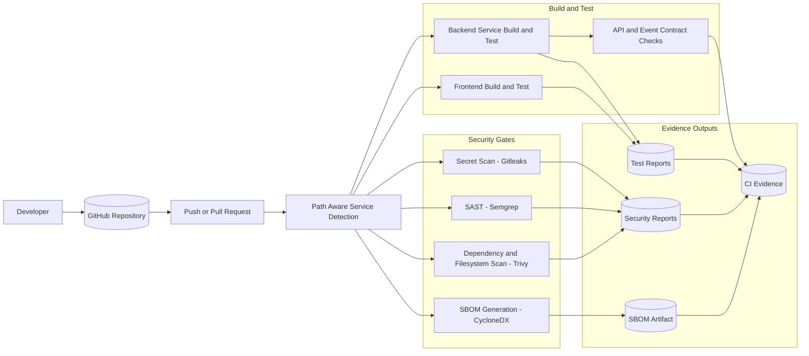
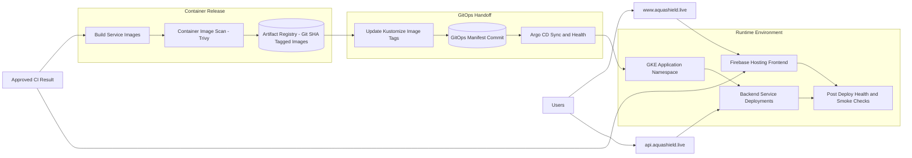

# DevSecOps Pipeline Design

The AquaShield DevSecOps pipeline is designed to make every platform change traceable, testable, secure, and deployable. The pipeline combines continuous integration, security validation, container release, GitOps handoff, and deployment reconciliation. This supports the project goal of delivering AquaShield as a professional aquaculture platform rather than only as a working application.

## Continuous Integration and Security Pipeline

## Continuous Delivery and GitOps Pipeline

## Pipeline Stages

| No. | Stage | Purpose | Output |
|---|---|---|---|
| 1 | Source control trigger | Start the pipeline when a change is pushed or reviewed. | Traceable commit and workflow run. |
| 2 | Changed-service detection | Identify which services are affected by the change. | Path-aware build and test scope. |
| 3 | Build and test | Validate frontend and backend behavior before release. | Test results and build evidence. |
| 4 | Contract validation | Check that API and event contracts remain consistent. | Contract compatibility evidence. |
| 5 | Secret scanning | Prevent leaked credentials from entering the repository history. | Secret scan report. |
| 6 | Static security scan | Detect risky source-code patterns before deployment. | SAST report. |
| 7 | Dependency and filesystem scan | Identify vulnerable dependencies and configuration risks. | Dependency and filesystem security report. |
| 8 | SBOM generation | Produce a software bill of materials for supply-chain visibility. | CycloneDX SBOM artifact. |
| 9 | Container build and image scan | Package services and scan images before release. | Scanned service images. |
| 10 | Artifact Registry push | Store versioned images with Git-SHA tags. | Traceable image artifact. |
| 11 | GitOps manifest update | Update deployment manifests with the approved image tag. | Kustomize manifest commit. |
| 12 | Argo CD rollout | Reconcile the runtime environment with the GitOps source of truth. | Synced and healthy deployment state. |
| 13 | Post-deploy validation | Confirm the deployed platform is reachable and operational. | Health or smoke-test evidence. |

## Design Rationale

The pipeline separates CI, security, release, and deployment responsibilities. CI validates code and produces evidence. Security gates run before the container image is promoted. The release stage pushes immutable, Git-SHA-tagged images to the image registry. The GitOps stage updates the deployment source of truth instead of changing the cluster manually. Argo CD then applies the desired state to the runtime environment and provides rollout visibility.

This design also supports path-aware delivery. A change to one backend service can trigger build, test, scan, image release, and deployment handoff for that service without requiring the whole platform to be rebuilt unnecessarily. At the same time, repository-wide security checks such as secret scanning, SAST, dependency scanning, and SBOM generation provide consistent DevSecOps control across the platform.
